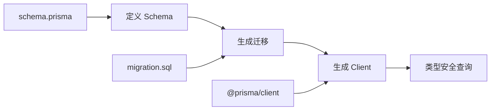
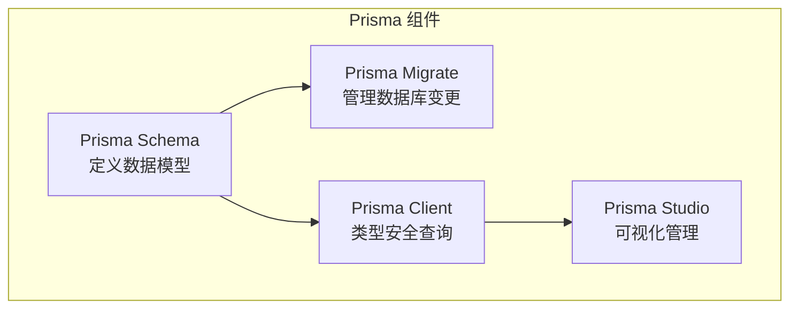

# 4.4 告别手写 SQL——Prisma 实战应用

### 认知重构

Prisma 是现代 TypeScript 项目的首选 ORM——它用类型安全的 API 取代了手写 SQL，让数据库操作变得简单、安全、可维护。

### 为什么选择 Prisma？

| 特性 | Prisma | 传统 ORM | 原生 SQL |
|------|--------|----------|----------|
| **类型安全** | 完全类型安全 | 部分支持 | 无 |
| **学习成本** | 低 | 中 | 高 |
| **迁移管理** | 内置 | 需配置 | 手动 |
| **查询性能** | 优秀 | 一般 | 最佳 |
| **开发体验** | 极佳 | 一般 | 差 |

### Prisma 工作流程



### 子章节导航

| 章节 | 主题 | 核心问题 |
|------|------|----------|
| 4.4.1 | 安装配置 | 如何初始化 Prisma 项目？ |
| 4.4.2 | Schema 结构 | schema.prisma 文件怎么写？ |
| 4.4.3 | 模型定义 | 如何定义表和关系？ |
| 4.4.4 | 数据库连接 | 如何配置数据库连接？ |
| 4.4.5 | 迁移管理 | 如何管理数据库变更？ |
| 4.4.6 | 种子数据 | 如何初始化测试数据？ |
| 4.4.7 | 建模实践 | 真实项目如何设计模型？ |
| 4.4.8 | 查询优化 | 如何优化 Prisma 查询？ |
| 4.4.9 | 事务处理 | 如何保证数据一致性？ |

### Prisma 核心概念



### 快速体验

```bash
# 1. 安装
npm install prisma @prisma/client

# 2. 初始化
npx prisma init

# 3. 定义模型（schema.prisma）
# 4. 生成迁移
npx prisma migrate dev --name init

# 5. 使用
```

```typescript
import { PrismaClient } from '@prisma/client'
const prisma = new PrismaClient()

// 完全类型安全的查询
const users = await prisma.user.findMany({
  where: { status: 'ACTIVE' },
  include: { posts: true }
})
```

### AI 协作指南

**核心意图**：让 AI 帮你生成 Prisma Schema 或查询代码。

**常用提问模板**：
```
帮我写一个 Prisma Schema：
- 需求：[业务需求描述]
- 表：[需要的表]
- 关系：[表之间的关系]
```

```
帮我写 Prisma 查询：
- 模型：[相关模型]
- 需求：[查询需求]
- 条件：[过滤条件]
```

### 学习路径建议

**新手**：4.4.1 → 4.4.2 → 4.4.3 → 4.4.5 → 4.4.6
**进阶**：4.4.4 → 4.4.7 → 4.4.8 → 4.4.9
