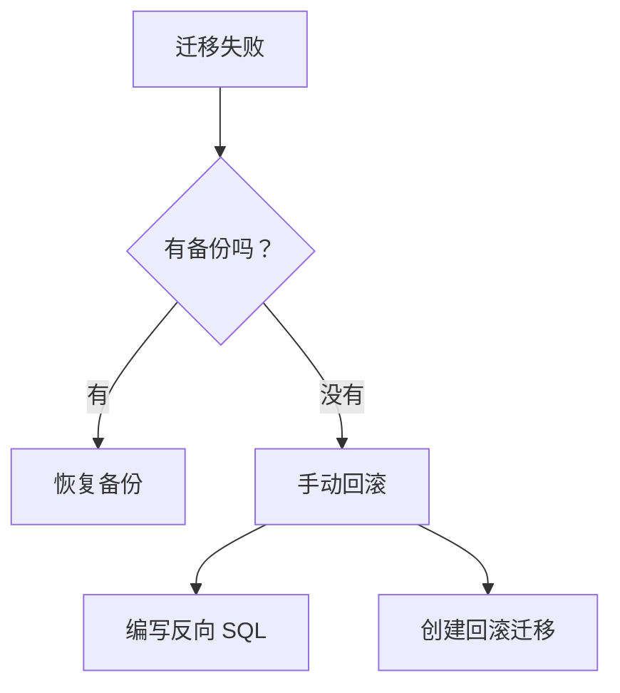

# 4.5.2 手术失败了怎么办——回滚机制：迁移失败的恢复方案

### 一句话破题

Prisma 没有内置回滚命令——你需要自己准备回滚脚本或恢复备份。

### 回滚策略



### 预防措施：备份

**PostgreSQL 备份**：
```bash
# 备份
pg_dump -U postgres -d myapp > backup_$(date +%Y%m%d_%H%M%S).sql

# 恢复
psql -U postgres -d myapp < backup_20240101_120000.sql
```

**Supabase 备份**：
- 自动每日备份（Pro 计划）
- 手动备份：Dashboard → Database → Backups

### 回滚方案一：恢复备份

```bash
# 1. 停止应用
pm2 stop all

# 2. 恢复数据库
psql -U postgres -d myapp < backup.sql

# 3. 回退代码版本
git checkout <previous-commit>

# 4. 重新部署
npm run deploy
```

### 回滚方案二：手动回滚迁移

**创建反向迁移**：

假设原迁移是添加字段：
```sql
-- 原迁移
ALTER TABLE users ADD COLUMN avatar TEXT;
```

创建回滚迁移：
```bash
npx prisma migrate dev --create-only --name rollback_avatar
```

编辑生成的 SQL：
```sql
-- 回滚迁移
ALTER TABLE users DROP COLUMN avatar;
```

应用回滚：
```bash
npx prisma migrate deploy
```

### 回滚方案三：标记迁移失败

如果迁移执行了一半失败：

```bash
# 标记迁移为已回滚
npx prisma migrate resolve --rolled-back "20240101120000_failed_migration"
```

然后修复迁移文件后重新执行。

### 安全迁移模式

**分阶段迁移**（避免破坏性变更）：

```
阶段 1: 添加新字段（可空）
阶段 2: 数据迁移
阶段 3: 设置默认值/非空约束
阶段 4: 删除旧字段
```

**示例：重命名字段**

```sql
-- 阶段 1: 添加新字段
ALTER TABLE users ADD COLUMN full_name TEXT;

-- 阶段 2: 数据迁移
UPDATE users SET full_name = name;

-- 阶段 3: 删除旧字段（下次迁移）
ALTER TABLE users DROP COLUMN name;
```

### 迁移失败常见原因

| 原因 | 解决方案 |
|------|----------|
| 数据不符合新约束 | 先清理数据再迁移 |
| 锁表超时 | 在低峰期执行 |
| 磁盘空间不足 | 清理空间或扩容 |
| 权限不足 | 检查数据库用户权限 |

### 回滚检查清单

- [ ] 迁移前已备份数据库
- [ ] 已准备回滚 SQL 脚本
- [ ] 已记录当前应用版本
- [ ] 已通知相关人员
- [ ] 已准备回滚后的验证步骤

### 本节小结

- Prisma 没有自动回滚，需手动准备
- 生产迁移前必须备份
- 大变更拆分成多个小迁移
- 准备好回滚脚本和验证步骤
