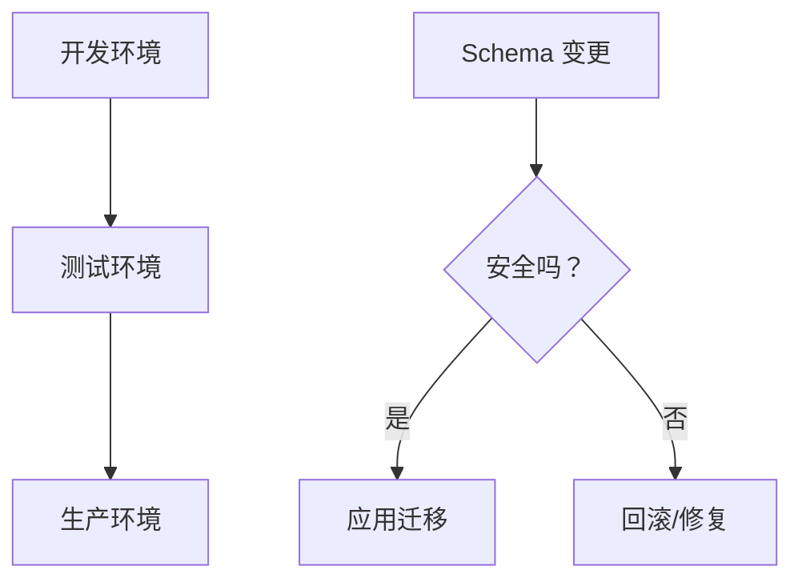

# 4.5 线上数据库动手术——数据库迁移策略：生产环境的变更管理

### 认知重构

生产环境的数据库变更就像给飞行中的飞机换引擎——需要极其谨慎的策略和充分的准备。

### 为什么迁移很重要？



**迁移失败的后果**：
- 服务中断
- 数据丢失
- 用户流失

### 子章节导航

| 章节 | 主题 | 核心问题 |
|------|------|----------|
| 4.5.1 | 环境同步 | 如何保证开发/测试/生产环境一致？ |
| 4.5.2 | 回滚机制 | 迁移失败了怎么恢复？ |
| 4.5.3 | 数据迁移 | 改表结构时数据怎么处理？ |

### 迁移的基本原则

1. **先备份**：生产环境迁移前必须备份
2. **先测试**：在测试环境验证迁移脚本
3. **小步快跑**：大变更拆分成多个小迁移
4. **可回滚**：每次迁移都要有回滚方案

### Prisma 迁移工作流

**开发环境**：
```bash
npx prisma migrate dev --name add_user_role
```

**生产环境**：
```bash
npx prisma migrate deploy
```

| 命令 | 环境 | 作用 |
|------|------|------|
| `migrate dev` | 开发 | 生成并应用迁移 |
| `migrate deploy` | 生产 | 只应用已有迁移 |
| `migrate reset` | 开发 | 重置数据库 |

### 迁移前检查清单

- [ ] 已在本地测试迁移
- [ ] 已在测试环境验证
- [ ] 已备份生产数据库
- [ ] 了解迁移的预计执行时间
- [ ] 准备好回滚方案
- [ ] 安排在低峰期执行

### 本章小结

- 生产迁移需要谨慎策略
- 使用 `migrate deploy` 部署生产环境
- 始终先备份、先测试
- 准备回滚方案应对失败
