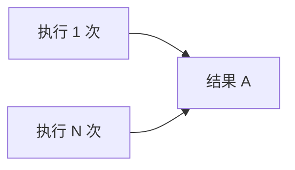

# 4.6.1 重复执行也不怕——多环境与幂等造数

### 一句话破题

幂等种子脚本的核心是"无论执行多少次，结果都一样"——不会重复创建，也不会报错失败。

### 什么是幂等性？



**非幂等脚本**：每次执行都创建新数据，导致数据膨胀或唯一约束报错

**幂等脚本**：已存在则跳过或更新，不存在则创建

### 实现幂等的三种方式

#### 方式一：upsert（推荐）

```typescript
await prisma.user.upsert({
  where: { email: 'admin@example.com' },
  update: { name: 'Admin User' },  // 已存在时更新
  create: {                        // 不存在时创建
    email: 'admin@example.com',
    name: 'Admin User',
    role: 'ADMIN'
  }
})
```

#### 方式二：createMany + skipDuplicates

```typescript
await prisma.user.createMany({
  data: [
    { email: 'user1@example.com', name: 'User 1' },
    { email: 'user2@example.com', name: 'User 2' }
  ],
  skipDuplicates: true  // 跳过已存在的记录
})
```

#### 方式三：先查询再决定

```typescript
const existingUser = await prisma.user.findUnique({
  where: { email: 'admin@example.com' }
})

if (!existingUser) {
  await prisma.user.create({
    data: { email: 'admin@example.com', name: 'Admin' }
  })
}
```

### 多环境种子策略

```typescript
// prisma/seed.ts
async function main() {
  const env = process.env.NODE_ENV || 'development'
  
  // 所有环境都需要的基础数据
  await seedBaseData()
  
  // 根据环境执行不同的种子
  switch (env) {
    case 'development':
      await seedDevelopmentData()
      break
    case 'test':
      await seedTestData()
      break
    case 'staging':
      await seedStagingData()
      break
  }
}

async function seedBaseData() {
  // 管理员账户、系统配置等
  await prisma.user.upsert({
    where: { email: 'admin@example.com' },
    update: {},
    create: {
      email: 'admin@example.com',
      name: 'Admin',
      role: 'ADMIN'
    }
  })
}

async function seedDevelopmentData() {
  // 开发环境：大量测试数据
  const users = Array.from({ length: 50 }, (_, i) => ({
    email: `user${i}@example.com`,
    name: faker.person.fullName()
  }))
  
  await prisma.user.createMany({
    data: users,
    skipDuplicates: true
  })
}

async function seedTestData() {
  // 测试环境：最小必要数据
  await prisma.user.upsert({
    where: { email: 'test@example.com' },
    update: {},
    create: {
      email: 'test@example.com',
      name: 'Test User'
    }
  })
}
```

### 使用固定 ID 保证一致性

```typescript
// 使用固定的 UUID 确保幂等
const ADMIN_ID = 'aaaaaaaa-0000-0000-0000-000000000001'
const TEST_USER_ID = 'aaaaaaaa-0000-0000-0000-000000000002'

await prisma.user.upsert({
  where: { id: ADMIN_ID },
  update: {},
  create: {
    id: ADMIN_ID,
    email: 'admin@example.com',
    name: 'Admin'
  }
})
```

### 处理关联数据

```typescript
async function seedWithRelations() {
  // 先创建父级数据
  const user = await prisma.user.upsert({
    where: { email: 'author@example.com' },
    update: {},
    create: {
      email: 'author@example.com',
      name: 'Author'
    }
  })
  
  // 再创建子级数据（使用唯一标识）
  await prisma.post.upsert({
    where: { 
      // 需要复合唯一索引或其他唯一字段
      slug: 'first-post'
    },
    update: {},
    create: {
      slug: 'first-post',
      title: 'First Post',
      authorId: user.id
    }
  })
}
```

### 执行顺序控制

```typescript
async function main() {
  // 按依赖顺序执行
  await seedUsers()      // 1. 用户
  await seedCategories() // 2. 分类
  await seedPosts()      // 3. 文章（依赖用户和分类）
  await seedComments()   // 4. 评论（依赖文章和用户）
}
```

### 本节小结

- 使用 `upsert` 是最简单的幂等方案
- `createMany + skipDuplicates` 适合批量插入
- 根据环境变量切换不同的种子策略
- 使用固定 ID 确保跨环境一致性
