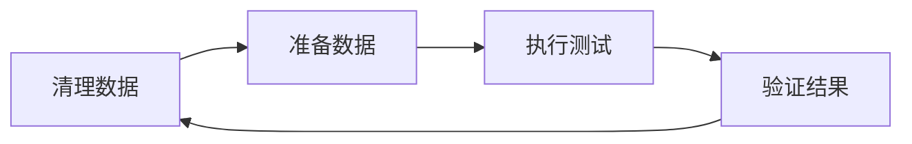

# 4.6.2 测试前后的清理——与测试/E2E 的执行顺序与清理

### 一句话破题

测试的可重复性依赖于"干净的起点"——每次测试都应该在已知状态下开始，避免测试间相互影响。

### 测试数据管理策略



### 清理策略对比

| 策略 | 优点 | 缺点 |
|------|------|------|
| 测试前清理 | 保证干净起点 | 清理可能失败 |
| 测试后清理 | 保持整洁 | 失败时可能遗留数据 |
| 事务回滚 | 最快最干净 | 不适用于所有场景 |
| 独立数据库 | 完全隔离 | 资源消耗大 |

### 测试前清理（推荐）

```typescript
// tests/setup.ts
import { prisma } from '../src/lib/prisma'

export async function cleanDatabase() {
  // 按外键依赖反向顺序删除
  await prisma.comment.deleteMany()
  await prisma.post.deleteMany()
  await prisma.user.deleteMany()
}

export async function setupTestData() {
  // 创建测试需要的基础数据
  const user = await prisma.user.create({
    data: {
      email: 'test@example.com',
      name: 'Test User'
    }
  })
  return { user }
}
```

### Vitest 配置

```typescript
// vitest.config.ts
import { defineConfig } from 'vitest/config'

export default defineConfig({
  test: {
    globalSetup: './tests/global-setup.ts',
    setupFiles: './tests/setup.ts',
    hookTimeout: 30000
  }
})
```

```typescript
// tests/global-setup.ts
export async function setup() {
  // 测试开始前的全局设置
  console.log('Starting test suite...')
}

export async function teardown() {
  // 测试结束后的全局清理
  console.log('Cleaning up...')
}
```

```typescript
// tests/setup.ts
import { beforeEach, afterAll } from 'vitest'
import { cleanDatabase, setupTestData } from './helpers'

beforeEach(async () => {
  await cleanDatabase()
})

afterAll(async () => {
  await prisma.$disconnect()
})
```

### 使用事务进行隔离

```typescript
// tests/helpers/with-transaction.ts
import { prisma } from '@/lib/prisma'

export async function withTransaction<T>(
  fn: (tx: typeof prisma) => Promise<T>
): Promise<T> {
  return prisma.$transaction(async (tx) => {
    const result = await fn(tx as typeof prisma)
    // 抛出错误触发回滚
    throw new Error('ROLLBACK')
  }).catch((error) => {
    if (error.message === 'ROLLBACK') {
      return undefined as T
    }
    throw error
  })
}
```

### E2E 测试数据管理

```typescript
// e2e/fixtures/user.ts
import { prisma } from '@/lib/prisma'

export async function createTestUser() {
  return prisma.user.create({
    data: {
      email: `test-${Date.now()}@example.com`,
      name: 'E2E Test User'
    }
  })
}

export async function cleanupTestUser(userId: string) {
  await prisma.user.delete({
    where: { id: userId }
  })
}
```

```typescript
// e2e/user.spec.ts
import { test, expect } from '@playwright/test'
import { createTestUser, cleanupTestUser } from './fixtures/user'

let testUser: { id: string; email: string }

test.beforeAll(async () => {
  testUser = await createTestUser()
})

test.afterAll(async () => {
  await cleanupTestUser(testUser.id)
})

test('should display user profile', async ({ page }) => {
  await page.goto(`/users/${testUser.id}`)
  await expect(page.getByText(testUser.email)).toBeVisible()
})
```

### 快速清理方案

**使用 TRUNCATE（PostgreSQL）**：

```typescript
async function truncateAllTables() {
  const tables = ['Comment', 'Post', 'User']
  
  for (const table of tables) {
    await prisma.$executeRawUnsafe(
      `TRUNCATE TABLE "${table}" CASCADE`
    )
  }
}
```

**重置数据库（开发/测试环境）**：

```bash
# 重置并重新种子
npx prisma migrate reset --force
```

### 测试数据工厂

```typescript
// tests/factories/user.ts
import { faker } from '@faker-js/faker'
import { prisma } from '@/lib/prisma'

export function createUserFactory(overrides = {}) {
  return prisma.user.create({
    data: {
      email: faker.internet.email(),
      name: faker.person.fullName(),
      ...overrides
    }
  })
}

// 使用
const user = await createUserFactory({ role: 'ADMIN' })
```

### 清理顺序注意事项

```typescript
// 按外键依赖的反向顺序删除
const cleanupOrder = [
  'Comment',    // 依赖 Post 和 User
  'Post',       // 依赖 User
  'Profile',    // 依赖 User
  'User'        // 基础表
]

for (const model of cleanupOrder) {
  await (prisma as any)[model.toLowerCase()].deleteMany()
}
```

### 本节小结

- 测试前清理确保干净起点
- 事务回滚是最快的隔离方式
- E2E 测试使用唯一标识避免冲突
- 按外键依赖反向顺序清理数据
