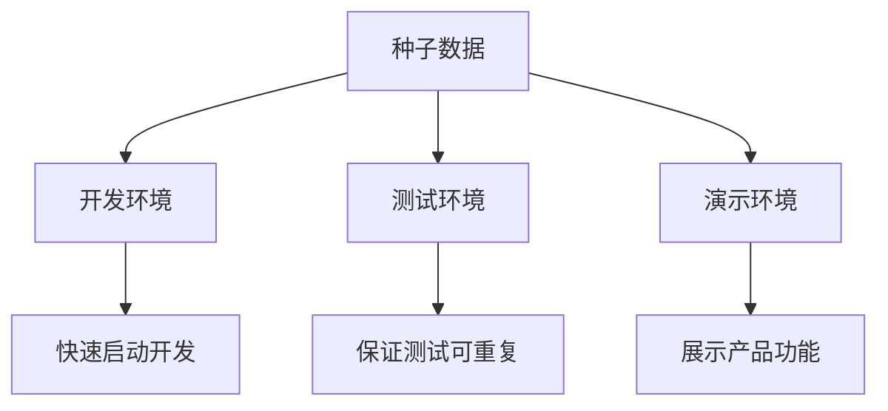

# 4.6 如何批量制造假数据——种子数据高级应用：多环境数据管理

### 认知重构

种子数据不只是"造假数据"——它是开发效率的倍增器，是测试质量的保障，是团队协作的基础。

### 种子数据的多重身份



### 子章节导航

| 章节 | 主题 | 核心问题 |
|------|------|----------|
| 4.6.1 | 幂等造数 | 如何让种子脚本可以重复执行？ |
| 4.6.2 | 测试清理 | 测试前后的数据如何管理？ |
| 4.6.3 | 数据脱敏 | 如何安全使用生产数据做测试？ |

### 基础种子脚本回顾

```typescript
// prisma/seed.ts
import { PrismaClient } from '@prisma/client'
import { faker } from '@faker-js/faker'

const prisma = new PrismaClient()

async function main() {
  // 创建用户
  const user = await prisma.user.upsert({
    where: { email: 'admin@example.com' },
    update: {},
    create: {
      email: 'admin@example.com',
      name: 'Admin',
      role: 'ADMIN'
    }
  })

  // 批量创建测试数据
  for (let i = 0; i < 10; i++) {
    await prisma.post.create({
      data: {
        title: faker.lorem.sentence(),
        content: faker.lorem.paragraphs(3),
        authorId: user.id
      }
    })
  }
}

main()
  .catch(console.error)
  .finally(() => prisma.$disconnect())
```

### 运行种子

```bash
# 执行种子脚本
npx prisma db seed

# 重置数据库并执行种子
npx prisma migrate reset
```

### 本章小结

- 种子数据服务于开发、测试、演示多种场景
- 使用 `upsert` 实现幂等性
- 使用 Faker 生成真实感的测试数据
- 根据环境定制不同的数据策略
