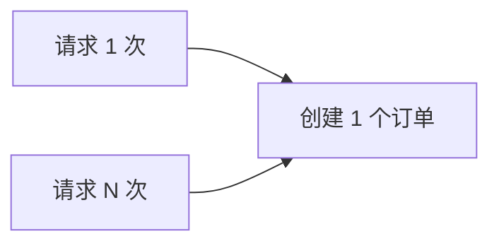

# 4.7.1 重复提交了怎么办——幂等性设计：重复请求的安全处理

### 一句话破题

幂等性让 API 能够安全地处理重复请求——无论调用一次还是多次，结果都一样。

### 什么是幂等性？



**幂等操作**：多次执行和执行一次效果相同

- `GET /users/1` - 天然幂等
- `PUT /users/1` - 天然幂等
- `DELETE /users/1` - 天然幂等
- `POST /orders` - **非幂等！** 需要特殊处理

### 为什么需要幂等性？

1. **网络抖动**：请求超时后重试
2. **用户行为**：快速双击提交按钮
3. **消息队列**：消息重复消费
4. **服务重试**：微服务调用失败重试

### 实现幂等的核心：幂等键

```typescript
// 前端生成幂等键
const idempotencyKey = crypto.randomUUID()

fetch('/api/orders', {
  method: 'POST',
  headers: {
    'X-Idempotency-Key': idempotencyKey
  },
  body: JSON.stringify(orderData)
})
```

```typescript
// 后端处理幂等键
// app/api/orders/route.ts
export async function POST(request: Request) {
  const idempotencyKey = request.headers.get('X-Idempotency-Key')
  
  if (!idempotencyKey) {
    return Response.json(
      { error: '缺少幂等键' },
      { status: 400 }
    )
  }
  
  // 检查是否已处理过
  const existing = await prisma.idempotencyRecord.findUnique({
    where: { key: idempotencyKey }
  })
  
  if (existing) {
    // 返回之前的结果
    return Response.json(existing.response)
  }
  
  // 创建订单
  const order = await prisma.$transaction(async (tx) => {
    const order = await tx.order.create({
      data: orderData
    })
    
    // 记录幂等键和响应
    await tx.idempotencyRecord.create({
      data: {
        key: idempotencyKey,
        response: order,
        expiresAt: new Date(Date.now() + 24 * 60 * 60 * 1000) // 24小时后过期
      }
    })
    
    return order
  })
  
  return Response.json(order)
}
```

### 幂等记录模型

```prisma
model IdempotencyRecord {
  id        String   @id @default(cuid())
  key       String   @unique
  response  Json
  createdAt DateTime @default(now())
  expiresAt DateTime
  
  @@index([expiresAt])
}
```

### 使用数据库唯一约束

对于某些场景，可以利用数据库唯一约束实现幂等：

```prisma
model Payment {
  id            String @id @default(cuid())
  orderId       String
  transactionNo String @unique // 唯一交易号
  amount        Float
  
  order Order @relation(fields: [orderId], references: [id])
}
```

```typescript
async function processPayment(orderId: string, transactionNo: string) {
  try {
    return await prisma.payment.create({
      data: {
        orderId,
        transactionNo,
        amount: 100
      }
    })
  } catch (error) {
    if (error.code === 'P2002') {
      // 唯一约束冲突 = 重复请求
      return prisma.payment.findUnique({
        where: { transactionNo }
      })
    }
    throw error
  }
}
```

### 使用 upsert 实现幂等

```typescript
async function updateUserProfile(userId: string, data: ProfileData) {
  return prisma.profile.upsert({
    where: { userId },
    update: data,
    create: { userId, ...data }
  })
}
```

### 前端防重复提交

```typescript
// 使用 React Hook 防止重复提交
function useSubmit() {
  const [isSubmitting, setIsSubmitting] = useState(false)
  const idempotencyKeyRef = useRef<string>()
  
  const submit = async (data: FormData) => {
    if (isSubmitting) return
    
    setIsSubmitting(true)
    idempotencyKeyRef.current = crypto.randomUUID()
    
    try {
      const response = await fetch('/api/orders', {
        method: 'POST',
        headers: {
          'X-Idempotency-Key': idempotencyKeyRef.current
        },
        body: JSON.stringify(data)
      })
      return response.json()
    } finally {
      setIsSubmitting(false)
    }
  }
  
  return { submit, isSubmitting }
}
```

### 清理过期记录

```typescript
// 定期清理过期的幂等记录
async function cleanupIdempotencyRecords() {
  await prisma.idempotencyRecord.deleteMany({
    where: {
      expiresAt: { lt: new Date() }
    }
  })
}
```

### 本节小结

- 幂等性保证重复请求不会产生副作用
- 使用幂等键（Idempotency Key）是最通用的方案
- 数据库唯一约束可以作为简单场景的兜底
- 前后端配合才能完整实现幂等
