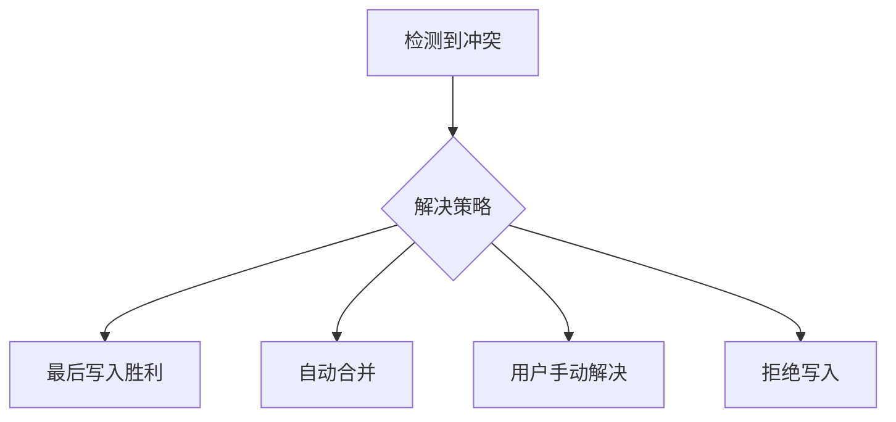
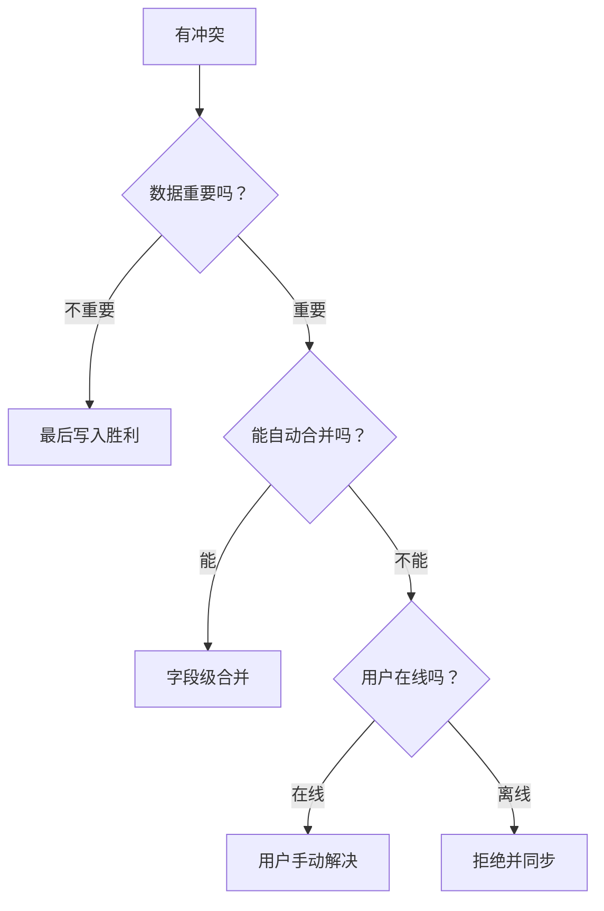

# 4.7.3 冲突了听谁的——冲突解决：最后写入胜利 vs 合并策略

### 一句话破题

冲突解决没有"最好"的策略——需要根据业务场景在"谁赢"、"合并"、"用户决定"之间做选择。

### 冲突解决策略



| 策略 | 说明 | 适用场景 |
|------|------|----------|
| **最后写入胜利** | 后到的覆盖先到的 | 简单场景，数据不重要 |
| **自动合并** | 按字段或规则合并 | 字段独立修改 |
| **用户手动解决** | 展示差异让用户选择 | 复杂内容编辑 |
| **拒绝写入** | 返回 409 要求刷新 | 数据准确性优先 |

### 最后写入胜利（LWW）

```typescript
// 简单粗暴：直接覆盖
async function updatePost(id: string, data: PostData) {
  return prisma.post.update({
    where: { id },
    data
  })
}
```

**适用场景**：
- 用户个人设置
- 不太重要的元数据
- 离线优先应用的同步

### 字段级合并

```typescript
async function mergePost(
  id: string, 
  updates: Partial<PostData>,
  baseVersion: number
) {
  const current = await prisma.post.findUnique({
    where: { id }
  })
  
  if (!current || current.version === baseVersion) {
    // 没有冲突，直接更新
    return prisma.post.update({
      where: { id },
      data: { ...updates, version: { increment: 1 } }
    })
  }
  
  // 字段级合并
  const merged: Partial<PostData> = {}
  
  for (const [key, value] of Object.entries(updates)) {
    // 如果该字段未被他人修改，则采用本次更新
    // 简化逻辑：这里需要记录每个字段的修改历史
    merged[key] = value
  }
  
  return prisma.post.update({
    where: { id },
    data: { ...merged, version: { increment: 1 } }
  })
}
```

### 用户手动解决

```typescript
// 检测冲突并返回两个版本供用户选择
async function updateWithConflictDetection(
  id: string,
  data: PostData,
  version: number
) {
  const current = await prisma.post.findUnique({
    where: { id }
  })
  
  if (current.version !== version) {
    // 返回冲突信息
    return {
      conflict: true,
      yourVersion: data,
      serverVersion: current,
      message: '数据已被他人修改'
    }
  }
  
  return prisma.post.update({
    where: { id },
    data: { ...data, version: { increment: 1 } }
  })
}
```

```typescript
// 前端展示冲突解决界面
function ConflictResolver({ yourVersion, serverVersion, onResolve }) {
  return (
    <div className="conflict-modal">
      <h3>检测到冲突</h3>
      <div className="versions">
        <div className="your-version">
          <h4>你的版本</h4>
          <pre>{JSON.stringify(yourVersion, null, 2)}</pre>
        </div>
        <div className="server-version">
          <h4>服务器版本</h4>
          <pre>{JSON.stringify(serverVersion, null, 2)}</pre>
        </div>
      </div>
      <div className="actions">
        <button onClick={() => onResolve('mine')}>使用我的版本</button>
        <button onClick={() => onResolve('theirs')}>使用服务器版本</button>
        <button onClick={() => onResolve('manual')}>手动合并</button>
      </div>
    </div>
  )
}
```

### 基于时间戳的合并

```typescript
interface FieldWithTimestamp<T> {
  value: T
  updatedAt: Date
}

// 每个字段都记录最后更新时间
async function mergeByTimestamp(
  id: string,
  updates: Record<string, FieldWithTimestamp<any>>
) {
  const current = await prisma.post.findUnique({
    where: { id }
  })
  
  const merged: Record<string, any> = {}
  
  for (const [field, update] of Object.entries(updates)) {
    const currentField = current[field + 'UpdatedAt']
    
    // 谁的时间戳更新，就用谁的值
    if (!currentField || update.updatedAt > currentField) {
      merged[field] = update.value
      merged[field + 'UpdatedAt'] = update.updatedAt
    }
  }
  
  return prisma.post.update({
    where: { id },
    data: merged
  })
}
```

### 业务规则优先

```typescript
// 库存扣减：不能超卖
async function reduceStock(productId: string, quantity: number) {
  return prisma.$transaction(async (tx) => {
    const product = await tx.product.findUnique({
      where: { id: productId }
    })
    
    // 业务规则：库存不能为负
    if (product.stock < quantity) {
      throw new Error('库存不足')
    }
    
    return tx.product.update({
      where: { id: productId },
      data: { stock: { decrement: quantity } }
    })
  })
}

// 点赞计数：可以合并
async function incrementLikes(postId: string) {
  // 使用原子操作，不会有冲突
  return prisma.post.update({
    where: { id: postId },
    data: { likes: { increment: 1 } }
  })
}
```

### 策略选择决策树



### 本节小结

- 最后写入胜利最简单，但可能丢失数据
- 字段级合并适合字段独立修改的场景
- 复杂内容冲突需要用户手动解决
- 原子操作（increment/decrement）可避免数值冲突
