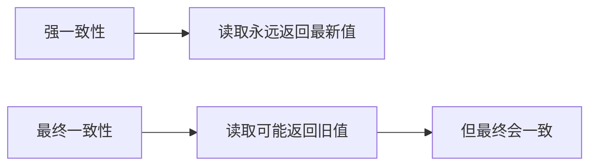
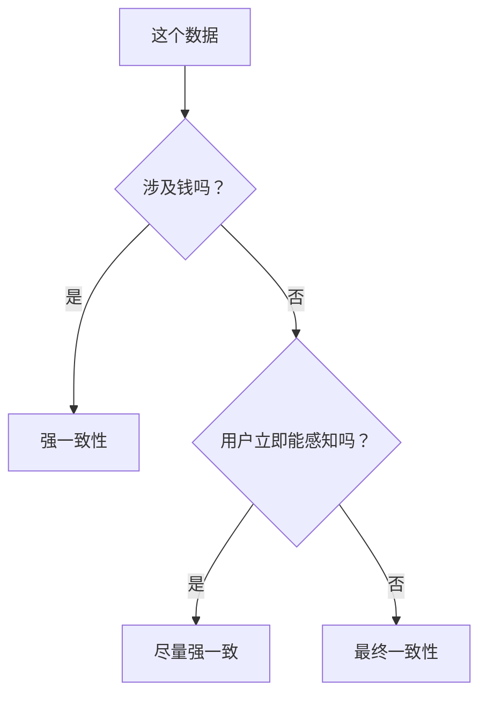

# 4.7.4 数据不一致了怎么办——数据一致性：最终一致性与强一致性

### 一句话破题

强一致性保证"立即看到最新数据"，最终一致性保证"迟早会看到最新数据"——选择取决于业务对"实时性"的要求。

### 一致性级别



| 类型 | 说明 | 示例 |
|------|------|------|
| **强一致性** | 写入后立即可见 | 银行转账 |
| **最终一致性** | 写入后一段时间可见 | 社交媒体点赞数 |

### 为什么会不一致？

1. **缓存延迟**：数据库更新了，但缓存还是旧的
2. **复制延迟**：主库更新了，从库还没同步
3. **客户端缓存**：服务器更新了，浏览器还是旧数据

### 场景一：缓存导致的不一致

```typescript
// 问题：更新后缓存未失效
async function updateUser(id: string, data: UserData) {
  await prisma.user.update({
    where: { id },
    data
  })
  // 缓存还是旧数据！
}

// 解决：更新后失效缓存
async function updateUser(id: string, data: UserData) {
  const user = await prisma.user.update({
    where: { id },
    data
  })
  
  // 失效缓存
  await redis.del(`user:${id}`)
  
  return user
}
```

### 场景二：读写分离导致的不一致

```typescript
// 问题：写主库后立即读从库
async function createPostAndRedirect(data: PostData) {
  const post = await prisma.post.create({ data })  // 写入主库
  
  // 立即跳转详情页
  redirect(`/posts/${post.id}`)  // 从库可能还没同步
}

// 解决方案 1：写后读走主库
async function getPost(id: string, forceMain = false) {
  if (forceMain) {
    return prismaMain.post.findUnique({ where: { id } })
  }
  return prismaReplica.post.findUnique({ where: { id } })
}

// 解决方案 2：创建后延迟跳转
async function createPostAndRedirect(data: PostData) {
  const post = await prisma.post.create({ data })
  
  // 短暂等待同步
  await new Promise(resolve => setTimeout(resolve, 100))
  
  redirect(`/posts/${post.id}`)
}
```

### 场景三：前端缓存不一致

```typescript
// 使用 SWR 的乐观更新
import useSWR, { mutate } from 'swr'

function usePost(id: string) {
  return useSWR(`/api/posts/${id}`)
}

async function updatePost(id: string, data: PostData) {
  // 乐观更新：立即更新本地缓存
  mutate(
    `/api/posts/${id}`,
    { ...data },
    false  // 不重新验证
  )
  
  // 发送请求
  await fetch(`/api/posts/${id}`, {
    method: 'PUT',
    body: JSON.stringify(data)
  })
  
  // 重新验证确保一致
  mutate(`/api/posts/${id}`)
}
```

### 保证强一致性的场景

**金融交易**：

```typescript
async function transfer(from: string, to: string, amount: number) {
  return prisma.$transaction(async (tx) => {
    // 在事务中完成所有操作
    const fromAccount = await tx.account.update({
      where: { id: from },
      data: { balance: { decrement: amount } }
    })
    
    if (fromAccount.balance < 0) {
      throw new Error('余额不足')
    }
    
    await tx.account.update({
      where: { id: to },
      data: { balance: { increment: amount } }
    })
    
    // 记录交易
    await tx.transaction.create({
      data: { from, to, amount }
    })
  }, {
    isolationLevel: 'Serializable'  // 最高隔离级别
  })
}
```

### 可接受最终一致性的场景

**点赞计数**：

```typescript
// 立即返回，后台异步更新
async function likePost(postId: string, userId: string) {
  // 记录点赞
  await prisma.like.create({
    data: { postId, userId }
  })
  
  // 异步更新计数（可能有延迟）
  updateLikeCountAsync(postId)
  
  return { success: true }
}

async function updateLikeCountAsync(postId: string) {
  const count = await prisma.like.count({
    where: { postId }
  })
  
  await prisma.post.update({
    where: { id: postId },
    data: { likeCount: count }
  })
}
```

### 一致性保证策略

| 策略 | 实现方式 | 代价 |
|------|----------|------|
| 数据库事务 | `$transaction` | 性能开销 |
| 写后读主库 | 路由到主库 | 主库压力 |
| 缓存失效 | 更新后删除缓存 | 缓存命中率 |
| 版本号校验 | 乐观锁 | 冲突重试 |

### 如何选择？



### 本节小结

- 强一致性保证实时性，但有性能代价
- 最终一致性性能好，但要接受短暂不一致
- 金融场景必须强一致性
- 社交/统计类数据可以最终一致性
- 更新后记得处理缓存
