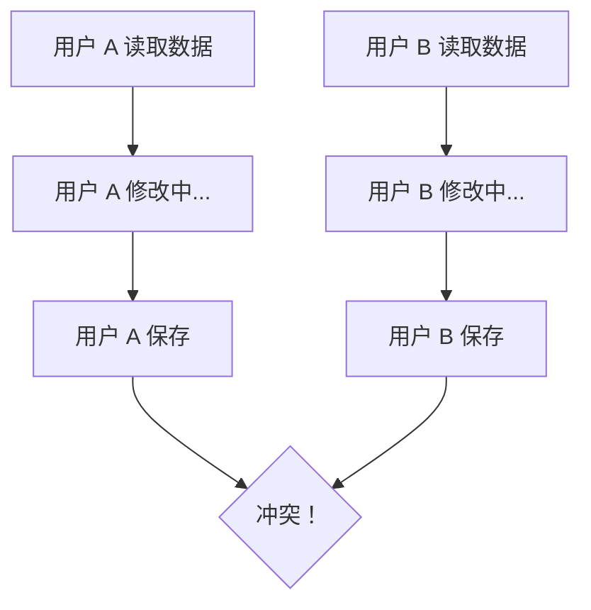

# 4.7 数据打架了怎么办——数据同步：幂等/冲突处理

### 认知重构

在分布式系统和多用户场景下，数据"打架"是常态而非异常——学会处理冲突是构建健壮应用的必修课。

### 数据冲突的典型场景

**常见冲突场景**：
- 两个用户同时编辑同一篇文章
- 用户重复点击提交按钮
- 网络延迟导致请求重发
- 离线应用数据同步

### 子章节导航

| 章节 | 主题 | 核心问题 |
|------|------|----------|
| 4.7.1 | 幂等性设计 | 如何让重复请求安全无害？ |
| 4.7.2 | 冲突检测 | 如何发现数据被别人改了？ |
| 4.7.3 | 冲突解决 | 冲突了该听谁的？ |
| 4.7.4 | 数据一致性 | 如何保证数据最终正确？ |

### 冲突处理策略概览

| 策略 | 适用场景 | 优点 | 缺点 |
|------|----------|------|------|
| 悲观锁 | 高冲突场景 | 彻底避免冲突 | 性能差 |
| 乐观锁 | 低冲突场景 | 性能好 | 需处理冲突 |
| 幂等键 | 表单重复提交 | 简单有效 | 需要额外存储 |
| 版本号 | 并发编辑 | 实现简单 | 需前端配合 |

### 本章定位

本章聚焦于**应用层**的数据同步问题，不涉及数据库复制等底层机制。我们关注的是：

1. 如何让 API 安全应对重复请求
2. 如何检测和解决用户级别的数据冲突
3. 如何在用户体验和数据正确性之间取得平衡

### 本章小结

- 数据冲突在多用户系统中不可避免
- 根据业务场景选择合适的冲突处理策略
- 幂等性设计是 API 健壮性的基础
- 冲突检测和解决需要前后端配合
