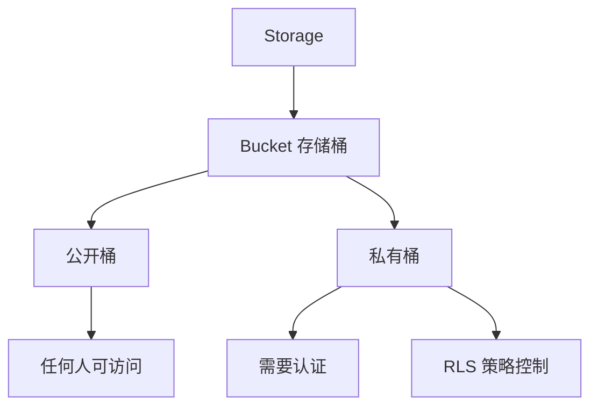

# 4.8.1 拓展：文件怎么和权限挂钩——存储桶：文件上传与权限控制

### 一句话破题

Supabase Storage 的精髓是"文件权限与用户权限统一"——通过 RLS 策略，用户只能访问自己有权限的文件。

### Storage 核心概念



### 创建存储桶

**Dashboard 方式**：
1. 进入 Supabase Dashboard
2. Storage → Create new bucket
3. 设置名称和访问权限

**SQL 方式**：

```sql
-- 创建私有存储桶
INSERT INTO storage.buckets (id, name, public)
VALUES ('avatars', 'avatars', false);

-- 创建公开存储桶
INSERT INTO storage.buckets (id, name, public)
VALUES ('public-images', 'public-images', true);
```

### 配置 RLS 策略

```sql
-- 允许用户上传到自己的文件夹
CREATE POLICY "Users can upload own files"
ON storage.objects
FOR INSERT
WITH CHECK (
  bucket_id = 'avatars' AND
  auth.uid()::text = (storage.foldername(name))[1]
);

-- 允许用户读取自己的文件
CREATE POLICY "Users can view own files"
ON storage.objects
FOR SELECT
USING (
  bucket_id = 'avatars' AND
  auth.uid()::text = (storage.foldername(name))[1]
);

-- 允许用户删除自己的文件
CREATE POLICY "Users can delete own files"
ON storage.objects
FOR DELETE
USING (
  bucket_id = 'avatars' AND
  auth.uid()::text = (storage.foldername(name))[1]
);
```

### 上传文件

```typescript
import { supabase } from '@/lib/supabase'

async function uploadAvatar(file: File, userId: string) {
  const fileExt = file.name.split('.').pop()
  const fileName = `${userId}/${Date.now()}.${fileExt}`
  
  const { data, error } = await supabase.storage
    .from('avatars')
    .upload(fileName, file, {
      cacheControl: '3600',
      upsert: true
    })
  
  if (error) throw error
  
  return data.path
}
```

### 获取文件 URL

```typescript
// 公开桶：直接获取公开 URL
function getPublicUrl(path: string) {
  const { data } = supabase.storage
    .from('public-images')
    .getPublicUrl(path)
  
  return data.publicUrl
}

// 私有桶：获取签名 URL（有时效）
async function getSignedUrl(path: string) {
  const { data, error } = await supabase.storage
    .from('avatars')
    .createSignedUrl(path, 3600)  // 1小时有效
  
  if (error) throw error
  return data.signedUrl
}
```

### 下载文件

```typescript
async function downloadFile(path: string) {
  const { data, error } = await supabase.storage
    .from('avatars')
    .download(path)
  
  if (error) throw error
  return data  // Blob
}
```

### 删除文件

```typescript
async function deleteFile(path: string) {
  const { error } = await supabase.storage
    .from('avatars')
    .remove([path])
  
  if (error) throw error
}

// 批量删除
async function deleteFiles(paths: string[]) {
  const { error } = await supabase.storage
    .from('avatars')
    .remove(paths)
  
  if (error) throw error
}
```

### 列出文件

```typescript
async function listUserFiles(userId: string) {
  const { data, error } = await supabase.storage
    .from('avatars')
    .list(userId, {
      limit: 100,
      offset: 0,
      sortBy: { column: 'created_at', order: 'desc' }
    })
  
  if (error) throw error
  return data
}
```

### React 组件示例

```typescript
'use client'

import { useState } from 'react'
import { supabase } from '@/lib/supabase'

export function AvatarUpload({ userId }: { userId: string }) {
  const [uploading, setUploading] = useState(false)
  const [avatarUrl, setAvatarUrl] = useState<string | null>(null)
  
  async function handleUpload(e: React.ChangeEvent<HTMLInputElement>) {
    const file = e.target.files?.[0]
    if (!file) return
    
    setUploading(true)
    
    try {
      const path = `${userId}/${Date.now()}.${file.name.split('.').pop()}`
      
      const { error } = await supabase.storage
        .from('avatars')
        .upload(path, file)
      
      if (error) throw error
      
      const { data } = await supabase.storage
        .from('avatars')
        .createSignedUrl(path, 3600)
      
      setAvatarUrl(data?.signedUrl ?? null)
    } catch (error) {
      console.error('上传失败:', error)
    } finally {
      setUploading(false)
    }
  }
  
  return (
    <div>
      <input
        type="file"
        accept="image/*"
        onChange={handleUpload}
        disabled={uploading}
      />
      {avatarUrl && }
    </div>
  )
}
```

### 文件类型限制

```typescript
// 验证文件类型和大小
function validateFile(file: File) {
  const allowedTypes = ['image/jpeg', 'image/png', 'image/webp']
  const maxSize = 5 * 1024 * 1024 // 5MB
  
  if (!allowedTypes.includes(file.type)) {
    throw new Error('只支持 JPG、PNG、WebP 格式')
  }
  
  if (file.size > maxSize) {
    throw new Error('文件大小不能超过 5MB')
  }
}
```

### 本节小结

- 使用 RLS 策略控制文件访问权限
- 公开桶用于无需认证的资源
- 私有桶配合签名 URL 提供临时访问
- 文件路径建议按用户 ID 组织
