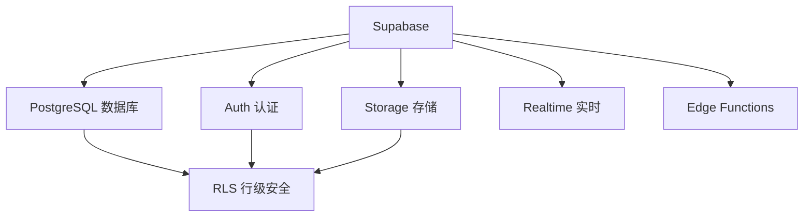
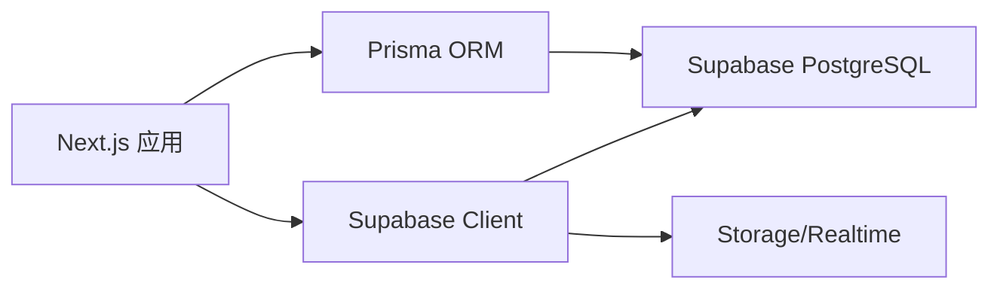

# 4.8 拓展：Supabase 为何如此强大——存储与认证联动

### 认知重构

Supabase 不只是"开源 Firebase"——它是基于 PostgreSQL 的全栈后端平台，将数据库、认证、存储、实时订阅完美整合。

### Supabase 生态全景



### 子章节导航

| 章节 | 主题 | 核心问题 |
|------|------|----------|
| 4.8.1 | Storage | 如何安全地存储和访问文件？ |
| 4.8.2 | Realtime | 如何实时推送数据变更？ |
| 4.8.3 | Edge Functions | 如何在边缘运行自定义逻辑？ |

### 为什么选择 Supabase？

| 特性 | Supabase | 传统方案 |
|------|----------|----------|
| 数据库 | PostgreSQL（企业级） | 各种选择 |
| 认证 | 内置 + RLS 联动 | 需要自己实现 |
| 文件存储 | 内置 + 权限控制 | 需要额外服务 |
| 实时订阅 | 内置 WebSocket | 需要自己搭建 |
| 定价 | 免费额度充足 | 成本难控制 |

### 核心优势：RLS 统一权限

Supabase 的杀手锏是 **Row Level Security**（行级安全策略），让数据库、存储、实时订阅共享同一套权限规则：

```sql
-- 创建策略：用户只能访问自己的数据
CREATE POLICY "Users can view own data"
ON users
FOR SELECT
USING (auth.uid() = id);

-- 同样的策略自动应用于：
-- - 数据库查询
-- - 文件存储访问
-- - 实时订阅过滤
```

### 快速上手

**安装 SDK**：

```bash
npm install @supabase/supabase-js
```

**初始化客户端**：

```typescript
// lib/supabase.ts
import { createClient } from '@supabase/supabase-js'

export const supabase = createClient(
  process.env.NEXT_PUBLIC_SUPABASE_URL!,
  process.env.NEXT_PUBLIC_SUPABASE_ANON_KEY!
)
```

### 与 Prisma 的关系



- **Prisma**：用于复杂的数据库操作
- **Supabase Client**：用于存储、实时订阅、认证等特性

### 本章小结

- Supabase 提供一站式后端解决方案
- RLS 是统一权限控制的核心
- 可以与 Prisma 配合使用
- 适合快速构建全栈应用
