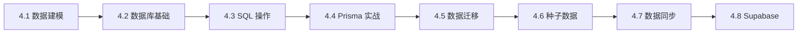

# 4 ｜数据库与数据生命周期

### 认知重构

数据库不是"存数据的地方"，而是应用的**记忆中枢**。它决定了你的应用能"记住"什么、"想起"什么、以及如何保证"记忆"的准确性。

### 本章学习目标

完成本章后，你将能够：

- 理解数据建模的核心概念，设计合理的数据结构
- 掌握关系型数据库的基本原理和操作
- 熟练使用 Prisma ORM 进行数据库开发
- 处理数据迁移、种子数据和数据同步问题
- 了解 Supabase 的高级特性

### 章节导航

| 章节 | 主题 | 核心内容 |
|------|------|----------|
| 4.1 | 数据建模 | ER 图、实体关系、范式理论 |
| 4.2 | 数据库基础 | CRUD、索引、事务、并发控制 |
| 4.3 | SQL 基础 | DDL、DML、约束、JOIN、聚合 |
| 4.4 | Prisma 实战 | Schema、迁移、查询、事务 |
| 4.5 | 数据迁移 | 环境同步、回滚、数据处理 |
| 4.6 | 种子数据 | 幂等造数、测试数据、脱敏 |
| 4.7 | 数据同步 | 幂等性、冲突处理、一致性 |
| 4.8 | Supabase | 存储桶、实时订阅、边缘函数 |

### 技术栈说明

本章使用的技术栈：

- **ORM**：Prisma（类型安全的数据库访问）
- **数据库**：PostgreSQL（生产环境）/ SQLite（开发环境）
- **BaaS**：Supabase（可选的全栈解决方案）

### 学习路径建议

- **零基础**：按顺序学习 4.1 → 4.2 → 4.3 → 4.4
- **有 SQL 基础**：可跳过 4.2、4.3，重点学习 4.4 Prisma
- **使用 Supabase**：完成基础后，重点学习 4.8
