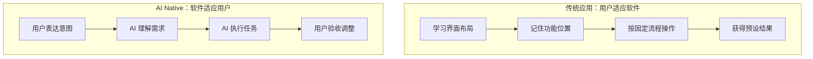

# 5.1.1 为什么 AI 应用不一样——AI Native 应用特点

### 一句话破题

AI Native 应用的本质区别：**用户从"学习如何操作软件"变成了"告诉软件想要什么"**。

### 核心价值

理解 AI Native 的特点，能帮你：
- 设计更符合 AI 时代的产品交互
- 在与 AI 协作时，更好地利用其"理解意图"的能力
- 避免用传统软件思维来设计 AI 辅助的功能

### 传统应用 vs AI Native 应用



| 维度 | 传统应用 | AI Native 应用 |
|------|----------|----------------|
| **交互方式** | 点击菜单、填写表单 | 自然语言对话 |
| **学习成本** | 需要培训和记忆 | 会说话就会用 |
| **功能边界** | 开发了什么就有什么 | 在能力范围内灵活响应 |
| **个性化** | 配置选项有限 | 根据上下文自动适配 |

### AI Native 的三个核心特征

#### 1. 自然语言是核心界面

```
传统方式：
文件 → 导出 → 选择 PDF → 设置边距 → 选择页面范围 → 确认

AI Native：
"把这个文档导出成 PDF，页边距 2cm，只要第 1-5 页"
```

**启示**：在与 AI 协作写代码时，你不需要记住所有 API，只需要描述你想要的效果。

#### 2. 上下文感知与记忆

AI 能记住之前的对话，理解指代关系：

```
你：帮我创建一个用户表，包含 id、name、email
AI：[生成 Prisma schema]

你：再加一个创建时间字段
AI：[理解是在上一个表的基础上添加 createdAt]
```

**启示**：与 AI 对话时，可以渐进式地补充需求，不需要一次说完所有细节。

#### 3. 意图推断与智能补全

AI 能从不完整的描述中推断你的真实意图：

```
你：这个按钮点了没反应
AI：[理解你可能想让它添加点击事件处理函数]
```

**启示**：AI 会"猜"你的意图，但猜测可能出错。重要的需求要明确表达，不要依赖推断。

### 避坑指南

**常见误区：认为 AI 能"自动理解一切"**

AI 能理解的只是你**表达出来**的内容。如果你说"做一个好看的页面"，AI 不知道你认为什么是"好看"。

**正确做法**：提供具体的参考和约束：
- "参考 Stripe 的风格"
- "使用 Tailwind 的默认配色"
- "卡片圆角 8px，间距 16px"

### 对产品设计的影响

如果你未来要设计 AI Native 产品，记住这些原则：

1. **减少操作步骤**：能用一句话完成的，不要设计多步表单
2. **提供明确反馈**：AI 在做什么、做完了没有、结果对不对
3. **允许修正**：用户说"不对，我要的是..."时能轻松调整
4. **设置边界**：明确 AI 能做什么、不能做什么，防止用户产生错误预期
