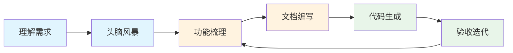

# 5.1.2 AI 如何包办开发——AI 协助产品开发全流程

### 一句话破题

AI 可以参与从"理解需求"到"生成代码"的全流程，但**你始终是决策者和验收者**。

### 全流程协作地图



| 阶段 | 你的职责 | AI 的角色 |
|------|----------|-----------|
| **理解需求** | 提供原始信息 | 帮你拆解、提问、澄清 |
| **头脑风暴** | 选择方向 | 提供创意、分析可行性 |
| **功能梳理** | 确定优先级 | 结构化整理、查缺补漏 |
| **文档编写** | 审核确认 | 生成初稿、格式规范 |
| **代码生成** | 验收审查 | 编写代码、处理细节 |
| **验收迭代** | 反馈问题 | 修复调整、优化改进 |

### 阶段一：理解需求

**场景**：你拿到一个模糊的需求，比如"做一个博客系统"。

**与 AI 的协作方式**：

```
你：我想做一个博客系统，请帮我梳理一下核心需求

AI 会帮你：
1. 提出澄清问题：面向个人还是多用户？需要评论吗？
2. 列出功能清单：文章管理、分类标签、用户系统...
3. 识别技术约束：SEO 要求、性能考量...
```

**你的决策点**：从 AI 提供的选项中选择，明确边界。

### 阶段二：头脑风暴

**场景**：需求明确后，需要决定具体的实现方案。

**与 AI 的协作方式**：

```
你：博客系统的文章编辑器，有哪些实现方案？

AI 会提供：
1. 方案对比：Markdown vs 富文本 vs 块编辑器
2. 优劣分析：学习成本、开发难度、用户体验
3. 推荐建议：根据你的场景推荐合适方案
```

**你的决策点**：选择最适合你场景的方案。

### 阶段三：功能梳理

**场景**：把散乱的想法整理成结构化的功能列表。

**与 AI 的协作方式**：

```
你：帮我把博客系统的功能整理成 MVP 和后续迭代两部分

AI 会帮你：
1. 按优先级分类：核心功能 vs 锦上添花
2. 识别依赖关系：哪些功能依赖其他功能
3. 估算复杂度：简单/中等/复杂
```

**输出示例**：

```markdown
## MVP（第一版）
- [ ] 文章 CRUD
- [ ] Markdown 编辑器
- [ ] 文章列表页

## V1.1（第二版）
- [ ] 分类和标签
- [ ] 搜索功能

## V1.2（第三版）
- [ ] 评论系统
- [ ] RSS 订阅
```

### 阶段四：文档编写

**场景**：把功能列表转化为 AI 能执行的结构化文档。

**与 AI 的协作方式**：

```
你：帮我为"文章 CRUD"功能写一份技术方案

AI 会生成：
1. 数据模型设计
2. API 接口定义
3. 前端页面规划
4. 边界情况处理
```

**你的审核点**：
- 数据结构是否合理？
- 接口设计是否符合 RESTful 规范？
- 是否遗漏了重要场景？

### 阶段五：代码生成

**场景**：基于文档让 AI 生成代码。

**与 AI 的协作方式**：

```
你：根据上面的技术方案，生成 Prisma schema 和 API 路由

AI 会生成：
- prisma/schema.prisma
- app/api/posts/route.ts
- app/api/posts/[id]/route.ts
```

**你的验收点**：
- 代码能运行吗？
- 逻辑正确吗？
- 符合项目规范吗？

### 阶段六：验收迭代

**场景**：发现问题，让 AI 修复。

**高效反馈的方式**：

```
❌ 不好的反馈："这个不对"

✅ 好的反馈："创建文章时，如果标题为空，应该返回 400 错误，
但现在返回的是 500。请检查参数校验逻辑。"
```

**迭代技巧**：
1. **一次只反馈一个问题**：避免 AI 遗漏
2. **提供具体的错误信息**：报错日志、截图
3. **说明期望的行为**：你希望它变成什么样

### 协作心法

1. **先粗后细**：从整体框架开始，逐步细化
2. **分步验收**：不要等全部完成再检查，每个阶段都要验收
3. **保持主动**：AI 是助手，不是老板，你来决定方向
4. **记录决策**：重要的选择记录下来，方便后续回顾
