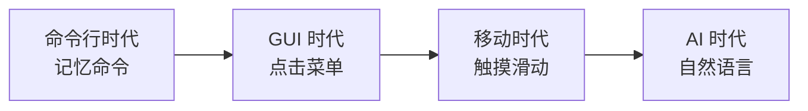

# 5.1.3 告别繁琐的点击——AI 重塑交互方式

### 一句话破题

AI 时代的交互设计核心：**用一句话完成过去需要十次点击的操作**。

### 交互范式的演变



| 时代 | 主要交互 | 学习成本 | 灵活性 |
|------|----------|----------|--------|
| 命令行 | 输入命令 | 高 | 高 |
| 图形界面 | 点击按钮 | 中 | 中 |
| 移动端 | 触摸手势 | 低 | 低 |
| AI | 自然语言 | 最低 | 最高 |

### 传统交互的痛点

以"导出 PDF"为例：

```
传统方式（6 步）：
1. 点击"文件"菜单
2. 找到"导出"选项
3. 选择"PDF 格式"
4. 设置页边距
5. 选择页面范围
6. 点击"确认"

AI 方式（1 步）：
"导出为 PDF，页边距 2cm，只要前 5 页"
```

### AI 交互的核心优势

#### 1. 意图直达

用户不需要知道功能藏在哪个菜单里，直接说出想要的结果：

```
传统：我要在哪里找到这个功能？
AI：我直接说我想要什么
```

#### 2. 参数内联

不需要一个个字段填写，所有条件在一句话里说完：

```
传统：填写表单 → 日期、金额、类别分别选择
AI："帮我统计上个月餐饮类支出超过 100 元的订单"
```

#### 3. 复合操作

多个步骤可以合并成一个指令：

```
传统：创建文件夹 → 移动文件 → 重命名
AI："把这些照片按日期分类整理到不同文件夹"
```

### 对开发者的启示

当你用 AI 辅助编程时，同样可以：

**传统方式**：
1. 打开文档查 API
2. 复制示例代码
3. 修改参数
4. 调试运行

**AI 方式**：
```
"用 Prisma 创建一个用户表，包含 id、邮箱、密码哈希、
创建时间，邮箱要唯一索引"
```

### 设计 AI 友好的产品

如果你要设计支持 AI 交互的产品，记住：

1. **减少必填项**：能推断的就不要强制填写
2. **支持自然语言输入**：在关键入口提供对话框
3. **提供快捷确认**：AI 理解后让用户一键确认
4. **优雅降级**：AI 无法理解时，平滑切换到传统表单
