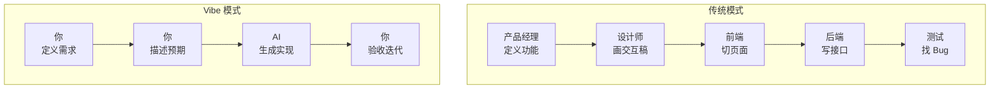

# 5.1.4 Vibe 如何改变产品设计

### 一句话破题

Vibe Coding 的核心理念：**你负责定义"做什么"和"做成什么样"，AI 负责"怎么做"**。

### 传统产品设计 vs Vibe 产品设计



| 维度 | 传统模式 | Vibe 模式 |
|------|----------|-----------|
| **关注点** | 实现细节 | 最终效果 |
| **沟通对象** | 团队成员 | AI 助手 |
| **迭代速度** | 天/周 | 分钟/小时 |
| **试错成本** | 高 | 低 |

### Vibe 设计的三个核心原则

#### 1. 效果驱动，而非过程驱动

**传统思维**：先想清楚每一步怎么做，再开始执行  
**Vibe 思维**：先描述想要的效果，让 AI 找最佳路径

```
传统："我需要一个状态管理库，考虑用 Redux 还是 Zustand..."

Vibe："我需要在多个组件间共享用户登录状态，
页面刷新后状态要保持，帮我实现"
```

#### 2. 渐进式细化，而非一次到位

**传统思维**：写一份完整的 PRD，然后开始开发  
**Vibe 思维**：先跑通最小闭环，再逐步添加细节

```
第一轮："做一个博客，能发文章就行"
第二轮："加上 Markdown 支持"
第三轮："文章要能分类和打标签"
第四轮："加个搜索功能"
```

#### 3. 快速验证，而非完美规划

**传统思维**：规划周全再动手，避免返工  
**Vibe 思维**：快速产出原型，通过实际使用发现问题

```
传统：花一周写 PRD → 一周设计 → 两周开发 → 发现需求理解错误

Vibe：30 分钟出原型 → 试用发现问题 → 10 分钟调整 → 再试用
```

### 对产品定义的影响

在 Vibe 模式下，产品定义的重点从"怎么实现"转向：

1. **用户是谁**：这个功能给谁用？
2. **场景是什么**：用户在什么情况下会用到？
3. **期望是什么**：用户希望得到什么结果？
4. **成功标准**：怎么判断这个功能做得好不好？

### 实践建议

1. **先做最小可用版本**：能跑起来的粗糙版本，比完美的规划更有价值
2. **让 AI 提供选项**：不确定时，让 AI 给出 2-3 种方案供你选择
3. **保持迭代节奏**：每次只改一小部分，验证通过再继续
4. **记录决策理由**：为什么选 A 不选 B，后面可能会用到

### 心态转变

从"我要把每个细节都想清楚"转变为"我先把核心需求说清楚，细节在迭代中完善"。

这不是偷懒，而是更高效的工作方式。你的时间应该花在思考"做什么"和"为什么做"上，而不是纠结于实现细节。
