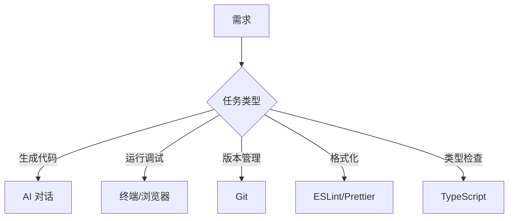

# 5.1.7 别把 AI 累死——工具调用策略

### 一句话破题

AI 不是万能的，**把合适的任务交给合适的工具**才是高效协作的秘诀。

### AI 擅长与不擅长的事

| AI 擅长 | AI 不擅长 |
|---------|-----------|
| 生成代码框架 | 复杂的多文件重构 |
| 解释概念和原理 | 实时调试运行时错误 |
| 提供实现思路 | 访问外部服务和 API |
| 代码审查建议 | 记住跨对话的状态 |
| 格式转换和规范化 | 精确的数学计算 |

### 工具分工策略



#### 1. AI 负责生成，工具负责验证

```
工作流程：
1. [AI] 生成代码
2. [TypeScript] 检查类型错误
3. [ESLint] 检查代码规范
4. [浏览器] 验证功能正确性
5. [AI] 根据反馈修复问题
```

#### 2. 不要让 AI 做重复劳动

```
❌ 每次都让 AI 重新格式化代码

✅ 配置好 Prettier，保存时自动格式化
```

#### 3. 利用 AI 的强项

```
✅ 生成 boilerplate 代码
✅ 解释复杂的报错信息
✅ 提供多种实现方案
✅ 代码重构建议
```

### 常见场景的工具选择

| 场景 | 推荐工具 | 原因 |
|------|----------|------|
| **创建新文件** | AI | 生成完整模板 |
| **小范围修改** | 手动编辑 | 比描述更快 |
| **批量重命名** | IDE 重构功能 | 更可靠 |
| **理解陌生代码** | AI | 擅长解释 |
| **性能优化** | Profiler + AI | AI 分析结果 |
| **依赖安装** | 包管理器 | 更可靠 |

### 高效协作模式

#### 模式一：AI 写骨架，你填细节

```
你：帮我创建一个用户管理的 CRUD API 骨架

AI：[生成基本结构]

你：[手动补充业务逻辑、错误处理等细节]
```

#### 模式二：你写代码，AI 审查

```
你：帮我审查这段代码，看看有什么问题

AI：[指出潜在问题和改进建议]

你：[根据建议修改]
```

#### 模式三：AI 解释，你决策

```
你：这个报错是什么意思？有哪些解决方案？

AI：[解释原因，提供 2-3 种方案]

你：[选择合适的方案执行]
```

### 避免的反模式

**反模式 1：让 AI 做它不擅长的事**

```
❌ "帮我连接数据库测试一下"
（AI 无法执行实际操作）

✅ "帮我写一个测试数据库连接的脚本，我来运行"
```

**反模式 2：过度依赖 AI**

```
❌ 每个小改动都问 AI

✅ 简单修改直接做，复杂问题才请教 AI
```

**反模式 3：不给 AI 足够信息**

```
❌ "这个不行"

✅ "运行报错：TypeError: Cannot read property 'id' of undefined
在 app/api/posts/route.ts 第 15 行"
```

### 建议的工具链配置

```json
// package.json
{
  "scripts": {
    "dev": "next dev",
    "lint": "eslint .",
    "format": "prettier --write .",
    "typecheck": "tsc --noEmit"
  }
}
```

在提交代码前运行这些检查，而不是期望 AI 帮你发现所有问题。
