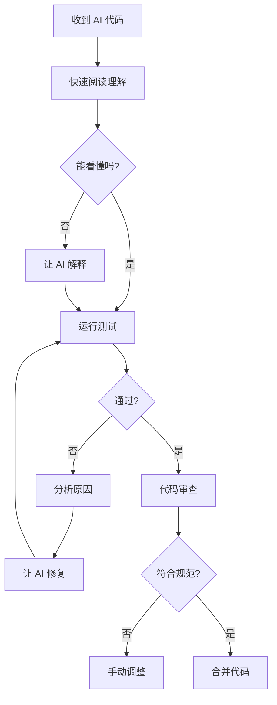

# 5.1.9 AI 写的代码能用吗——代码质量控制

### 一句话破题

AI 生成的代码**不能直接用**，必须经过审查、测试和优化。

### AI 代码的常见问题

| 问题类型 | 表现 | 风险等级 |
|----------|------|----------|
| **幻觉 API** | 使用不存在的库或方法 | 高 |
| **过时语法** | 使用旧版本的写法 | 中 |
| **逻辑漏洞** | 边界情况未处理 | 高 |
| **安全隐患** | 敏感信息暴露、注入风险 | 严重 |
| **性能问题** | 低效算法、重复查询 | 中 |
| **风格不一致** | 与项目规范不符 | 低 |

### 审查清单

收到 AI 生成的代码后，逐项检查：

#### 1. 依赖检查

```
□ 引入的库在 package.json 中存在吗？
□ API 方法在当前版本中存在吗？
□ 是否使用了正确的导入路径？
```

#### 2. 逻辑检查

```
□ 空值/undefined 处理了吗？
□ 数组为空的情况处理了吗？
□ 异步操作有错误处理吗？
□ 循环有终止条件吗？
```

#### 3. 安全检查

```
□ 用户输入有验证和过滤吗？
□ 敏感信息（密钥、密码）没有硬编码吧？
□ SQL/NoSQL 注入风险排除了吗？
□ XSS 风险排除了吗？
```

#### 4. 性能检查

```
□ 数据库查询有必要的索引吗？
□ N+1 查询问题解决了吗？
□ 大数据量有分页吗？
□ 没有不必要的重复计算吧？
```

### 审查流程



### 实战示例

**AI 生成的代码**：

```typescript
// 获取用户列表
export async function GET() {
  const users = await prisma.user.findMany()
  return Response.json(users)
}
```

**问题分析**：

1. ❌ 没有分页，数据量大时会崩溃
2. ❌ 返回了所有字段，可能暴露敏感信息
3. ❌ 没有错误处理

**修复后**：

```typescript
export async function GET(request: Request) {
  try {
    const { searchParams } = new URL(request.url)
    const page = parseInt(searchParams.get('page') || '1')
    const limit = parseInt(searchParams.get('limit') || '10')
    
    const users = await prisma.user.findMany({
      skip: (page - 1) * limit,
      take: limit,
      select: {
        id: true,
        name: true,
        email: true,
        // 不返回 password 等敏感字段
      }
    })
    
    return Response.json(users)
  } catch (error) {
    console.error('Failed to fetch users:', error)
    return Response.json(
      { error: 'Internal server error' },
      { status: 500 }
    )
  }
}
```

### 培养代码审查能力

1. **多看好代码**：阅读开源项目，学习最佳实践
2. **理解原理**：知道为什么要这样写，而不只是照搬
3. **总结经验**：记录 AI 常犯的错误，下次重点检查
4. **持续学习**：关注安全公告、最佳实践更新

### 建立审查习惯

```
每次收到 AI 代码后：
1. 先不要急着运行
2. 花 2 分钟快速审查
3. 有疑问就问 AI 为什么这样写
4. 运行并观察行为是否符合预期
5. 通过测试后再合并
```
