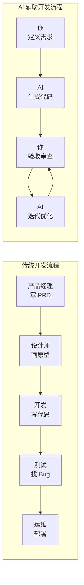

# 5.1 先把想做的说明白——AI 时代产品开发理念

在传统开发中，"想法"到"产品"的路径是：**想法 → 需求文档 → 设计稿 → 代码 → 测试 → 上线**。每一步都需要专业人员，每一步都可能出现理解偏差。

在 AI 时代，这条路径被大幅压缩：**想法 → 结构化描述 → AI 生成代码 → 人工验收 → 迭代优化**。

### 核心转变：从"执行者"到"决策者"

| 角色 | 传统模式 | AI 时代 |
|------|----------|---------|
| **你的职责** | 写代码、调 Bug | 定义需求、验收结果 |
| **核心能力** | 编程技能 | 问题定义、沟通表达 |
| **时间分配** | 80% 编码、20% 思考 | 30% 描述、70% 验收与迭代 |

### 本节目标

学完本节，你将掌握：

1. **AI Native 思维**：理解 AI 应用与传统应用的本质区别
2. **全流程协作**：学会在"理解需求 → 功能设计 → 代码生成 → 验收迭代"各环节与 AI 高效配合
3. **Prompt 工程基础**：掌握与 AI 有效沟通的核心原则
4. **质量把控**：学会审查 AI 产出、识别错误、提供反馈

**记住**：AI 是你的高效执行者，但你才是产品的主人。你需要清晰地知道"要做什么"、"为什么做"、"做成什么样"，AI 才能帮你把想法变成现实。
