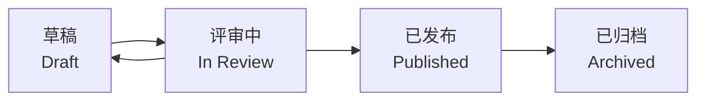

# 5.2.1 这份文档算数吗——文档状态管理

### 一句话破题

文档状态告诉所有人：**这份文档能不能当真**。

### 为什么需要状态管理

没有状态标识的文档会导致：

- **误用过时信息**：以为是最新版，其实已经废弃
- **提前实现**：按照还没确认的草稿开始开发
- **重复劳动**：不知道别人已经在改这份文档了

### 常见的文档状态



| 状态 | 含义 | 能否执行 |
|------|------|----------|
| **草稿** | 作者还在写，内容不完整 | ❌ 不能 |
| **评审中** | 等待他人审核确认 | ❌ 不能 |
| **已发布** | 经过确认，可以作为依据 | ✅ 可以 |
| **已归档** | 历史版本，仅供参考 | ❌ 不能 |

### 在文档中标注状态

**方式一：文档头部元数据**

```markdown
status: draft  # draft | review | published | archived
author: 张三
last_updated: 2024-01-15
```

**方式二：显眼的提示框**

```markdown
> ⚠️ **文档状态：草稿**
> 
> 本文档尚未完成评审，内容可能发生变化。
> 请勿基于此文档进行开发。
```

**方式三：文件名约定**

```
feature-login.md          # 已发布
feature-login.draft.md    # 草稿
feature-login.v1.md       # 归档的历史版本
```

### 状态流转规则

```
1. 新建文档 → 草稿
2. 草稿完成 → 提交评审
3. 评审通过 → 发布
4. 评审不通过 → 返回草稿修改
5. 需求变更 → 已发布变为草稿，重新评审
6. 功能下线 → 归档
```

### 对 AI 协作的影响

当你把文档喂给 AI 时：

- **草稿**：告诉 AI "这是初稿，帮我补充完善"
- **已发布**：告诉 AI "按照这个文档实现代码"

```
示例 Prompt：

这是一份已发布的 PRD 文档，请严格按照文档要求生成代码，
不要自行添加或修改功能。

[文档内容]
```

### 实用建议

1. **简单项目**：草稿 → 发布 两个状态就够了
2. **团队协作**：加上"评审中"状态，明确责任
3. **长期维护**：加上"归档"状态，保留历史记录
4. **状态要显眼**：放在文档开头，一眼就能看到
