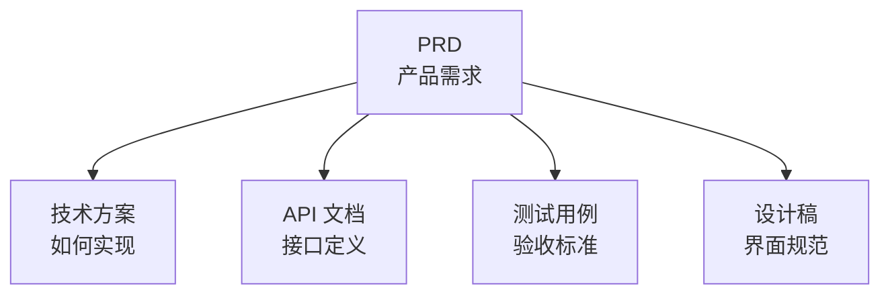

# 5.2.3 去哪里找相关资料——相关文档索引

### 一句话破题

相关文档索引让你知道：**这个功能还有哪些配套资料**。

### 为什么需要文档索引

一个功能通常涉及多份文档：



没有索引时，你需要四处寻找相关资料。有了索引，**一切关联文档一目了然**。

### 索引的标准格式

```markdown
## 相关文档

| 文档类型 | 链接 | 说明 |
|----------|------|------|
| 技术方案 | [user-auth-tech.md](./tech/user-auth-tech.md) | 认证流程技术设计 |
| API 文档 | [api/auth.md](./api/auth.md) | 登录注册接口定义 |
| 测试用例 | [tests/auth.md](./tests/auth.md) | 功能测试用例 |
| 设计稿 | [Figma 链接](https://figma.com/...) | UI 设计规范 |
```

### 常见的关联文档类型

| 类型 | 内容 | 谁负责 |
|------|------|--------|
| **PRD** | 功能需求描述 | 产品/你自己 |
| **技术方案** | 实现思路、架构设计 | 开发/你自己 |
| **API 文档** | 接口定义、参数说明 | 后端/你自己 |
| **测试用例** | 验收标准、边界测试 | 测试/你自己 |
| **设计稿** | UI 规范、交互说明 | 设计/你自己 |

### 在 Vibe Coding 中的应用

对于个人项目，可以简化文档结构：

```
docs/
├── features/
│   ├── user-auth/
│   │   ├── prd.md          # 需求文档
│   │   ├── tech-spec.md    # 技术方案
│   │   └── api.md          # API 定义
│   └── blog-posts/
│       ├── prd.md
│       └── tech-spec.md
└── shared/
    └── glossary.md         # 全局术语表
```

### 索引的维护原则

1. **创建时就添加**：新建文档时，同时更新相关文档的索引
2. **删除时要清理**：删除文档时，检查并移除失效的链接
3. **定期检查**：确保链接仍然有效
4. **双向链接**：A 链接到 B，B 也应该链接到 A

### 对 AI 协作的影响

向 AI 提供相关文档，能让它更好地理解全局：

```
我要实现用户认证功能。

相关文档：
- PRD: [粘贴内容或链接]
- 技术方案: [粘贴内容或链接]
- 已有的 API 定义: [粘贴内容或链接]

请基于以上文档生成认证相关的代码。
```

### 实用建议

1. **使用相对路径**：`./tech-spec.md` 而不是绝对路径
2. **说明文档用途**：不仅给链接，还要说明这份文档是干什么的
3. **区分必读和参考**：标注哪些是必须阅读的，哪些是可选参考的
