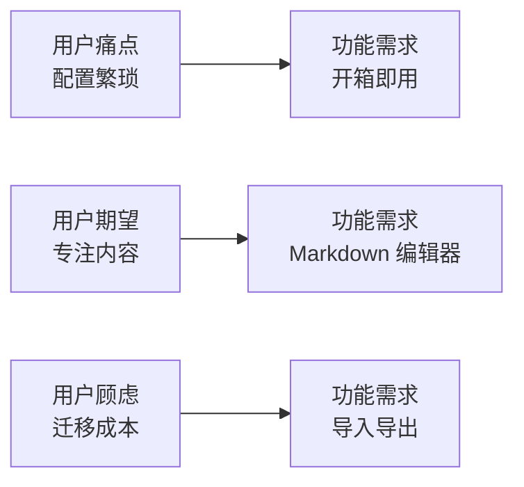

# 5.3.3 用户到底想要什么——AI 协助用户洞察

### 一句话破题

让 AI 帮你**站在用户角度思考**，发现你作为开发者看不到的需求。

### 为什么需要用户洞察

开发者视角和用户视角往往存在偏差：

| 你以为的需求 | 用户真实的需求 |
|--------------|----------------|
| 功能越多越好 | 核心功能好用就行 |
| 界面要炫酷 | 找得到想要的功能 |
| 技术要先进 | 加载速度快、不卡 |
| 数据结构要完美 | 操作步骤要少 |

### 用 AI 构建用户画像

**Prompt 模板**：

```markdown
我要做一个 [产品描述]。

请帮我分析目标用户：
1. 用户是谁？（人口统计特征）
2. 用户在什么场景下使用？
3. 用户的核心痛点是什么？
4. 用户期望获得什么价值？
5. 用户可能的顾虑是什么？
```

**示例对话**：

```
你：我要做一个个人博客系统，目标用户是技术人员

AI：## 用户画像分析

### 1. 用户是谁
- 年龄：25-40 岁
- 职业：程序员、技术经理、技术自媒体
- 技术水平：熟悉 Markdown、Git，有一定开发能力
- 特点：追求效率，对技术有洁癖

### 2. 使用场景
- 记录技术学习笔记和踩坑经验
- 分享开源项目和技术方案
- 建立个人技术品牌
- 求职时展示技术能力

### 3. 核心痛点
- 第三方平台审核严格、限制多
- 担心平台关闭导致内容丢失
- 想要自定义域名和样式
- 现有方案（如 Hexo）配置繁琐

### 4. 期望价值
- 快速发布文章，专注内容
- 良好的 SEO，被搜索引擎收录
- 代码高亮、Markdown 支持
- 稳定运行，不用操心维护

### 5. 可能顾虑
- 自建博客的服务器成本
- 维护精力（更新、安全）
- 迁移成本（已有内容如何导入）
```

### 从用户画像推导功能

用户画像不是终点，而是推导功能的起点：



**痛点到功能的映射**：

| 用户痛点 | 对应功能 |
|----------|----------|
| 平台审核多 | 完全自主可控 |
| 担心丢失 | 本地备份、导出 |
| 配置繁琐 | 一键部署、默认配置 |
| SEO 差 | 自动生成 sitemap、meta |

### 用 AI 验证需求

在确定功能后，可以让 AI 从用户角度验证：

```
你：我计划在博客系统中实现以下功能：
- Markdown 编辑器
- 文章分类
- 评论系统

请从用户角度评估，有没有遗漏的重要需求？

AI：从用户角度，还建议考虑：

## 高优先级遗漏
1. **搜索功能**：文章多了之后，用户需要快速找到历史内容
2. **草稿保存**：写长文时意外关闭页面，内容不能丢失

## 中优先级建议
3. **RSS 订阅**：技术用户习惯用 RSS 阅读器
4. **代码块复制**：一键复制代码片段

## 可后续迭代
5. **阅读统计**：了解哪些文章受欢迎
6. **系列文章**：将相关文章组织成系列
```

### 用户访谈的 AI 替代

如果没有条件做真实用户访谈，可以让 AI 模拟：

```
你：请扮演一个想要搭建技术博客的程序员，回答我的问题。

AI：好的，我是一名有 5 年经验的后端工程师，最近想搭建一个技术博客...

你：你最看重博客系统的什么特性？

AI：首先是 Markdown 支持，这是必须的。其次是部署要简单，
我不想花太多时间在运维上。另外，加载速度要快，
我自己访问一个网站如果超过 3 秒就会关掉...
```

### 实用建议

1. **区分用户和客户**：使用产品的人和付费的人可能不同
2. **避免自我代入**：你不是典型用户，你的需求不代表大多数
3. **关注行为而非态度**：用户说"我想要 X"不一定代表他真的会用
4. **持续验证**：上线后收集真实反馈，修正用户画像
