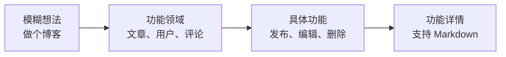
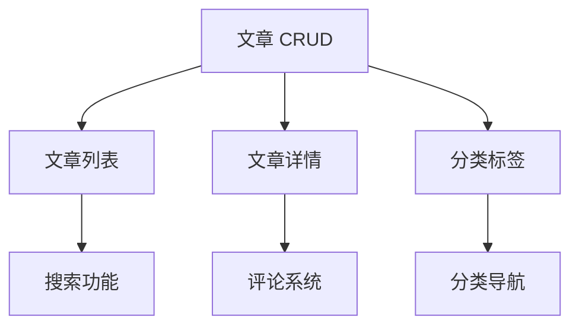

# 5.3.4 从想法到功能列表——AI 辅助功能梳理

### 一句话破题

让 AI 帮你把散乱的想法**整理成结构化、可执行的功能清单**。

### 从模糊到具体的转化



### 让 AI 帮你梳理功能

**Prompt 模板**：

```markdown
我要做一个 [产品描述]。

请帮我梳理功能列表：
1. 按功能模块分类
2. 每个功能说明：功能描述、用户价值、实现复杂度
3. 标注哪些是核心功能，哪些是可选功能
```

**示例对话**：

```
你：我要做一个个人博客系统

AI：## 功能清单

### 模块一：文章管理
| 功能 | 描述 | 用户价值 | 复杂度 | 优先级 |
|------|------|----------|--------|--------|
| 创建文章 | 新建文章并保存 | 核心功能 | ⭐ | P0 |
| 编辑文章 | 修改已发布的文章 | 核心功能 | ⭐ | P0 |
| 删除文章 | 移除不需要的文章 | 核心功能 | ⭐ | P0 |
| 草稿保存 | 未发布的文章保存为草稿 | 防止内容丢失 | ⭐ | P1 |
| 定时发布 | 设定发布时间 | 内容规划 | ⭐⭐ | P2 |

### 模块二：内容展示
| 功能 | 描述 | 用户价值 | 复杂度 | 优先级 |
|------|------|----------|--------|--------|
| 文章列表 | 展示所有已发布文章 | 核心功能 | ⭐ | P0 |
| 文章详情 | 单篇文章的完整内容 | 核心功能 | ⭐ | P0 |
| 分类导航 | 按类别筛选文章 | 内容组织 | ⭐ | P1 |
| 标签系统 | 多维度标记文章 | 内容发现 | ⭐ | P1 |
| 搜索功能 | 关键词检索文章 | 快速定位 | ⭐⭐ | P1 |

### 模块三：用户交互
| 功能 | 描述 | 用户价值 | 复杂度 | 优先级 |
|------|------|----------|--------|--------|
| 评论系统 | 读者留言互动 | 社区感 | ⭐⭐ | P2 |
| 点赞/收藏 | 标记喜欢的文章 | 用户参与 | ⭐ | P2 |
| 分享功能 | 分享到社交平台 | 内容传播 | ⭐ | P2 |
```

### 功能的分层结构

将功能按层次组织，便于后续开发：

```
博客系统
├── 核心功能（P0 - 必须有）
│   ├── 文章 CRUD
│   ├── 文章列表/详情页
│   └── Markdown 编辑器
├── 重要功能（P1 - 应该有）
│   ├── 分类和标签
│   ├── 搜索
│   ├── 草稿保存
│   └── SEO 优化
├── 增强功能（P2 - 可以有）
│   ├── 评论系统
│   ├── 阅读统计
│   └── RSS 订阅
└── 未来功能（P3 - 后续考虑）
    ├── 多作者支持
    ├── 会员订阅
    └── Newsletter
```

### 功能依赖分析

有些功能依赖其他功能，需要理清顺序：



**让 AI 帮你分析依赖**：

```
你：帮我分析这些功能的依赖关系和开发顺序

AI：## 依赖分析

### 第一阶段（无依赖）
- 文章 CRUD：基础功能，其他都依赖它
- 用户认证：如果需要后台管理

### 第二阶段（依赖第一阶段）
- 文章列表/详情：依赖文章数据
- 分类标签：依赖文章模型

### 第三阶段（依赖第二阶段）
- 搜索功能：需要文章数据
- 分类导航：需要分类数据

### 第四阶段（独立增强）
- 评论系统：可独立开发
- RSS 订阅：依赖文章列表
```

### 功能描述的规范

每个功能应包含以下信息：

```markdown
## 功能名称

### 功能描述
一句话说明这个功能做什么

### 用户故事
作为 [用户类型]，我希望 [做什么]，以便 [获得什么价值]

### 验收标准
- [ ] 条件 1：结果 1
- [ ] 条件 2：结果 2

### 边界情况
- 情况 1：如何处理
- 情况 2：如何处理
```

**示例**：

```markdown
## 文章发布

### 功能描述
用户可以创建并发布博客文章

### 用户故事
作为博主，我希望能够撰写并发布文章，以便分享我的技术经验

### 验收标准
- [ ] 可以输入标题（必填，1-100 字符）
- [ ] 可以输入正文（必填，支持 Markdown）
- [ ] 可以选择分类（可选，单选）
- [ ] 可以添加标签（可选，多选，最多 5 个）
- [ ] 点击发布后，文章在列表页可见

### 边界情况
- 标题为空：提示"请输入标题"
- 正文为空：提示"请输入内容"
- 网络断开：保存到本地草稿
```

### 实用建议

1. **先粗后细**：先列大模块，再拆小功能
2. **用户视角**：每个功能都要回答"给用户带来什么价值"
3. **标注优先级**：不是所有功能都一样重要
4. **保持灵活**：功能列表会随着开发迭代调整
