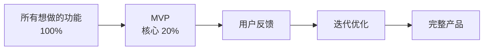

# 5.3.5 哪些功能最重要——MVP 视角收敛

### 一句话破题

MVP 不是"做一个简陋的版本"，而是**用最小成本验证核心价值**。

### 什么是 MVP

MVP（Minimum Viable Product）= 最小可行产品



**MVP 的核心理念**：
- 不是做一个"半成品"
- 而是做一个"能验证想法的完整闭环"
- 用最少的功能，验证用户是否真的需要这个产品

### 如何定义 MVP

**Prompt 模板**：

```markdown
我要做一个 [产品描述]，功能列表如下：
[功能列表]

请帮我定义 MVP：
1. 哪些功能是 MVP 必须有的？
2. 判断标准是什么？
3. MVP 需要多长时间可以完成？
```

**示例对话**：

```
你：我要做一个博客系统，功能列表：
- 文章 CRUD
- Markdown 编辑器
- 分类标签
- 评论系统
- 搜索功能
- RSS 订阅
- 阅读统计

请帮我定义 MVP

AI：## MVP 定义

### MVP 必须包含
| 功能 | 理由 | 预计工时 |
|------|------|----------|
| 文章创建/编辑/删除 | 核心功能，没有就不是博客 | 4h |
| Markdown 编辑器 | 目标用户的基本预期 | 2h |
| 文章列表和详情页 | 内容展示的基础 | 3h |

**MVP 工时估算：约 9 小时（1-2 天）**

### MVP 可以不包含
| 功能 | 理由 | 延后优先级 |
|------|------|------------|
| 分类标签 | 文章少时不需要 | V1.1 |
| 评论系统 | 可用第三方替代 | V1.2 |
| 搜索功能 | 文章少时不急需 | V1.1 |
| RSS 订阅 | 增强功能 | V1.2 |
| 阅读统计 | 锦上添花 | V1.3 |

### 判断标准
一个博客的 MVP 能回答这个问题：
**"我能不能用它写文章并让别人看到？"**
- 能写 ✓
- 能保存 ✓
- 能展示 ✓
→ MVP 达成
```

### MVP 判断的四个问题

在决定某个功能是否进入 MVP 时，问自己：

```
1. 没有这个功能，产品还能用吗？
   - 能用 → 不进 MVP
   - 不能用 → 进 MVP

2. 这个功能能被其他方式替代吗？
   - 能替代 → 不进 MVP（如：评论可用 Giscus 替代）
   - 不能替代 → 进 MVP

3. 这个功能是解决核心问题还是锦上添花？
   - 核心问题 → 进 MVP
   - 锦上添花 → 不进 MVP

4. 实现这个功能需要多少成本？
   - 成本低且有价值 → 进 MVP
   - 成本高 → 延后
```

### 优先级排序矩阵

使用重要性和紧急性两个维度来排序：

```
         紧急
          ↑
    P0    |   P1
  (立即做) | (尽快做)
    ------+------
    P2    |   P3
  (计划做) | (以后再说)
          |
  ← 不重要 ─┼─ 重要 →
          |
        不紧急
```

**让 AI 帮你排序**：

```
你：请帮我给这些功能排优先级：
[功能列表]

排序标准：
- 用户价值：对用户有多重要
- 实现成本：需要多少开发时间
- 依赖关系：是否依赖其他功能

AI：## 优先级排序

### P0（MVP 必须）
1. 文章 CRUD - 价值高/成本低/无依赖
2. 文章列表 - 价值高/成本低/依赖 CRUD

### P1（第二版）
3. 分类标签 - 价值中/成本低/依赖 CRUD
4. 搜索 - 价值高/成本中/依赖列表

### P2（第三版）
5. 评论 - 价值中/成本高/可替代
6. RSS - 价值低/成本低/依赖列表

### P3（以后考虑）
7. 阅读统计 - 价值低/成本中
```

### MVP 的验收标准

MVP 完成的标志是能够回答核心问题：

| 产品类型 | 核心问题 | MVP 验收标准 |
|----------|----------|--------------|
| 博客系统 | 能写文章并展示吗？ | 发布一篇文章并能访问 |
| 电商网站 | 能下单购买吗？ | 完成一次完整购买流程 |
| 社交应用 | 能发消息给朋友吗？ | 发送并接收一条消息 |
| 工具应用 | 能解决核心问题吗？ | 用工具完成一次任务 |

### 常见误区

**误区 1：MVP = 简陋版**
```
❌ 界面丑、Bug 多、体验差的"能用就行"版本
✅ 功能精简但体验完整的"小而美"版本
```

**误区 2：什么都想放进 MVP**
```
❌ "这个功能很简单，顺便加上吧"
✅ "这个功能对验证核心价值有帮助吗？"
```

**误区 3：MVP 完成后就结束**
```
❌ 发布 MVP 后就不管了
✅ MVP 是起点，收集反馈、持续迭代
```

### 实用建议

1. **先做减法**：列完功能后，问"哪些可以不做"
2. **一周原则**：MVP 最好能在一周内完成
3. **用户视角**：MVP 要能让用户完成一个完整的任务
4. **快速迭代**：MVP 上线后，根据反馈快速优化
