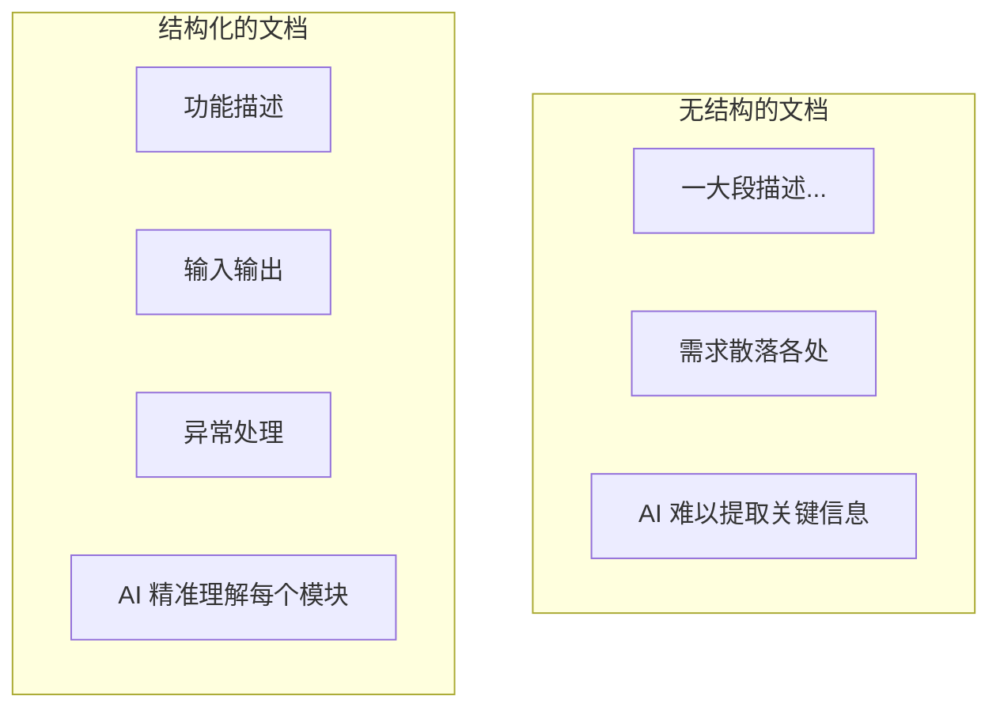

# 5.4.1 为什么格式很重要——结构化 PRD

### 一句话破题

结构化的文档让 AI 能**准确定位信息**，而不是在模糊描述中猜测。

### 结构化的价值



### 推荐的文档结构

```markdown
# [功能名称]

## 功能概述
一句话说明这个功能做什么

## 用户故事
作为 [角色]，我希望 [做什么]，以便 [获得什么价值]

## 功能详情

### 输入
- 字段 1：类型，必填/可选，约束条件
- 字段 2：类型，必填/可选，约束条件

### 输出
- 成功时：返回数据结构
- 失败时：错误码和错误信息

### 业务规则
1. 规则 1
2. 规则 2

### 异常处理
| 异常情况 | 处理方式 |
|----------|----------|
| 情况 1 | 响应 1 |
| 情况 2 | 响应 2 |

## 技术约束
- 使用什么技术栈
- 遵循什么规范

## 验收标准
- [ ] 标准 1
- [ ] 标准 2
```

### 实际示例

**功能**：用户注册

```markdown
# 用户注册

## 功能概述
新用户通过邮箱和密码创建账号

## 用户故事
作为新访客，我希望能注册一个账号，以便保存我的个人设置

## 功能详情

### 输入
| 字段 | 类型 | 必填 | 约束 |
|------|------|------|------|
| email | string | 是 | 有效邮箱格式 |
| password | string | 是 | 8-20 字符，至少包含字母和数字 |
| name | string | 否 | 最长 50 字符 |

### 输出
成功：
```json
{
  "id": "user_123",
  "email": "user@example.com",
  "name": "张三",
  "createdAt": "2024-01-15T10:00:00Z"
}
```

失败：
```json
{
  "error": "EMAIL_EXISTS",
  "message": "该邮箱已被注册"
}
```

### 业务规则
1. 邮箱不区分大小写
2. 密码存储前必须 hash
3. 注册后发送验证邮件

### 异常处理
| 异常情况 | HTTP 状态码 | 错误码 |
|----------|-------------|--------|
| 邮箱已存在 | 409 | EMAIL_EXISTS |
| 邮箱格式错误 | 400 | INVALID_EMAIL |
| 密码不符合要求 | 400 | WEAK_PASSWORD |

## 技术约束
- API 路径：POST /api/auth/register
- 使用 bcrypt 加密密码
- 返回 JWT token

## 验收标准
- [ ] 有效输入可以成功注册
- [ ] 重复邮箱返回正确错误
- [ ] 密码在数据库中是加密的
```

### 模块化的好处

将文档分成独立模块后：

1. **AI 更容易理解**：每个模块职责明确
2. **便于局部更新**：修改一处不影响其他
3. **方便验收**：逐个模块检查是否完成
4. **支持迭代**：可以先实现核心模块

### 常见的结构问题

**问题 1：信息混在一起**
```
❌ "用户输入邮箱和密码，如果邮箱已存在就报错，密码要加密..."

✅ 分开写：
- 输入：邮箱、密码
- 异常：邮箱已存在 → 报错
- 技术约束：密码要加密
```

**问题 2：缺少关键信息**
```
❌ "实现用户登录功能"

✅ 补充完整：
- 输入：邮箱、密码
- 输出：用户信息 + token
- 异常：密码错误、用户不存在
- 技术：JWT 有效期 7 天
```

### 实用建议

1. **使用模板**：每次写文档都用同样的结构
2. **先列框架再填内容**：先写好标题，再逐个补充
3. **保持一致性**：项目内所有文档用同样的格式
4. **定期回顾**：检查文档结构是否需要优化
