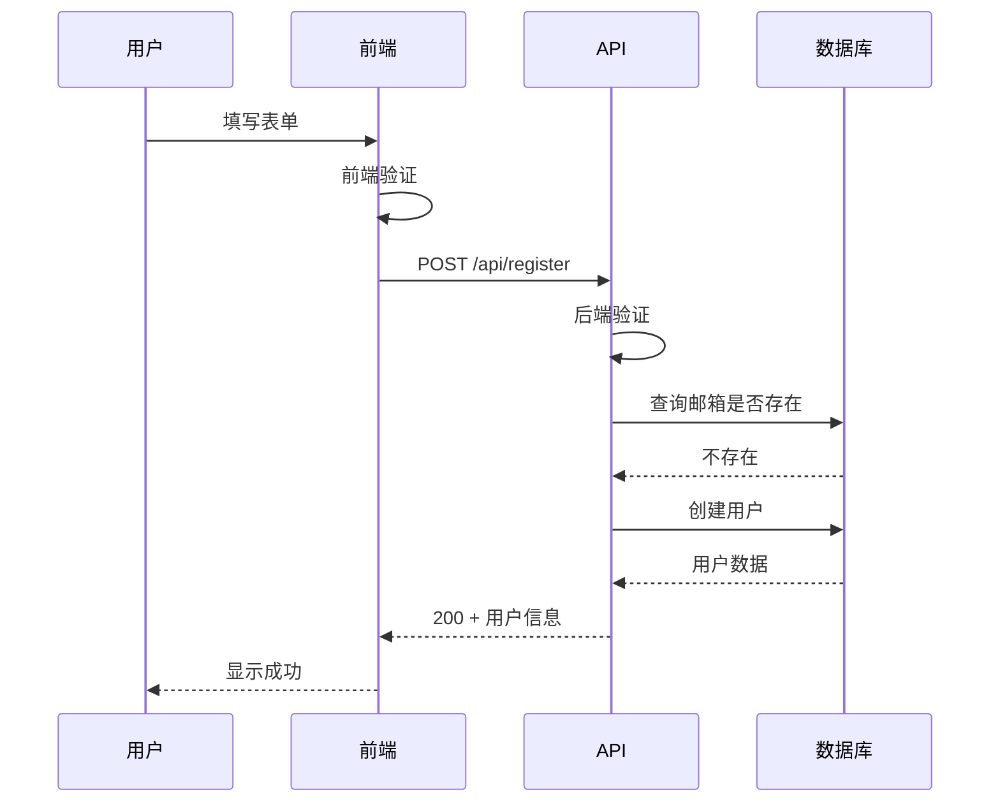

# 5.4.2 数据从哪来，到哪去——输入输出定义

### 一句话破题

明确的输入输出定义，让 AI 知道**接收什么数据、返回什么结果**。

### 为什么输入输出很重要


模糊的输入输出定义是代码错误的主要来源：

| 模糊的定义 | AI 可能的理解 | 你期望的 |
|------------|---------------|----------|
| "接收用户数据" | 只有 name？ | email + password + name |
| "返回用户信息" | 包括密码？ | 不包括敏感字段 |
| "分页返回" | 一页多少条？ | 10 条/页 |

### 输入定义的要素

每个输入字段应该说明：

```markdown
| 字段 | 类型 | 必填 | 默认值 | 约束条件 | 说明 |
|------|------|------|--------|----------|------|
| email | string | 是 | - | 有效邮箱格式 | 用户邮箱 |
| password | string | 是 | - | 8-20 字符 | 登录密码 |
| page | number | 否 | 1 | >= 1 | 页码 |
| limit | number | 否 | 10 | 1-100 | 每页条数 |
```

### 输出定义的要素

成功和失败要分开定义：

```markdown
### 成功响应 (200)
```json
{
  "data": {
    "id": "string",
    "email": "string",
    "name": "string | null",
    "createdAt": "ISO8601 时间戳"
  },
  "token": "string (JWT)"
}
```

### 失败响应
```json
{
  "error": {
    "code": "ERROR_CODE",
    "message": "人类可读的错误描述"
  }
}
```
```

### 数据流的完整描述

用图表展示数据的流转：



### 常见的数据类型说明

```markdown
## 数据类型约定

### 基础类型
- string: 字符串
- number: 数字（整数或浮点）
- boolean: true/false
- null: 空值

### 复合类型
- array<T>: T 类型的数组
- object: 键值对对象

### 特殊类型
- id: 唯一标识符（如 "user_abc123"）
- email: 有效邮箱格式
- url: 有效 URL
- datetime: ISO8601 格式时间戳
- uuid: UUID 格式字符串
```

### 输入验证规则

明确每个字段的验证规则：

```markdown
### email
- 格式：xxx@xxx.xxx
- 大小写不敏感
- 最大长度：255 字符

### password
- 长度：8-20 字符
- 必须包含：至少 1 个字母 + 1 个数字
- 可选包含：特殊字符 !@#$%^&*

### name
- 长度：1-50 字符
- 允许中文、英文、数字
- 不允许特殊字符
```

### 分页输出格式

分页是常见场景，建议标准化：

```markdown
### 分页响应格式
```json
{
  "data": [...],           // 当前页数据
  "pagination": {
    "page": 1,             // 当前页码
    "limit": 10,           // 每页条数
    "total": 100,          // 总条数
    "totalPages": 10       // 总页数
  }
}
```
```

### 实际案例：文章列表 API

```markdown
## 获取文章列表

### 请求
- 方法：GET
- 路径：/api/posts

### 输入参数（Query）
| 参数 | 类型 | 必填 | 默认值 | 说明 |
|------|------|------|--------|------|
| page | number | 否 | 1 | 页码 |
| limit | number | 否 | 10 | 每页条数 |
| category | string | 否 | - | 分类筛选 |
| search | string | 否 | - | 关键词搜索 |

### 成功响应 (200)
```json
{
  "data": [
    {
      "id": "post_123",
      "title": "文章标题",
      "excerpt": "摘要...",
      "author": {
        "id": "user_456",
        "name": "张三"
      },
      "createdAt": "2024-01-15T10:00:00Z"
    }
  ],
  "pagination": {
    "page": 1,
    "limit": 10,
    "total": 50,
    "totalPages": 5
  }
}
```
```

### 实用建议

1. **用表格列出字段**：比文字描述更清晰
2. **给出示例数据**：让 AI 知道期望的格式
3. **区分必填和可选**：避免遗漏验证
4. **说明边界值**：最大长度、范围限制
5. **保持一致性**：整个项目用相同的格式约定
