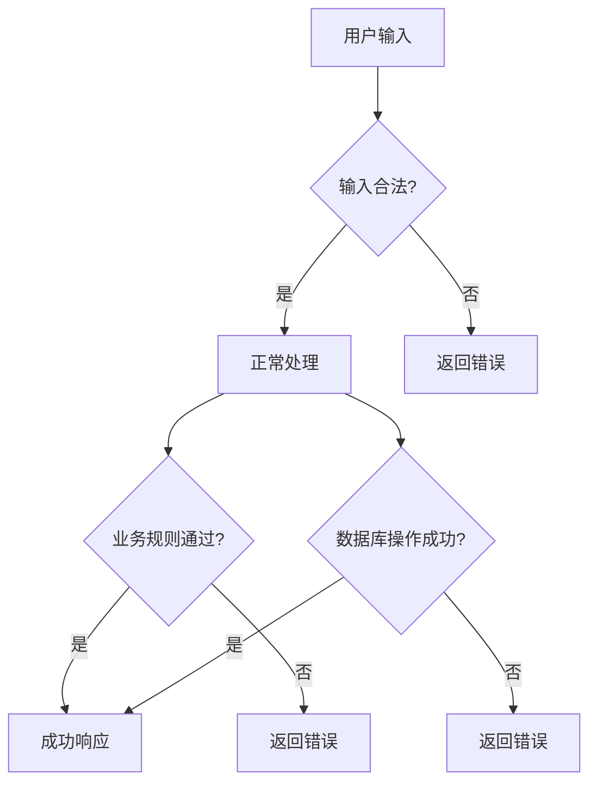

# 5.4.3 万一...怎么办——边界条件与异常处理

### 一句话破题

预判所有可能出错的情况，让 AI 知道**每种异常该如何响应**。

### 为什么边界条件很重要

正常流程只占代码的 20%，异常处理占 80%：



如果不定义边界条件，AI 生成的代码可能：
- 遗漏重要的错误处理
- 返回不一致的错误格式
- 产生安全漏洞

### 边界条件的分类

```markdown
## 边界条件清单

### 1. 输入边界
- 必填字段为空
- 字段格式错误
- 字段超出范围
- 非法字符

### 2. 业务边界
- 资源不存在
- 资源已存在（重复）
- 无权限访问
- 超出配额限制

### 3. 系统边界
- 数据库连接失败
- 第三方服务超时
- 服务器内部错误
```

### 异常处理的标准格式

每种异常都要说明：

| 异常情况 | HTTP 状态码 | 错误码 | 错误消息 | 处理建议 |
|----------|-------------|--------|----------|----------|
| 邮箱为空 | 400 | MISSING_EMAIL | 请输入邮箱 | 前端表单验证 |
| 邮箱格式错误 | 400 | INVALID_EMAIL | 邮箱格式不正确 | 前端正则校验 |
| 邮箱已存在 | 409 | EMAIL_EXISTS | 该邮箱已被注册 | 提示去登录 |
| 用户不存在 | 404 | USER_NOT_FOUND | 用户不存在 | - |
| 密码错误 | 401 | INVALID_PASSWORD | 密码错误 | 不透露具体原因 |

### 错误响应的统一格式

```json
{
  "error": {
    "code": "ERROR_CODE",
    "message": "给用户看的友好提示",
    "details": {
      "field": "email",
      "reason": "格式不正确"
    }
  }
}
```

### 实际案例：用户登录

```markdown
## 登录接口异常处理

### 输入验证
| 条件 | 响应 |
|------|------|
| 邮箱为空 | 400 MISSING_EMAIL |
| 密码为空 | 400 MISSING_PASSWORD |
| 邮箱格式错误 | 400 INVALID_EMAIL |

### 业务验证
| 条件 | 响应 |
|------|------|
| 用户不存在 | 401 INVALID_CREDENTIALS |
| 密码错误 | 401 INVALID_CREDENTIALS |
| 账号被禁用 | 403 ACCOUNT_DISABLED |
| 登录次数过多 | 429 TOO_MANY_ATTEMPTS |

### 安全考虑
- 用户不存在和密码错误返回相同的错误码
- 避免攻击者通过错误信息探测有效账号
```

### 边界值测试清单

为每个功能列出测试边界：

```markdown
## 文章发布 - 边界测试

### 标题
- 空标题 → 400 MISSING_TITLE
- 1 个字符 → 成功
- 100 个字符 → 成功
- 101 个字符 → 400 TITLE_TOO_LONG
- 包含 HTML 标签 → 自动转义

### 内容
- 空内容 → 400 MISSING_CONTENT
- 1 个字符 → 成功
- 100000 个字符 → 成功
- 100001 个字符 → 400 CONTENT_TOO_LONG

### 标签
- 0 个标签 → 成功
- 5 个标签 → 成功
- 6 个标签 → 400 TOO_MANY_TAGS
- 标签名 50 字符 → 成功
- 标签名 51 字符 → 400 TAG_TOO_LONG
```

### 让 AI 帮你发现边界条件

```
你：我要实现用户注册功能，请帮我列出所有需要处理的边界条件

AI：## 边界条件清单

### 输入验证
1. 邮箱
   - 为空 → 400 MISSING_EMAIL
   - 格式错误 → 400 INVALID_EMAIL
   - 长度超过 255 → 400 EMAIL_TOO_LONG

2. 密码
   - 为空 → 400 MISSING_PASSWORD
   - 长度小于 8 → 400 PASSWORD_TOO_SHORT
   - 长度大于 20 → 400 PASSWORD_TOO_LONG
   - 不包含字母 → 400 PASSWORD_WEAK
   - 不包含数字 → 400 PASSWORD_WEAK

### 业务验证
1. 邮箱已被注册 → 409 EMAIL_EXISTS
2. 触发反垃圾规则 → 429 RATE_LIMITED

### 系统异常
1. 数据库连接失败 → 500 INTERNAL_ERROR
2. 邮件服务不可用 → 注册成功，但记录发送失败
```

### 优雅降级策略

对于非关键功能，考虑降级处理：

```markdown
## 降级策略

### 发送验证邮件
- 正常：注册成功后立即发送
- 降级：邮件服务故障时，记录到队列，稍后重试
- 用户提示："注册成功，验证邮件稍后送达"

### 头像上传
- 正常：上传到 OSS
- 降级：OSS 故障时，保存到本地临时目录
- 后续：定时任务迁移到 OSS
```

### 实用建议

1. **先列再补**：先想正常流程，再逐个想"如果...怎么办"
2. **安全优先**：敏感操作的错误信息要模糊化
3. **用户友好**：错误消息要让用户知道该怎么做
4. **统一格式**：所有接口用相同的错误响应结构
5. **记录日志**：服务端错误要有详细日志，但不暴露给用户
