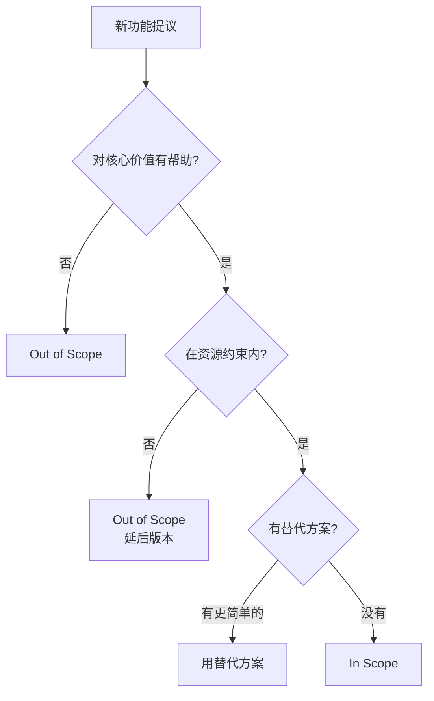

# 5.5.3 哪些该做，哪些不做——范围界定

### 一句话破题

范围界定就是明确：**做什么（In Scope）和不做什么（Out of Scope）**。

### 为什么范围界定很重要

没有边界的需求会导致：
- **范围蔓延**：不断加新功能，项目无限延期
- **期望偏差**：你以为做完了，用户以为还差很多
- **资源浪费**：做了很多"锦上添花"却忽略了核心

### 范围界定的结构

```markdown
## 范围界定

### In Scope（要做的）
- 功能 1
- 功能 2
- 功能 3

### Out of Scope（不做的）
- 功能 A（原因：超出 MVP）
- 功能 B（原因：技术复杂度高）
- 功能 C（原因：用户量不足以支撑）

### 非功能需求
- 性能要求
- 安全要求
- 兼容性要求
```

### 实际案例：博客系统

```markdown
## 博客系统 V1.0 范围

### In Scope
- [x] 文章 CRUD（创建、阅读、更新、删除）
- [x] Markdown 编辑器
- [x] 文章列表和详情页
- [x] 分类和标签
- [x] 基础 SEO（meta 标签、sitemap）

### Out of Scope
| 功能 | 原因 | 计划版本 |
|------|------|----------|
| 评论系统 | MVP 阶段不需要 | V1.1 |
| 多用户支持 | 个人博客暂不需要 | V2.0 |
| 付费订阅 | 商业化考虑延后 | V2.0+ |
| 多语言 | 初期只服务中文用户 | 暂不规划 |

### 非功能需求
- **性能**：首页加载 < 3 秒
- **安全**：用户密码加密存储
- **兼容**：支持主流浏览器（Chrome、Safari、Firefox）
- **可用性**：99% 可用率
```

### In/Out 的判断标准



### 非功能需求清单

除了功能，还要考虑：

| 类型 | 考虑点 | 示例 |
|------|--------|------|
| **性能** | 响应时间、并发量 | 首页加载 < 3s |
| **安全** | 认证、授权、数据保护 | 密码加密、HTTPS |
| **可用性** | 在线率、故障恢复 | 99% 可用率 |
| **可维护** | 代码质量、文档 | TypeScript 强类型 |
| **兼容性** | 浏览器、设备 | 支持移动端 |
| **扩展性** | 未来增长 | 支持水平扩展 |

### 如何拒绝范围蔓延

当有人提出新功能时：

```
1. 首先确认理解需求
   "你希望实现的是...对吗？"

2. 评估与核心价值的关系
   "这个功能对解决核心问题有多大帮助？"

3. 评估实现成本
   "实现这个需要多少时间？"

4. 提出替代方案或延后
   "我们可以先用 XX 方式解决，下个版本再优化"
```

### 让 AI 帮你界定范围

```
你：博客系统 MVP 应该包含什么功能？哪些可以延后？

AI：## MVP 范围建议

### 必须有（In Scope）
核心价值：让用户能写博客并被访问
1. 文章 CRUD - 核心功能
2. Markdown 支持 - 目标用户基本预期
3. 列表/详情页 - 内容展示基础

### 可以延后（Out of Scope）
1. 评论 → 可用 Giscus 等第三方
2. 搜索 → 文章少时可用浏览器搜索
3. RSS → 增强功能，非必需
4. 统计 → 可用 Google Analytics

### 非功能优先级
1. 高优：安全（密码加密）
2. 中优：性能（首页 3s 内）
3. 低优：SEO（可后续优化）
```

### 实用建议

1. **写下来**：口头说的边界容易遗忘
2. **说明理由**：为什么不做比不做本身更重要
3. **留有余地**：Out of Scope 不是永远不做
4. **定期回顾**：随着项目进展，范围可能需要调整
