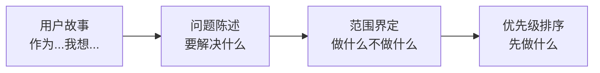

# 5.5 先讲故事再列清单——用户故事与优先级

### 从故事到清单

在定义需求时，很多人习惯直接列功能清单。但更好的方式是**先讲故事，再列清单**。

### 为什么用户故事很重要

用户故事帮助你：
- **保持用户视角**：功能是为用户服务的
- **明确价值**：每个功能都要回答"为什么要做"
- **便于沟通**：用自然语言描述，AI 和人都能理解

### 用户故事 vs 功能列表

| 功能列表 | 用户故事 |
|----------|----------|
| "用户登录功能" | "作为用户，我想用邮箱密码登录，以便访问我的个人数据" |
| "文章搜索" | "作为读者，我想搜索历史文章，以便快速找到感兴趣的内容" |
| "消息通知" | "作为作者，我想收到评论通知，以便及时回复读者" |

### 本节目标

学完本节，你将掌握：

1. **用户故事格式**：用标准格式描述需求
2. **问题陈述**：明确要解决的核心问题
3. **范围界定**：定义做什么、不做什么
4. **优先级矩阵**：科学地决定先后顺序

**记住**：好的需求定义不是"我要什么功能"，而是"用户需要解决什么问题"。
