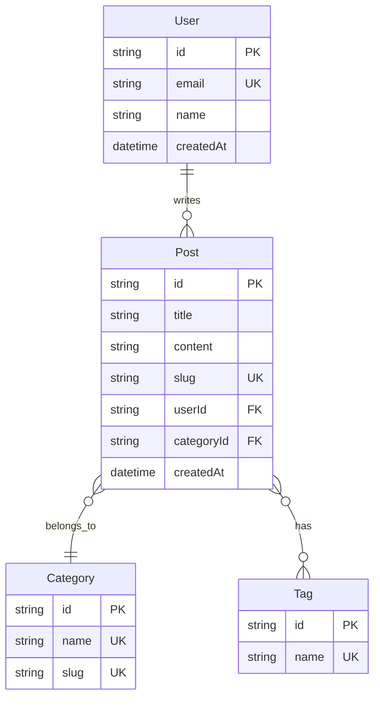

# 5.6.2 数据该怎么存——数据表设计

### 一句话破题

数据表设计回答一个问题：**数据以什么结构存储、表与表之间有什么关系**。

### 实体关系图（ER 图）

先画图，再建表：



### 关系类型

| 关系 | 符号 | 示例 |
|------|------|------|
| 一对一 | `||--||` | User - Profile |
| 一对多 | `||--o{` | User - Posts |
| 多对多 | `}o--o{` | Post - Tags |

### 字段定义模板

```markdown
## Post 表

| 字段 | 类型 | 约束 | 说明 |
|------|------|------|------|
| id | string | PK | 主键，使用 cuid |
| title | string | NOT NULL | 标题，1-100 字符 |
| content | text | NOT NULL | 内容，Markdown 格式 |
| slug | string | UNIQUE | URL 友好标识 |
| status | enum | DEFAULT 'draft' | draft/published |
| userId | string | FK → User.id | 作者 |
| categoryId | string | FK → Category.id | 分类 |
| createdAt | datetime | DEFAULT now() | 创建时间 |
| updatedAt | datetime | AUTO UPDATE | 更新时间 |

### 索引
- `slug` - 唯一索引，用于 URL 查询
- `userId` - 普通索引，用于按作者筛选
- `createdAt` - 普通索引，用于排序
```

### Prisma Schema 示例

```prisma
model Post {
  id         String    @id @default(cuid())
  title      String
  content    String
  slug       String    @unique
  status     Status    @default(DRAFT)
  
  author     User      @relation(fields: [userId], references: [id])
  userId     String
  
  category   Category  @relation(fields: [categoryId], references: [id])
  categoryId String
  
  tags       Tag[]
  
  createdAt  DateTime  @default(now())
  updatedAt  DateTime  @updatedAt
  
  @@index([userId])
  @@index([createdAt])
}

enum Status {
  DRAFT
  PUBLISHED
}
```

### 设计原则

#### 1. 主键设计
```
✅ 使用 cuid 或 uuid
   - 不暴露业务信息
   - 支持分布式生成
   
❌ 使用自增 ID
   - 容易被猜测
   - 合并数据时冲突
```

#### 2. 时间字段
```
每张表都应该有：
- createdAt：记录创建时间
- updatedAt：记录最后更新时间

可选：
- deletedAt：软删除标记
```

#### 3. 外键处理
```
删除关联数据时的策略：

CASCADE  - 级联删除（删用户时删文章）
SET NULL - 设为空（删分类时文章分类设空）
RESTRICT - 禁止删除（有文章时不能删分类）
```

### 常见设计模式

#### 多对多关系
```prisma
// 方案一：隐式中间表（Prisma 自动创建）
model Post {
  tags Tag[]
}
model Tag {
  posts Post[]
}

// 方案二：显式中间表（需要额外字段时）
model PostTag {
  post    Post     @relation(fields: [postId], references: [id])
  postId  String
  tag     Tag      @relation(fields: [tagId], references: [id])
  tagId   String
  order   Int      // 额外字段：排序
  
  @@id([postId, tagId])
}
```

#### 软删除
```prisma
model Post {
  // ...
  deletedAt DateTime?
}

// 查询时过滤
const posts = await prisma.post.findMany({
  where: { deletedAt: null }
})
```

### 让 AI 帮你设计数据表

```
你：博客系统需要哪些数据表？请给出 Prisma Schema

AI：// prisma/schema.prisma

model User {
  id       String @id @default(cuid())
  email    String @unique
  name     String
  password String
  posts    Post[]
  createdAt DateTime @default(now())
}

model Post {
  id         String   @id @default(cuid())
  title      String
  content    String
  slug       String   @unique
  published  Boolean  @default(false)
  author     User     @relation(fields: [authorId], references: [id])
  authorId   String
  category   Category @relation(fields: [categoryId], references: [id])
  categoryId String
  tags       Tag[]
  createdAt  DateTime @default(now())
  updatedAt  DateTime @updatedAt
}

model Category {
  id    String @id @default(cuid())
  name  String @unique
  slug  String @unique
  posts Post[]
}

model Tag {
  id    String @id @default(cuid())
  name  String @unique
  posts Post[]
}
```

### 实用建议

1. **先画 ER 图**：可视化帮助理清关系
2. **命名一致**：字段命名风格统一（camelCase 或 snake_case）
3. **适度冗余**：为了查询效率，可以适当冗余
4. **预留扩展**：考虑未来可能的需求
