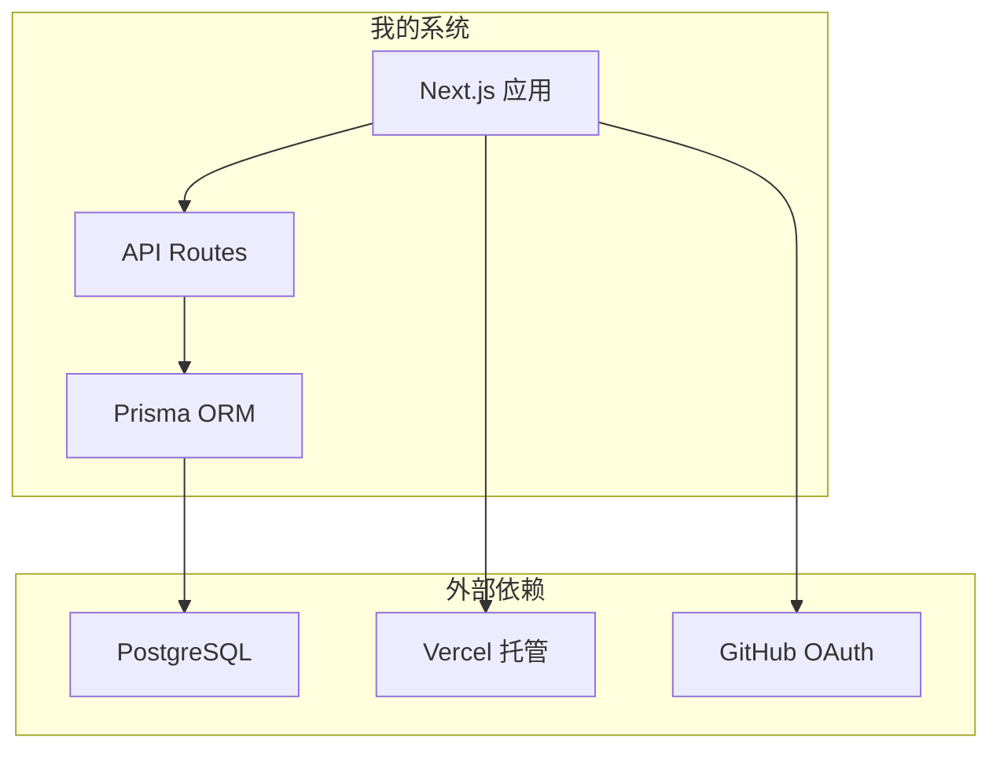
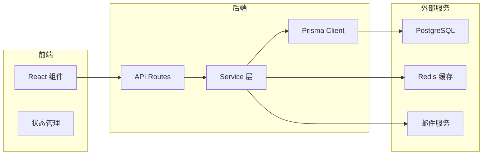

# 5.6.3 哪里归我管——系统边界

### 一句话破题

系统边界定义**哪些是自己开发的、哪些是依赖外部的**。

### 为什么要划分边界



边界清晰才能：
- 知道什么问题找谁解决
- 评估哪些是可控的、哪些有风险
- 制定备选方案

### 内部组件 vs 外部依赖

```markdown
## 博客系统边界划分

### 内部组件（自己实现）
| 组件 | 说明 | 可控性 |
|------|------|--------|
| 前端页面 | Next.js React 组件 | 完全可控 |
| API 接口 | Next.js API Routes | 完全可控 |
| 数据访问 | Prisma ORM 调用 | 完全可控 |
| 业务逻辑 | 文章/用户/分类管理 | 完全可控 |

### 外部依赖（使用服务）
| 依赖 | 用途 | 可替换性 | 风险 |
|------|------|----------|------|
| PostgreSQL | 数据存储 | 中（换 MySQL） | 低 |
| Vercel | 部署托管 | 高（换 Railway） | 低 |
| GitHub OAuth | 用户认证 | 中（换 Google） | 低 |
| Cloudinary | 图片存储 | 高（换 OSS） | 低 |
```

### 依赖关系图



### 外部依赖清单

```markdown
## 外部依赖清单

### 基础设施
| 服务 | 用途 | 免费额度 | 付费价格 |
|------|------|----------|----------|
| Vercel | 托管 | 100GB/月 | $20/月起 |
| Supabase | 数据库 | 500MB | $25/月起 |
| Cloudflare | CDN | 无限 | 免费 |

### 第三方 API
| 服务 | 用途 | 免费额度 |
|------|------|----------|
| GitHub OAuth | 登录 | 免费 |
| Resend | 邮件 | 100封/天 |
| Sentry | 错误监控 | 5K事件/月 |

### npm 依赖
| 包 | 用途 | 活跃度 |
|----|------|--------|
| @prisma/client | ORM | 活跃 |
| next-auth | 认证 | 活跃 |
| zod | 验证 | 活跃 |
```

### 风险评估

每个外部依赖都要考虑：

| 风险类型 | 问题 | 应对方案 |
|----------|------|----------|
| **可用性** | 服务宕机怎么办 | 准备备选服务 |
| **成本** | 超出免费额度怎么办 | 设置用量告警 |
| **迁移** | 需要换服务怎么办 | 抽象接口层 |
| **安全** | API Key 泄露怎么办 | 环境变量 + 权限控制 |

### 依赖抽象

为了降低依赖风险，可以做一层抽象：

```typescript
// 不好：直接耦合
import { S3Client } from '@aws-sdk/client-s3'
const client = new S3Client({...})

// 好：抽象接口
interface StorageService {
  upload(file: File): Promise<string>
  delete(url: string): Promise<void>
}

class S3Storage implements StorageService {
  async upload(file: File) { /* ... */ }
  async delete(url: string) { /* ... */ }
}

class LocalStorage implements StorageService {
  async upload(file: File) { /* ... */ }
  async delete(url: string) { /* ... */ }
}
```

### 让 AI 帮你分析依赖

```
你：分析我的博客系统有哪些外部依赖，评估风险

AI：## 依赖分析

### 高依赖（必须有）
1. **PostgreSQL 数据库**
   - 风险：中等（托管服务可能变更）
   - 备选：自建 / 换 MySQL
   
2. **Vercel 托管**
   - 风险：低（可快速迁移）
   - 备选：Railway / Fly.io

### 中依赖（可替换）
1. **GitHub OAuth**
   - 风险：低
   - 备选：Google OAuth / 邮箱密码

### 低依赖（锦上添花）
1. **Google Analytics**
   - 风险：很低
   - 备选：Umami / 不用
```

### 实用建议

1. **列出所有依赖**：包括 npm 包和云服务
2. **评估替换成本**：哪些是容易换的
3. **关键依赖要抽象**：方便未来迁移
4. **监控依赖健康**：关注服务状态和版本更新
