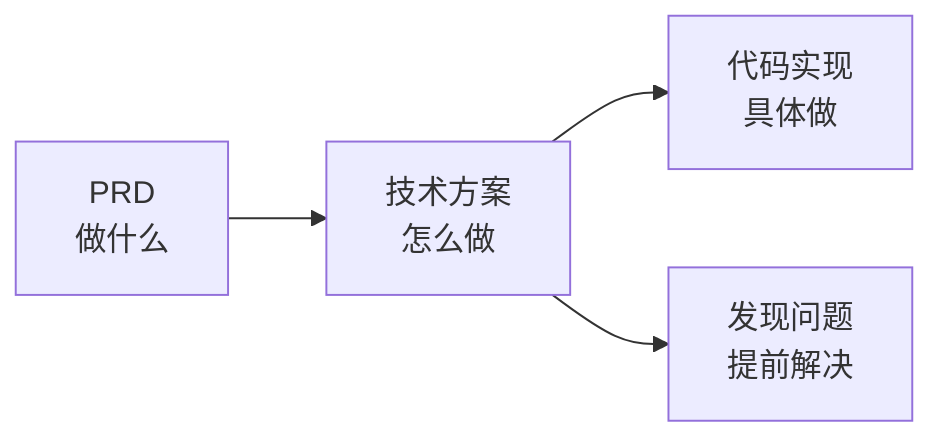

# 5.6 方案是用来减风险的——技术方案

### 写技术方案的目的

技术方案不是为了"走流程"，而是为了**在写代码之前发现问题**。



### 技术方案该包含什么

一份最小化但有效的技术方案：

```markdown
## 技术方案模板

### 1. 接口设计
- API 路径、方法、参数
- 请求/响应格式

### 2. 数据表设计
- 表结构、字段定义
- 表之间的关系

### 3. 系统边界
- 哪些是自己实现
- 哪些依赖外部服务

### 4. 风险评估
- 可能遇到的技术难点
- 应对措施

### 5. 工作量估算
- 各模块开发时间
- 总体时间安排
```

### 为什么独立开发者也需要技术方案

| 场景 | 不写方案 | 写方案 |
|------|----------|--------|
| 开发中途 | 发现设计有问题，需要重写 | 提前发现，调整方案 |
| 让 AI 实现 | AI 各自为政，接口不统一 | AI 按方案实现，风格一致 |
| 评估时间 | 拍脑袋，经常低估 | 有依据，更准确 |

### 技术方案 vs 代码注释

技术方案是**顶层设计**，回答"为什么这样做"：
- 为什么用 PostgreSQL 而不是 MongoDB？
- 为什么用 JWT 而不是 Session？
- 表结构为什么这样设计？

代码注释是**实现细节**，回答"这段代码做什么"。

### 本节目标

学完本节，你将掌握：

1. **接口设计**：如何设计清晰的 API
2. **数据表设计**：如何设计合理的数据结构
3. **系统边界**：如何划分内外部依赖
4. **风险评估**：如何识别和缓解技术风险
5. **单人自评**：如何评估自己能否完成

**核心原则**：技术方案越早写越好，修改方案的成本远低于修改代码。
