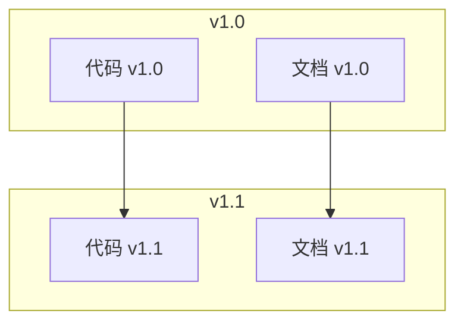

# 5.7.3 文档也需要后悔药——文档版本控制

### 一句话破题

用 Git 管理文档，可以**追溯历史、回退修改、对比变化**。

### 为什么要版本控制文档

```
场景 1：文档写错了
  没有版本控制 → 改了就改了，不知道原来写的是什么
  有版本控制   → git diff 看看改了什么，git revert 回退

场景 2：查历史决策
  没有版本控制 → 不知道为什么这样设计
  有版本控制   → git log 看看当时的 commit 信息

场景 3：多版本文档
  没有版本控制 → v1-doc.md, v2-doc.md, v2-final-doc.md
  有版本控制   → git checkout v1.0 看那个版本的文档
```

### 文档版本控制基础

```bash
# 查看文档变更历史
git log --oneline docs/

# 查看某个文档的修改
git log --oneline docs/api.md

# 查看具体改了什么
git diff HEAD~1 docs/api.md

# 回退到上一个版本
git checkout HEAD~1 -- docs/api.md
```

### Commit 信息规范

文档相关的 commit 建议使用 `docs:` 前缀：

```bash
# 新增文档
docs: 添加 API 文档

# 更新文档
docs: 更新部署说明

# 修复文档错误
docs: 修正 API 参数说明

# 重构文档结构
docs: 重新组织文档目录
```

### 文档与代码版本对应

确保每个代码版本都有对应的文档：



实现方法：
```bash
# 打版本标签时，确保文档也更新了
git tag -a v1.0.0 -m "Release v1.0.0"

# 查看某个版本的文档
git checkout v1.0.0 -- docs/
```

### 文档分支策略

对于复杂项目，文档可以有分支：

```
main 分支
├── 最新稳定版文档

develop 分支  
├── 开发中的文档更新

feature/xxx 分支
├── 新功能相关的文档草稿
```

对于个人项目，通常只用 main 分支就够了。

### 查看文档变更示例

```bash
# 看 api.md 最近 5 次修改
git log --oneline -5 docs/api.md

# 输出示例
a1b2c3d docs: 添加搜索接口文档
e4f5g6h docs: 更新认证接口参数
i7j8k9l feat: 实现用户注册（含文档）
m0n1o2p docs: 初始化 API 文档
q3r4s5t docs: 创建文档目录结构

# 查看某次修改的内容
git show a1b2c3d
```

### 文档版本发布

发布新版本时，确保文档同步：

```markdown
## 发布检查清单

### 代码
- [ ] 所有功能开发完成
- [ ] 测试通过
- [ ] 版本号更新

### 文档
- [ ] API 文档与代码一致
- [ ] CHANGELOG 更新
- [ ] README 版本号更新
- [ ] 部署文档检查
```

### CHANGELOG 维护

记录每个版本的变更：

```markdown
# Changelog

## [1.1.0] - 2024-01-20

### Added
- 文章搜索功能
- 标签管理功能

### Changed
- 优化文章列表加载速度

### Fixed
- 修复登录超时问题

## [1.0.0] - 2024-01-01

### Added
- 初始版本
- 文章 CRUD
- 用户认证
```

### 实用建议

1. **文档和代码一起提交**：保证版本对应
2. **commit 信息要清晰**：方便以后查找
3. **重要版本打 tag**：便于回溯
4. **定期清理过时文档**：删除或归档
