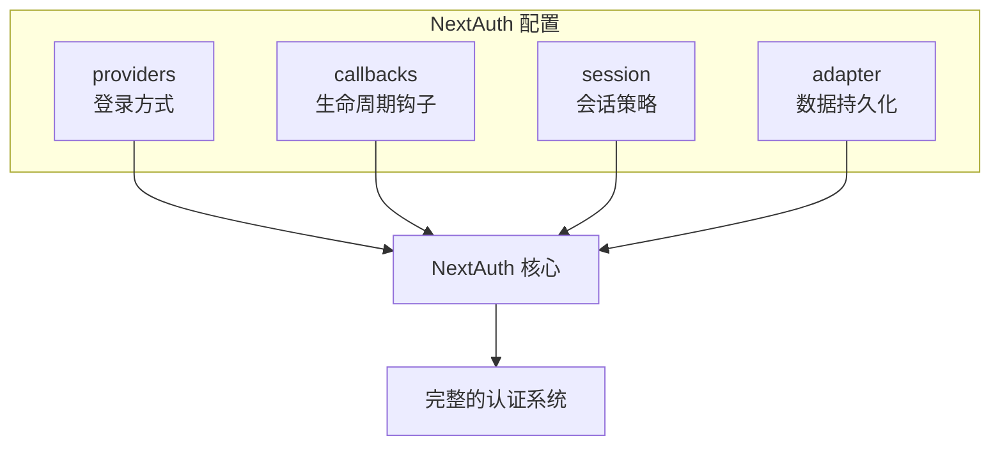
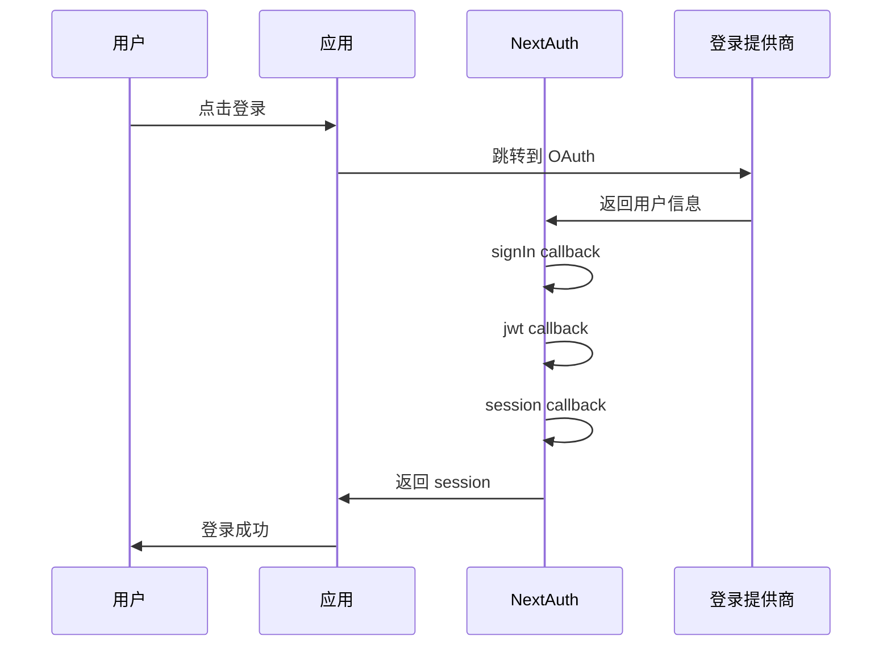

# 6.1.1 开箱即用的认证——NextAuth 配置

## 本质还原

NextAuth 的核心是一个**配置驱动的认证框架**。你只需要告诉它"用什么方式登录"（providers）和"登录过程中要做什么额外处理"（callbacks），剩下的流程它全包了。



## 配置文件结构

在 App Router 中，NextAuth 的配置文件位于 `app/api/auth/[...nextauth]/route.ts`：

```typescript
import NextAuth, { type NextAuthOptions } from "next-auth"
import GoogleProvider from "next-auth/providers/google"

export const authOptions: NextAuthOptions = {
  // 1. providers: 定义支持的登录方式
  providers: [
    GoogleProvider({
      clientId: process.env.GOOGLE_CLIENT_ID!,
      clientSecret: process.env.GOOGLE_CLIENT_SECRET!,
    }),
  ],
  
  // 2. callbacks: 自定义认证流程中的行为
  callbacks: {
    // 登录时触发，返回 true 允许登录
    async signIn({ user, account, profile }) {
      return true
    },
    // 创建 JWT 时触发
    async jwt({ token, user, account }) {
      if (user) {
        token.id = user.id
      }
      return token
    },
    // 获取 session 时触发
    async session({ session, token }) {
      if (session.user) {
        session.user.id = token.id as string
      }
      return session
    },
  },
  
  // 3. session: 会话存储策略
  session: {
    strategy: "jwt", // 或 "database"
    maxAge: 30 * 24 * 60 * 60, // 30 天
  },
  
  // 4. pages: 自定义页面路由
  pages: {
    signIn: "/login",      // 自定义登录页
    error: "/auth/error",  // 错误页
  },
}

const handler = NextAuth(authOptions)
export { handler as GET, handler as POST }
```

## Providers 详解

Providers 决定了用户可以通过什么方式登录你的应用：

### OAuth Providers（社交登录）

```typescript
import GoogleProvider from "next-auth/providers/google"
import GitHubProvider from "next-auth/providers/github"
import DiscordProvider from "next-auth/providers/discord"

providers: [
  GoogleProvider({
    clientId: process.env.GOOGLE_CLIENT_ID!,
    clientSecret: process.env.GOOGLE_CLIENT_SECRET!,
  }),
  GitHubProvider({
    clientId: process.env.GITHUB_ID!,
    clientSecret: process.env.GITHUB_SECRET!,
  }),
]
```

### Credentials Provider（账号密码登录）

```typescript
import CredentialsProvider from "next-auth/providers/credentials"

providers: [
  CredentialsProvider({
    name: "Credentials",
    credentials: {
      email: { label: "邮箱", type: "email" },
      password: { label: "密码", type: "password" }
    },
    async authorize(credentials) {
      // 在这里验证用户凭据
      const user = await validateUser(
        credentials?.email,
        credentials?.password
      )
      if (user) {
        return user
      }
      return null
    }
  })
]
```

::: warning 安全提醒
使用 Credentials Provider 时，你需要自己处理密码哈希、防暴力破解等安全问题。对于新手，推荐先使用 OAuth Provider。
:::

## Callbacks 详解

Callbacks 是 NextAuth 的钩子函数，让你在认证流程的关键节点插入自定义逻辑：



### 常用 Callback 场景

```typescript
callbacks: {
  // 场景1：限制只有特定邮箱域名可以登录
  async signIn({ user }) {
    const allowedDomain = "@company.com"
    if (user.email?.endsWith(allowedDomain)) {
      return true
    }
    return false // 拒绝登录
  },
  
  // 场景2：在 token 中添加用户角色
  async jwt({ token, user }) {
    if (user) {
      // 首次登录时，从数据库获取用户角色
      const dbUser = await prisma.user.findUnique({
        where: { email: user.email! }
      })
      token.role = dbUser?.role || "user"
    }
    return token
  },
  
  // 场景3：在 session 中暴露用户角色
  async session({ session, token }) {
    if (session.user) {
      session.user.role = token.role as string
    }
    return session
  },
}
```

## 环境变量配置

```bash
# .env.local
NEXTAUTH_URL=http://localhost:3000
NEXTAUTH_SECRET=your-secret-key-here

# Google OAuth
GOOGLE_CLIENT_ID=your-google-client-id
GOOGLE_CLIENT_SECRET=your-google-client-secret

# GitHub OAuth
GITHUB_ID=your-github-client-id
GITHUB_SECRET=your-github-client-secret
```

::: danger 重要
- `NEXTAUTH_SECRET` 是必需的，用于加密 JWT。生产环境请使用强随机字符串
- 使用 `openssl rand -base64 32` 生成安全的密钥
- 永远不要将这些值提交到 Git
:::

## 觉知：审查 AI 生成代码的检查点

当 AI 帮你生成 NextAuth 配置时，重点检查：

1. **环境变量引用**：是否使用 `process.env.XXX`，而不是硬编码值
2. **类型安全**：是否添加了 `!` 或进行了空值检查
3. **Callback 返回值**：`signIn` 必须返回布尔值，`jwt` 和 `session` 必须返回修改后的对象
4. **路由文件位置**：App Router 必须放在 `app/api/auth/[...nextauth]/route.ts`
