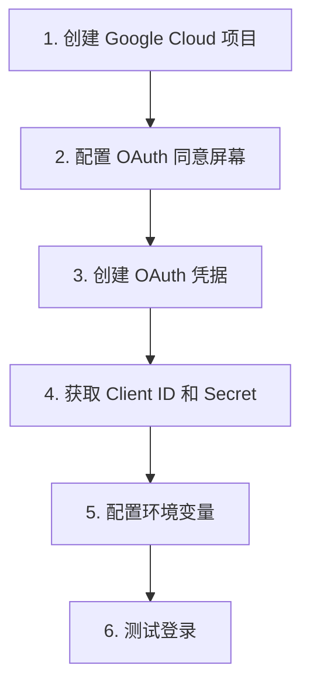

# 6.1.2 Google 登录怎么接——Google OAuth 实战

## 一句话破题

接入 Google 登录只需要三步：在 Google Cloud Console 创建应用、配置回调地址、把 Client ID 和 Secret 填到环境变量里。

## 完整流程图



## 步骤一：创建 Google Cloud 项目

1. 访问 [Google Cloud Console](https://console.cloud.google.com/)
2. 点击顶部的项目选择器 → "新建项目"
3. 输入项目名称（如 `my-nextjs-app`）→ 创建

## 步骤二：配置 OAuth 同意屏幕

1. 在左侧菜单选择 **"API 和服务"** → **"OAuth 同意屏幕"**
2. 选择用户类型：
   - **外部**：适用于公开应用，任何 Google 账号都能登录
   - **内部**：仅限组织内部使用（需要 Google Workspace）
3. 填写必填信息：
   - 应用名称
   - 用户支持邮箱
   - 开发者联系信息

::: tip 开发阶段
选择"外部"后，应用会处于"测试"状态。在测试状态下，只有你添加的测试用户才能登录。正式发布前需要提交审核。
:::

## 步骤三：创建 OAuth 凭据

1. 进入 **"API 和服务"** → **"凭据"**
2. 点击 **"创建凭据"** → **"OAuth 客户端 ID"**
3. 应用类型选择 **"Web 应用"**
4. 填写名称（如 `NextJS App`）
5. 配置重定向 URI：

```
# 开发环境
http://localhost:3000/api/auth/callback/google

# 生产环境
https://your-domain.com/api/auth/callback/google
```

::: warning 回调地址格式
NextAuth 的 Google Provider 固定使用 `/api/auth/callback/google` 作为回调路径，不要修改。
:::

6. 创建完成后，复制 **Client ID** 和 **Client Secret**

## 步骤四：配置环境变量

```bash
# .env.local
GOOGLE_CLIENT_ID=your-client-id-here.apps.googleusercontent.com
GOOGLE_CLIENT_SECRET=your-client-secret-here
```

## 步骤五：NextAuth 配置

```typescript
// app/api/auth/[...nextauth]/route.ts
import NextAuth from "next-auth"
import GoogleProvider from "next-auth/providers/google"

const handler = NextAuth({
  providers: [
    GoogleProvider({
      clientId: process.env.GOOGLE_CLIENT_ID!,
      clientSecret: process.env.GOOGLE_CLIENT_SECRET!,
    }),
  ],
})

export { handler as GET, handler as POST }
```

## 测试登录

```typescript
// app/page.tsx
"use client"

import { signIn, signOut, useSession } from "next-auth/react"

export default function Home() {
  const { data: session, status } = useSession()

  if (status === "loading") {
    return <div>加载中...</div>
  }

  if (session) {
    return (
      <div>
        <p>已登录：{session.user?.email}</p>
        
        <button onClick={() => signOut()}>退出</button>
      </div>
    )
  }

  return (
    <button onClick={() => signIn("google")}>
      使用 Google 登录
    </button>
  )
}
```

## 常见问题

### Error 400: redirect_uri_mismatch

**原因**：回调地址配置不匹配

**解决**：检查 Google Console 中的重定向 URI 是否与你的 `NEXTAUTH_URL` 一致

### Error: Access blocked

**原因**：应用处于测试状态，且当前用户不在测试用户列表中

**解决**：
1. 去 OAuth 同意屏幕 → 测试用户 → 添加当前账号
2. 或者提交应用审核

## 获取更多用户信息

默认情况下，Google 只返回基础信息。如需获取更多数据，配置 `authorization` 参数：

```typescript
GoogleProvider({
  clientId: process.env.GOOGLE_CLIENT_ID!,
  clientSecret: process.env.GOOGLE_CLIENT_SECRET!,
  authorization: {
    params: {
      scope: "openid email profile",
      // 可添加更多 scope
    },
  },
})
