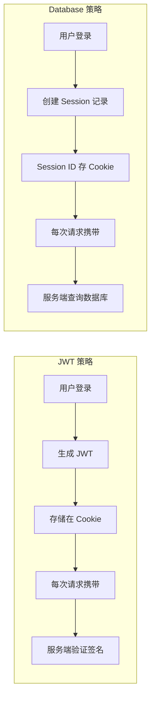

# 6.1.4 用户登录状态怎么保持——会话管理

## 本质还原

用户登录后，服务器需要一种方式来"记住"这个用户。这就是**会话（Session）**的作用。NextAuth 提供了两种会话策略：



## JWT vs Database 策略对比

| 特性 | JWT | Database |
|------|-----|----------|
| 无状态 | ✅ 服务端不存储 | ❌ 需要数据库 |
| 可扩展性 | ✅ 更好 | ⚠️ 需要共享存储 |
| 即时失效 | ❌ 无法立即失效 | ✅ 删除记录即可 |
| 配置复杂度 | 简单 | 需要 Adapter |

**推荐**：对于大多数应用，使用 JWT 策略即可。

## 配置 SessionProvider

要在客户端组件中使用 `useSession`，必须用 `SessionProvider` 包裹应用：

```typescript
// app/providers.tsx
"use client"

import { SessionProvider } from "next-auth/react"

export function Providers({ children }: { children: React.ReactNode }) {
  return <SessionProvider>{children}</SessionProvider>
}
```

```typescript
// app/layout.tsx
import { Providers } from "./providers"

export default function RootLayout({
  children,
}: {
  children: React.ReactNode
}) {
  return (
    <html>
      <body>
        <Providers>{children}</Providers>
      </body>
    </html>
  )
}
```

## 在客户端获取 Session

```typescript
"use client"

import { useSession } from "next-auth/react"

export function UserProfile() {
  const { data: session, status } = useSession()

  if (status === "loading") {
    return <div>加载中...</div>
  }

  if (status === "unauthenticated") {
    return <div>请先登录</div>
  }

  return (
    <div>
      <p>欢迎, {session?.user?.name}</p>
      <p>邮箱: {session?.user?.email}</p>
    </div>
  )
}
```

## 在服务端获取 Session

### Server Component

```typescript
// app/dashboard/page.tsx
import { getServerSession } from "next-auth"
import { authOptions } from "@/app/api/auth/[...nextauth]/route"
import { redirect } from "next/navigation"

export default async function DashboardPage() {
  const session = await getServerSession(authOptions)

  if (!session) {
    redirect("/login")
  }

  return <div>欢迎, {session.user?.name}</div>
}
```

### API Route

```typescript
// app/api/user/route.ts
import { getServerSession } from "next-auth"
import { authOptions } from "@/app/api/auth/[...nextauth]/route"
import { NextResponse } from "next/server"

export async function GET() {
  const session = await getServerSession(authOptions)

  if (!session) {
    return NextResponse.json({ error: "未授权" }, { status: 401 })
  }

  return NextResponse.json({ user: session.user })
}
```

## 路由保护

### 方式一：页面级保护

```typescript
// app/dashboard/page.tsx
import { getServerSession } from "next-auth"
import { authOptions } from "@/app/api/auth/[...nextauth]/route"
import { redirect } from "next/navigation"

export default async function DashboardPage() {
  const session = await getServerSession(authOptions)

  if (!session) {
    redirect("/login")
  }

  return <div>受保护的内容</div>
}
```

### 方式二：Middleware 保护

```typescript
// middleware.ts
import { withAuth } from "next-auth/middleware"

export default withAuth({
  pages: {
    signIn: "/login",
  },
})

export const config = {
  matcher: ["/dashboard/:path*", "/profile/:path*"],
}
```

### 方式三：自定义 Middleware

```typescript
// middleware.ts
import { getToken } from "next-auth/jwt"
import { NextResponse } from "next/server"
import type { NextRequest } from "next/server"

export async function middleware(request: NextRequest) {
  const token = await getToken({
    req: request,
    secret: process.env.NEXTAUTH_SECRET,
  })

  const isAuthPage = request.nextUrl.pathname.startsWith("/login")

  if (isAuthPage) {
    if (token) {
      return NextResponse.redirect(new URL("/dashboard", request.url))
    }
    return NextResponse.next()
  }

  if (!token) {
    return NextResponse.redirect(new URL("/login", request.url))
  }

  return NextResponse.next()
}

export const config = {
  matcher: ["/dashboard/:path*", "/login"],
}
```

## 自定义 Session 数据

默认 session 只包含 `name`、`email`、`image`。如需添加更多字段：

```typescript
// types/next-auth.d.ts
import { DefaultSession } from "next-auth"

declare module "next-auth" {
  interface Session {
    user: {
      id: string
      role: string
    } & DefaultSession["user"]
  }
}
```

```typescript
// NextAuth 配置
callbacks: {
  async jwt({ token, user }) {
    if (user) {
      token.id = user.id
      token.role = "user" // 或从数据库获取
    }
    return token
  },
  async session({ session, token }) {
    if (session.user) {
      session.user.id = token.id as string
      session.user.role = token.role as string
    }
    return session
  },
}
```

## 会话配置选项

```typescript
session: {
  strategy: "jwt",
  maxAge: 30 * 24 * 60 * 60, // 30 天
  updateAge: 24 * 60 * 60,   // 24 小时刷新一次
}
```

::: tip 安全建议
- 生产环境中，`maxAge` 不要设置过长
- 敏感操作前，考虑要求用户重新验证身份
- 定期轮换 `NEXTAUTH_SECRET`
:::
