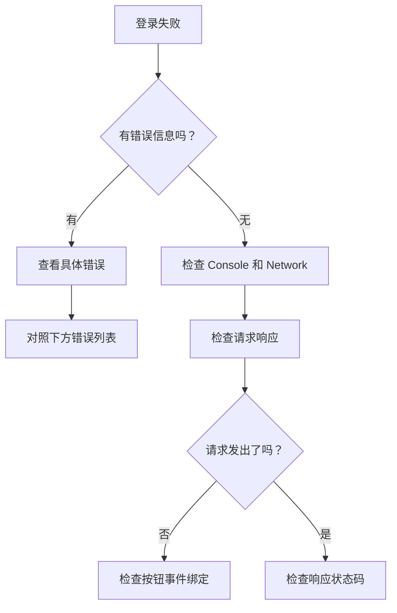

# 6.1.5 登录失败了怎么办——常见问题排查

## 问题排查思路



## 常见错误及解决方案

### 1. NEXTAUTH_URL 配置错误

**错误表现**：
```
Error: NEXTAUTH_URL environment variable is not set
```

**解决方案**：

```bash
# .env.local
# 开发环境
NEXTAUTH_URL=http://localhost:3000

# 生产环境
NEXTAUTH_URL=https://your-domain.com
```

::: warning 注意
- URL 末尾不要加 `/`
- 生产环境必须使用 HTTPS
- Vercel 部署时会自动设置，但其他平台需要手动配置
:::

### 2. NEXTAUTH_SECRET 未设置

**错误表现**：
```
[next-auth][error][NO_SECRET] 
Please define a `secret` in production
```

**解决方案**：

```bash
# 生成随机密钥
openssl rand -base64 32

# 添加到 .env.local
NEXTAUTH_SECRET=生成的随机字符串
```

### 3. 回调地址不匹配

**错误表现**：
```
Error 400: redirect_uri_mismatch
```

**排查步骤**：

1. 检查 OAuth 提供商后台配置的回调地址
2. 确保格式完全正确：

```
# Google
http://localhost:3000/api/auth/callback/google

# GitHub  
http://localhost:3000/api/auth/callback/github
```

3. 检查协议（http vs https）和端口号是否一致

### 4. OAuth Client ID/Secret 错误

**错误表现**：
```
Error: invalid_client
```

**排查步骤**：

1. 确认环境变量名称正确
2. 确认值没有多余的空格或换行
3. 确认 Secret 没有过期（GitHub Secret 只显示一次）

```bash
# 检查环境变量是否正确加载
console.log("GOOGLE_CLIENT_ID:", process.env.GOOGLE_CLIENT_ID)
```

### 5. SessionProvider 未配置

**错误表现**：
```
Error: useSession must be wrapped in a SessionProvider
```

**解决方案**：

```typescript
// app/providers.tsx
"use client"
import { SessionProvider } from "next-auth/react"

export function Providers({ children }: { children: React.ReactNode }) {
  return <SessionProvider>{children}</SessionProvider>
}

// app/layout.tsx
import { Providers } from "./providers"

export default function RootLayout({ children }) {
  return (
    <html>
      <body>
        <Providers>{children}</Providers>
      </body>
    </html>
  )
}
```

### 6. 服务器组件中使用客户端 Hook

**错误表现**：
```
Error: useSession only works in Client Components
```

**解决方案**：

```typescript
// ❌ 错误：在 Server Component 中使用 useSession
export default function Page() {
  const { data: session } = useSession() // 报错
}

// ✅ 正确：在 Server Component 中使用 getServerSession
import { getServerSession } from "next-auth"

export default async function Page() {
  const session = await getServerSession(authOptions)
}

// ✅ 正确：在 Client Component 中使用 useSession
"use client"
export default function Page() {
  const { data: session } = useSession()
}
```

### 7. 开发环境 HTTPS 问题

**错误表现**：
```
Cookies require Secure; SameSite=None
```

**解决方案**：

开发环境使用 HTTP 时，需要配置：

```typescript
// NextAuth 配置
cookies: {
  sessionToken: {
    name: `next-auth.session-token`,
    options: {
      httpOnly: true,
      sameSite: "lax",
      path: "/",
      secure: process.env.NODE_ENV === "production",
    },
  },
},
```

## 调试技巧

### 启用 NextAuth 调试模式

```typescript
const handler = NextAuth({
  debug: process.env.NODE_ENV === "development",
  // ...其他配置
})
```

### 检查 Network 请求

1. 打开浏览器开发者工具 → Network 面板
2. 过滤 `auth` 关键词
3. 检查 `/api/auth/` 开头的请求
4. 查看请求和响应的详细内容

### 常用调试端点

| 端点 | 用途 |
|------|------|
| `/api/auth/providers` | 查看已配置的 Provider |
| `/api/auth/session` | 查看当前 Session |
| `/api/auth/csrf` | 获取 CSRF Token |

## 生产环境检查清单

::: tip 上线前必查
1. [ ] `NEXTAUTH_URL` 设置为生产域名
2. [ ] `NEXTAUTH_SECRET` 使用强随机字符串
3. [ ] OAuth 提供商后台添加了生产环境回调地址
4. [ ] 环境变量已在部署平台正确配置
5. [ ] `debug: false` 或已移除 debug 选项
6. [ ] HTTPS 已正确配置
:::
