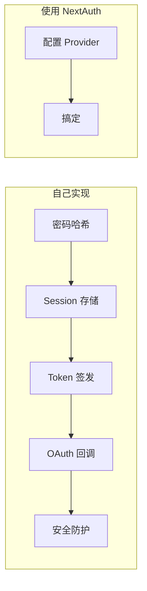

# 6.1 别再从零开始写登录注册——NextAuth 快速上手

## 一句话破题

NextAuth.js（现已更名为 Auth.js）是 Next.js 生态中最流行的认证解决方案——它让你用几行配置就能接入 Google、GitHub 等主流登录方式，省去从零实现认证系统的繁琐。

## 核心价值

自己实现登录系统意味着：密码加密、Session 管理、Token 签发、OAuth 回调处理、安全漏洞防护……每一项都是坑。NextAuth 把这些复杂性封装成开箱即用的 API，让你专注于业务逻辑。



## 本节内容

| 小节 | 学习目标 |
|------|----------|
| 6.1.1 NextAuth 配置 | 理解 providers 和 callbacks 的基础设置 |
| 6.1.2 Google OAuth | 实战接入 Google 登录 |
| 6.1.3 GitHub OAuth | 实战接入 GitHub 登录 |
| 6.1.4 会话管理 | 理解用户状态持久化与路由保护 |
| 6.1.5 常见问题 | 登录失败的排查与解决方案 |

## 快速上手预览

10 分钟内，你将实现这样的登录流程：

```typescript
// 1. 安装依赖
// npm install next-auth

// 2. 创建配置文件 app/api/auth/[...nextauth]/route.ts
import NextAuth from "next-auth"
import GoogleProvider from "next-auth/providers/google"
import GitHubProvider from "next-auth/providers/github"

const handler = NextAuth({
  providers: [
    GoogleProvider({
      clientId: process.env.GOOGLE_CLIENT_ID!,
      clientSecret: process.env.GOOGLE_CLIENT_SECRET!,
    }),
    GitHubProvider({
      clientId: process.env.GITHUB_ID!,
      clientSecret: process.env.GITHUB_SECRET!,
    }),
  ],
})

export { handler as GET, handler as POST }
```

```typescript
// 3. 在页面中使用
import { signIn, signOut, useSession } from "next-auth/react"

export function LoginButton() {
  const { data: session } = useSession()
  
  if (session) {
    return (
      <div>
        <p>欢迎, {session.user?.name}</p>
        <button onClick={() => signOut()}>退出登录</button>
      </div>
    )
  }
  
  return <button onClick={() => signIn()}>登录</button>
}
```

## AI 协作指南

向 AI 描述你的认证需求时，使用这些关键词：

- **核心意图**："使用 NextAuth 实现社交登录"
- **关键术语**：`providers`、`callbacks`、`session`、`signIn`、`signOut`
- **交互策略**：先让 AI 生成基础配置，确认能跑通后，再添加自定义 callbacks

::: tip 验收清单
在接受 AI 生成的 NextAuth 代码前，检查：
1. 环境变量是否正确引用（不要硬编码密钥）
2. 是否使用了 App Router 的 route handler 写法
3. SessionProvider 是否包裹在合适的层级
:::
