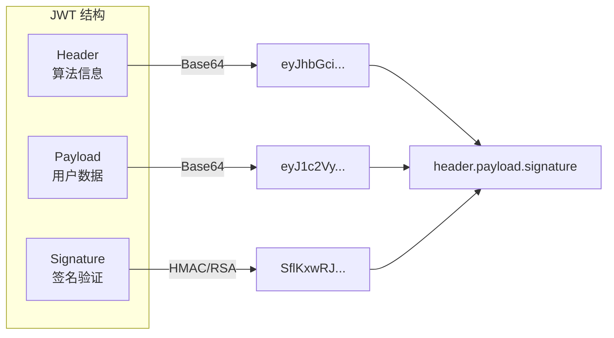
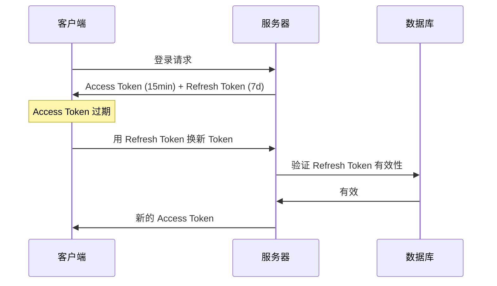

# 6.2.1 JWT 安全：密钥管理与过期策略

## 本质还原

JWT（JSON Web Token）是一种自包含的令牌格式，把用户信息编码在令牌本身中。服务器无需查询数据库就能验证用户身份，但这也带来了独特的安全挑战。



## JWT 的安全风险

### 1. 密钥泄露

如果签名密钥泄露，攻击者可以伪造任意用户的 Token。

```typescript
// ❌ 危险：硬编码密钥
const token = jwt.sign(payload, "my-secret-key")

// ✅ 安全：使用环境变量
const token = jwt.sign(payload, process.env.JWT_SECRET!)
```

### 2. 算法混淆攻击

某些 JWT 库允许攻击者将算法从 RS256 改为 HS256，用公钥作为密钥验证。

```typescript
// ✅ 显式指定算法，不信任 token 中的 alg
const decoded = jwt.verify(token, secret, { 
  algorithms: ['HS256']  // 只接受这个算法
})
```

### 3. 无法即时撤销

JWT 一旦签发，在过期前无法撤销。用户改密码后，旧 Token 仍然有效。

## 密钥管理最佳实践

### 生成强密钥

```bash
# 生成 256 位随机密钥
openssl rand -base64 32

# 输出类似：K7gNU3sdo+OL0wNhqoVWhr3g6s1xYv72ol/pe/Unols=
```

### 密钥轮换

定期更换密钥，但要支持旧 Token 的验证过渡期：

```typescript
const CURRENT_KEY = process.env.JWT_SECRET_CURRENT!
const PREVIOUS_KEY = process.env.JWT_SECRET_PREVIOUS!

function verifyToken(token: string) {
  try {
    return jwt.verify(token, CURRENT_KEY)
  } catch {
    // 尝试用旧密钥验证（过渡期）
    return jwt.verify(token, PREVIOUS_KEY)
  }
}
```

### 非对称加密

对于分布式系统，推荐使用 RS256（RSA + SHA256）：

```typescript
import { readFileSync } from 'fs'

const privateKey = readFileSync('private.pem')
const publicKey = readFileSync('public.pem')

// 签发（只有认证服务有私钥）
const token = jwt.sign(payload, privateKey, { algorithm: 'RS256' })

// 验证（任何服务都可以用公钥验证）
const decoded = jwt.verify(token, publicKey, { algorithms: ['RS256'] })
```

## 过期策略

### Access Token + Refresh Token



```typescript
// 签发双 Token
function issueTokens(userId: string) {
  const accessToken = jwt.sign(
    { userId, type: 'access' },
    process.env.JWT_SECRET!,
    { expiresIn: '15m' }  // 短期有效
  )
  
  const refreshToken = jwt.sign(
    { userId, type: 'refresh' },
    process.env.JWT_REFRESH_SECRET!,
    { expiresIn: '7d' }   // 长期有效
  )
  
  // 将 refresh token 存入数据库（可撤销）
  await db.refreshToken.create({
    data: { token: refreshToken, userId }
  })
  
  return { accessToken, refreshToken }
}
```

### 刷新 Token 端点

```typescript
// app/api/auth/refresh/route.ts
export async function POST(request: Request) {
  const { refreshToken } = await request.json()
  
  try {
    const decoded = jwt.verify(
      refreshToken,
      process.env.JWT_REFRESH_SECRET!
    )
    
    // 检查 token 是否在数据库中（未被撤销）
    const stored = await db.refreshToken.findUnique({
      where: { token: refreshToken }
    })
    
    if (!stored) {
      return Response.json({ error: '无效的刷新令牌' }, { status: 401 })
    }
    
    // 签发新的 access token
    const newAccessToken = jwt.sign(
      { userId: decoded.userId, type: 'access' },
      process.env.JWT_SECRET!,
      { expiresIn: '15m' }
    )
    
    return Response.json({ accessToken: newAccessToken })
  } catch {
    return Response.json({ error: '令牌已过期' }, { status: 401 })
  }
}
```

## Token 撤销机制

### 方案一：Token 黑名单

```typescript
// 退出登录时，将 token 加入黑名单
async function logout(token: string) {
  const decoded = jwt.decode(token) as { exp: number }
  const ttl = decoded.exp - Math.floor(Date.now() / 1000)
  
  // 存入 Redis，过期时间与 token 一致
  await redis.setex(`blacklist:${token}`, ttl, '1')
}

// 验证时检查黑名单
async function verifyToken(token: string) {
  const isBlacklisted = await redis.get(`blacklist:${token}`)
  if (isBlacklisted) throw new Error('Token 已撤销')
  
  return jwt.verify(token, process.env.JWT_SECRET!)
}
```

### 方案二：Token 版本号

```typescript
// 用户表增加 tokenVersion 字段
// 修改密码时递增版本号
async function changePassword(userId: string, newPassword: string) {
  await db.user.update({
    where: { id: userId },
    data: { 
      password: await hash(newPassword),
      tokenVersion: { increment: 1 }
    }
  })
}

// 签发时包含版本号
const token = jwt.sign({ userId, tokenVersion: user.tokenVersion }, secret)

// 验证时检查版本号
async function verifyToken(token: string) {
  const decoded = jwt.verify(token, secret)
  const user = await db.user.findUnique({ where: { id: decoded.userId } })
  
  if (user.tokenVersion !== decoded.tokenVersion) {
    throw new Error('Token 已失效')
  }
  return decoded
}
```

## 安全配置清单

::: tip JWT 安全检查清单
1. [ ] 密钥长度至少 256 位
2. [ ] 密钥存储在环境变量中
3. [ ] 显式指定签名算法
4. [ ] Access Token 过期时间 ≤ 15 分钟
5. [ ] 实现 Refresh Token 机制
6. [ ] Refresh Token 可撤销（存数据库）
7. [ ] 敏感操作前验证 Token 时效性
:::
