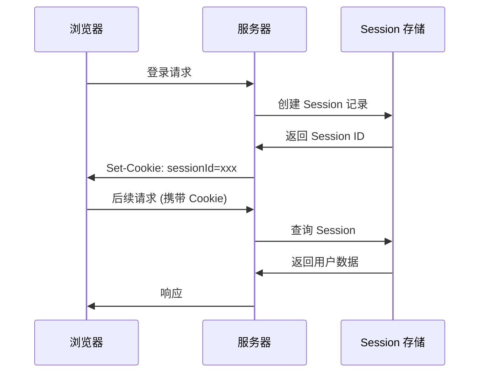

# 6.2.2 Session 安全：存储与传输安全

## 本质还原

Session 是服务端保存用户状态的机制。与 JWT 不同，Session 数据存储在服务端，客户端只保存一个 Session ID。



## Session 安全威胁

### 1. Session 劫持

攻击者通过各种手段获取用户的 Session ID，冒充用户身份。

**防护措施**：

```typescript
// 使用安全的 Cookie 设置
const sessionOptions = {
  cookie: {
    httpOnly: true,    // 防止 JS 读取
    secure: true,      // 仅 HTTPS 传输
    sameSite: 'strict', // 防止跨站请求携带
    maxAge: 24 * 60 * 60 * 1000 // 1 天
  }
}
```

### 2. Session 固定攻击

攻击者先获取一个有效的 Session ID，诱导用户使用该 ID 登录。

**防护措施**：

```typescript
// 登录成功后，重新生成 Session ID
async function login(user: User, session: Session) {
  // 销毁旧 session
  await session.destroy()
  
  // 创建新 session
  const newSession = await createSession()
  newSession.userId = user.id
  
  return newSession.id
}
```

### 3. Session 数据泄露

Session 存储不当导致数据泄露。

**防护措施**：

```typescript
// 不要在 session 中存储敏感信息
// ❌ 危险
session.password = user.password
session.creditCard = user.creditCard

// ✅ 安全：只存必要的标识符
session.userId = user.id
session.role = user.role
```

## Session 存储方案

| 存储方式 | 优点 | 缺点 | 适用场景 |
|----------|------|------|----------|
| 内存 | 快速 | 重启丢失、无法扩展 | 开发环境 |
| 文件 | 简单 | IO 慢、难扩展 | 小型应用 |
| 数据库 | 持久化 | 查询开销 | 中型应用 |
| Redis | 快速、可扩展 | 需额外维护 | 生产环境 |

### Redis Session 存储示例

```typescript
import Redis from 'ioredis'

const redis = new Redis(process.env.REDIS_URL)

async function getSession(sessionId: string) {
  const data = await redis.get(`session:${sessionId}`)
  return data ? JSON.parse(data) : null
}

async function setSession(sessionId: string, data: object, ttl: number) {
  await redis.setex(
    `session:${sessionId}`,
    ttl,
    JSON.stringify(data)
  )
}

async function deleteSession(sessionId: string) {
  await redis.del(`session:${sessionId}`)
}
```

## 安全配置最佳实践

### Session ID 生成

```typescript
import { randomBytes } from 'crypto'

function generateSessionId(): string {
  // 使用加密安全的随机数
  return randomBytes(32).toString('hex')
}
```

### Session 超时策略

```typescript
const SESSION_CONFIG = {
  // 绝对超时：创建后 24 小时过期
  absoluteTimeout: 24 * 60 * 60 * 1000,
  
  // 空闲超时：30 分钟无活动过期
  idleTimeout: 30 * 60 * 1000,
}

async function validateSession(session: Session) {
  const now = Date.now()
  
  // 检查绝对超时
  if (now - session.createdAt > SESSION_CONFIG.absoluteTimeout) {
    throw new Error('Session 已过期')
  }
  
  // 检查空闲超时
  if (now - session.lastActivity > SESSION_CONFIG.idleTimeout) {
    throw new Error('Session 因不活动已过期')
  }
  
  // 更新最后活动时间
  session.lastActivity = now
}
```

### 敏感操作的会话验证

```typescript
async function sensitiveOperation(session: Session) {
  // 敏感操作前检查 session 是否最近创建
  const sessionAge = Date.now() - session.createdAt
  const RECENT_THRESHOLD = 5 * 60 * 1000 // 5 分钟
  
  if (sessionAge > RECENT_THRESHOLD) {
    throw new Error('请重新登录以执行此操作')
  }
}
```

## NextAuth 中的 Session 安全

```typescript
// NextAuth 配置
export const authOptions: NextAuthOptions = {
  session: {
    strategy: 'database', // 使用数据库存储
    maxAge: 24 * 60 * 60,  // 24 小时
    updateAge: 60 * 60,    // 每小时更新
  },
  
  callbacks: {
    async session({ session, user }) {
      // 只暴露必要的用户信息
      session.user.id = user.id
      session.user.role = user.role
      // 不暴露敏感信息
      return session
    }
  }
}
```

::: tip Session 安全检查清单
1. [ ] Session ID 使用加密安全的随机数生成
2. [ ] Cookie 设置 HttpOnly、Secure、SameSite
3. [ ] 登录成功后重新生成 Session ID
4. [ ] 实现绝对超时和空闲超时
5. [ ] Session 数据不包含敏感信息
6. [ ] 生产环境使用 Redis 等可扩展存储
:::
