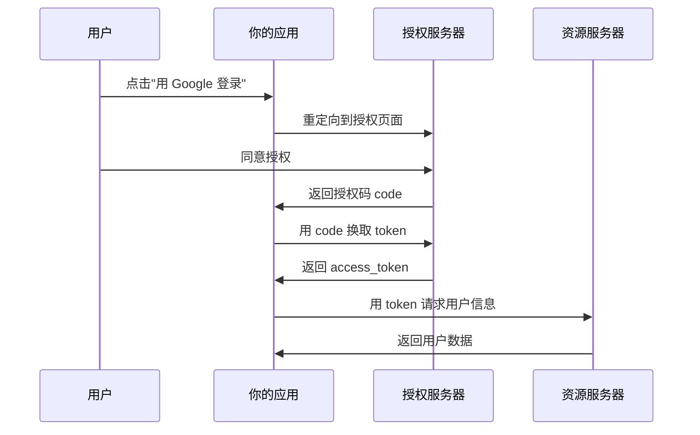

# 6.2.4 OAuth 2.0：授权码模式与安全配置

## 本质还原

OAuth 2.0 是一个授权框架，允许第三方应用在用户授权下访问用户的资源，而无需获取用户的密码。



## OAuth 2.0 授权模式

| 模式 | 适用场景 | 安全性 |
|------|----------|--------|
| 授权码模式 | Web 应用 | ⭐⭐⭐⭐⭐ |
| PKCE | 移动/SPA 应用 | ⭐⭐⭐⭐⭐ |
| 隐式模式 | 已废弃 | ⚠️ 不推荐 |
| 密码模式 | 仅自有应用 | ⚠️ 谨慎使用 |

## 授权码模式安全要点

### 1. State 参数防止 CSRF

```typescript
// 生成 state
const state = crypto.randomBytes(32).toString('hex')
session.oauthState = state

// 发起授权请求时带上 state
const authUrl = `https://accounts.google.com/oauth?
  client_id=${CLIENT_ID}&
  redirect_uri=${REDIRECT_URI}&
  state=${state}&
  response_type=code`

// 回调时验证 state
if (request.query.state !== session.oauthState) {
  throw new Error('State 验证失败，可能是 CSRF 攻击')
}
```

### 2. PKCE 防止授权码劫持

PKCE（Proof Key for Code Exchange）为 SPA 和移动应用提供额外保护：

```typescript
import crypto from 'crypto'

// 生成 code_verifier（随机字符串）
const codeVerifier = crypto.randomBytes(32).toString('base64url')

// 生成 code_challenge
const codeChallenge = crypto
  .createHash('sha256')
  .update(codeVerifier)
  .digest('base64url')

// 授权请求带上 challenge
const authUrl = `${AUTH_URL}?
  code_challenge=${codeChallenge}&
  code_challenge_method=S256`

// 换取 token 时带上 verifier
const tokenResponse = await fetch(TOKEN_URL, {
  method: 'POST',
  body: new URLSearchParams({
    code,
    code_verifier: codeVerifier,
    // ...其他参数
  })
})
```

### 3. 安全存储 Client Secret

```typescript
// ❌ 危险：Secret 暴露在前端
const response = await fetch('/oauth/token', {
  body: JSON.stringify({
    client_secret: 'my-secret' // 暴露在浏览器中！
  })
})

// ✅ 安全：Secret 只在服务端使用
// app/api/auth/callback/route.ts
export async function GET(request: Request) {
  const code = new URL(request.url).searchParams.get('code')
  
  // 在服务端使用 secret
  const token = await exchangeCodeForToken(code, {
    client_secret: process.env.CLIENT_SECRET // 环境变量
  })
}
```

## NextAuth 中的 OAuth 安全

NextAuth 已经内置了这些安全措施：

```typescript
import GoogleProvider from "next-auth/providers/google"

export const authOptions = {
  providers: [
    GoogleProvider({
      clientId: process.env.GOOGLE_CLIENT_ID!,
      clientSecret: process.env.GOOGLE_CLIENT_SECRET!,
      // NextAuth 自动处理：
      // - state 参数
      // - PKCE（如果 provider 支持）
      // - 安全的 token 存储
    }),
  ],
}
```

## Token 安全存储

| 存储位置 | 安全性 | 说明 |
|----------|--------|------|
| HttpOnly Cookie | ✅ 推荐 | 防 XSS |
| localStorage | ❌ 不推荐 | 易被 XSS 窃取 |
| sessionStorage | ❌ 不推荐 | 易被 XSS 窃取 |
| 内存 | ✅ 可用 | 刷新页面丢失 |

::: warning OAuth 安全检查清单
1. [ ] 使用授权码模式，不用隐式模式
2. [ ] SPA/移动应用使用 PKCE
3. [ ] 验证 state 参数防止 CSRF
4. [ ] Client Secret 只在服务端使用
5. [ ] Token 存储在 HttpOnly Cookie
6. [ ] 限制 redirect_uri 白名单
:::
