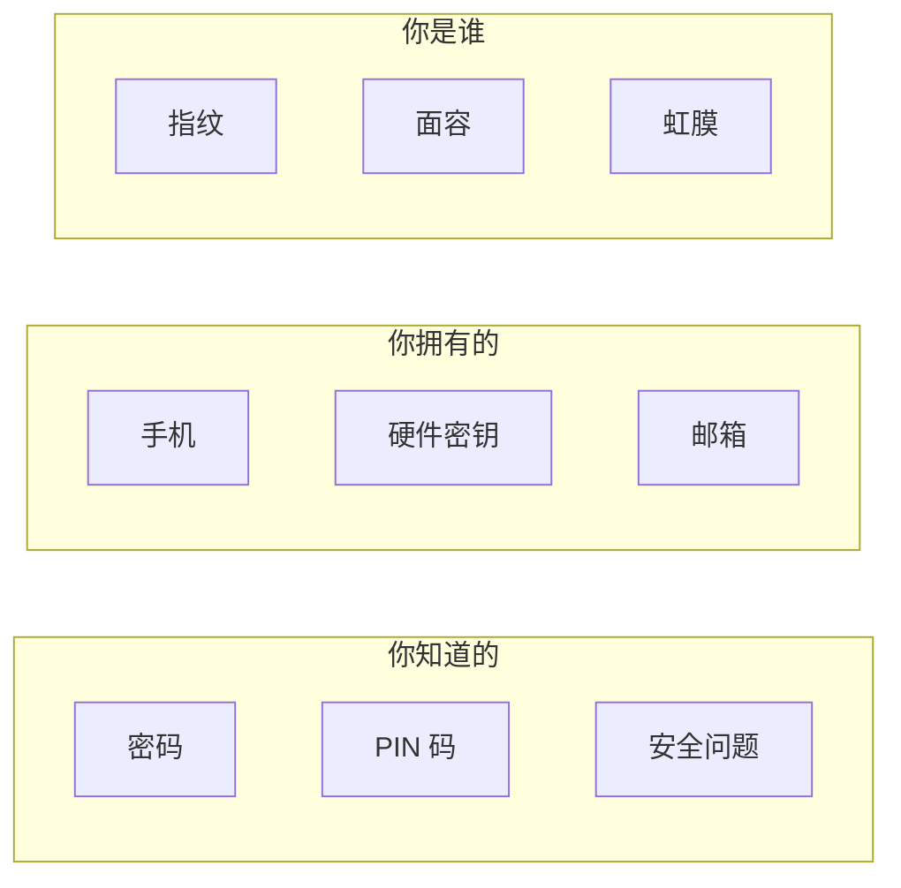

# 6.2.5 多因素认证：增强账户安全性

## 一句话破题

多因素认证（MFA）通过要求多种验证方式，即使密码泄露，攻击者也无法登录账户。

## 认证因素的三种类型



**MFA 要求至少使用两种不同类型的因素。**

## 常见 MFA 方案对比

| 方案 | 安全性 | 用户体验 | 实现难度 |
|------|--------|----------|----------|
| TOTP（验证器应用） | ⭐⭐⭐⭐ | ⭐⭐⭐ | 中等 |
| 短信验证码 | ⭐⭐ | ⭐⭐⭐⭐ | 简单 |
| 邮箱验证码 | ⭐⭐ | ⭐⭐⭐ | 简单 |
| 硬件密钥（WebAuthn） | ⭐⭐⭐⭐⭐ | ⭐⭐⭐⭐ | 复杂 |
| 推送通知 | ⭐⭐⭐⭐ | ⭐⭐⭐⭐⭐ | 复杂 |

## TOTP 实现

TOTP（Time-based One-Time Password）是最常用的 MFA 方案：

### 1. 安装依赖

```bash
npm install otplib qrcode
```

### 2. 生成密钥

```typescript
import { authenticator } from 'otplib'
import QRCode from 'qrcode'

async function setupTOTP(userId: string, email: string) {
  // 生成密钥
  const secret = authenticator.generateSecret()
  
  // 保存密钥到数据库（加密存储）
  await db.user.update({
    where: { id: userId },
    data: { totpSecret: encrypt(secret) }
  })
  
  // 生成二维码供用户扫描
  const otpauth = authenticator.keyuri(email, 'YourAppName', secret)
  const qrCodeUrl = await QRCode.toDataURL(otpauth)
  
  return { qrCodeUrl, secret }
}
```

### 3. 验证 TOTP

```typescript
import { authenticator } from 'otplib'

async function verifyTOTP(userId: string, token: string) {
  const user = await db.user.findUnique({ where: { id: userId } })
  const secret = decrypt(user.totpSecret)
  
  const isValid = authenticator.verify({
    token,
    secret,
  })
  
  return isValid
}
```

### 4. 登录流程集成

```typescript
async function login(email: string, password: string, totpToken?: string) {
  // 第一步：验证密码
  const user = await verifyPassword(email, password)
  if (!user) throw new Error('密码错误')
  
  // 第二步：如果启用了 MFA，验证 TOTP
  if (user.totpEnabled) {
    if (!totpToken) {
      return { requireMFA: true }
    }
    
    const isValidTOTP = await verifyTOTP(user.id, totpToken)
    if (!isValidTOTP) {
      throw new Error('验证码错误')
    }
  }
  
  // 登录成功
  return createSession(user)
}
```

## 恢复码

如果用户丢失了手机，需要恢复码作为备份：

```typescript
function generateRecoveryCodes(count = 10) {
  const codes: string[] = []
  for (let i = 0; i < count; i++) {
    // 生成 8 位随机恢复码
    codes.push(crypto.randomBytes(4).toString('hex').toUpperCase())
  }
  return codes
}

// 用户设置 MFA 时生成并显示恢复码
// 恢复码使用后即失效
```

## 安全建议

### 防止暴力破解

```typescript
const MAX_ATTEMPTS = 5
const LOCKOUT_DURATION = 15 * 60 * 1000 // 15 分钟

async function verifyWithRateLimit(userId: string, token: string) {
  const attempts = await getLoginAttempts(userId)
  
  if (attempts >= MAX_ATTEMPTS) {
    throw new Error('尝试次数过多，请稍后再试')
  }
  
  const isValid = await verifyTOTP(userId, token)
  
  if (!isValid) {
    await incrementLoginAttempts(userId)
  } else {
    await resetLoginAttempts(userId)
  }
  
  return isValid
}
```

### 敏感操作重新验证

```typescript
async function sensitiveAction(session: Session, totpToken: string) {
  // 即使已登录，敏感操作也要求重新验证 MFA
  const isValid = await verifyTOTP(session.userId, totpToken)
  
  if (!isValid) {
    throw new Error('请验证身份')
  }
  
  // 执行敏感操作...
}
```

::: tip MFA 实现检查清单
1. [ ] TOTP 密钥加密存储
2. [ ] 生成足够数量的恢复码
3. [ ] 实现登录尝试限制
4. [ ] 敏感操作要求重新验证
5. [ ] 提供禁用 MFA 的安全流程
:::
