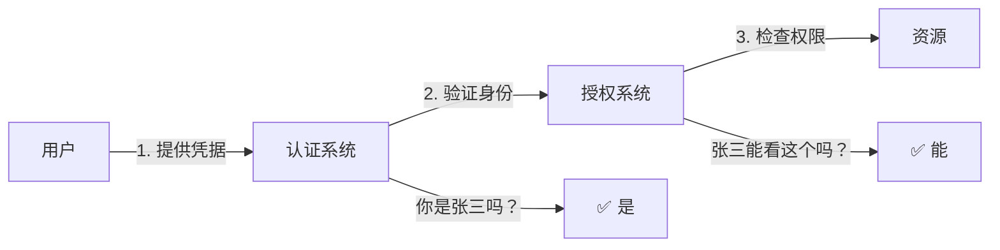

# 6.2 你是谁与你能做什么——认证与授权安全

## 认知重构：认证与授权的本质区别

很多人把"认证"和"授权"混为一谈，但它们解决的是完全不同的问题：

- **认证（Authentication）**：验证"你是谁"——确认用户身份的真实性
- **授权（Authorization）**：判断"你能做什么"——决定用户可以访问哪些资源



## 为什么需要关注认证安全

认证是整个安全体系的第一道防线。如果认证被突破：

- 攻击者可以冒充任意用户
- 所有后续的授权检查都失去意义
- 用户数据面临泄露风险

## 本节内容

| 小节 | 核心问题 | 你将学会 |
|------|----------|----------|
| 6.2.1 JWT 安全 | Token 被盗怎么办？ | 密钥管理、过期策略、刷新机制 |
| 6.2.2 Session 安全 | Session 如何防劫持？ | 安全存储、传输加密、固定攻击防护 |
| 6.2.3 Cookie 安全 | Cookie 怎么设置才安全？ | HttpOnly/Secure/SameSite 属性详解 |
| 6.2.4 OAuth 2.0 安全 | OAuth 流程有哪些风险？ | 授权码模式、PKCE、state 参数 |
| 6.2.5 多因素认证 | 密码不够安全怎么办？ | TOTP、短信验证、硬件密钥 |

## 认证方案对比

| 方案 | 适用场景 | 优点 | 缺点 |
|------|----------|------|------|
| **Session** | 传统 Web 应用 | 服务端可控、即时失效 | 需要存储、扩展性差 |
| **JWT** | 微服务、API | 无状态、易扩展 | 无法即时撤销 |
| **OAuth 2.0** | 第三方登录 | 标准协议、用户体验好 | 实现复杂 |

## 安全设计原则

### 1. 纵深防御

不要只依赖一层防护：

```typescript
// 多层验证
async function protectedAction(request: Request) {
  // 第一层：验证 Token 有效性
  const token = await verifyToken(request)
  
  // 第二层：验证用户状态
  const user = await getUser(token.userId)
  if (user.status !== 'active') throw new Error('账号已禁用')
  
  // 第三层：验证操作权限
  if (!user.permissions.includes('write')) {
    throw new Error('无权执行此操作')
  }
}
```

### 2. 最小权限

只授予必要的权限：

```typescript
// ❌ 过度授权
const token = jwt.sign({ 
  userId, 
  role: 'admin',  // 太宽泛
  permissions: ['*']  // 危险
})

// ✅ 最小权限
const token = jwt.sign({
  userId,
  permissions: ['posts:read', 'posts:write']  // 具体权限
})
```

### 3. 安全默认

默认拒绝，显式允许：

```typescript
// ❌ 默认允许
function checkPermission(user, resource) {
  if (resource.isRestricted) {
    return user.hasAccess(resource)
  }
  return true  // 默认允许
}

// ✅ 默认拒绝
function checkPermission(user, resource) {
  if (resource.isPublic) {
    return true
  }
  return user.hasAccess(resource)  // 默认需要验证
}
```

## AI 协作提示

在让 AI 帮你实现认证功能时，务必强调：

- "使用 HttpOnly 和 Secure 标志设置 Cookie"
- "JWT 过期时间设置为较短时间，并实现 refresh token 机制"
- "对敏感操作要求重新验证身份"
- "实现登录失败次数限制"

::: warning 审查要点
AI 生成的认证代码，重点检查：
1. 密钥是否硬编码？
2. Token 过期时间是否合理？
3. 错误信息是否泄露敏感信息？
4. 是否有防暴力破解机制？
:::
