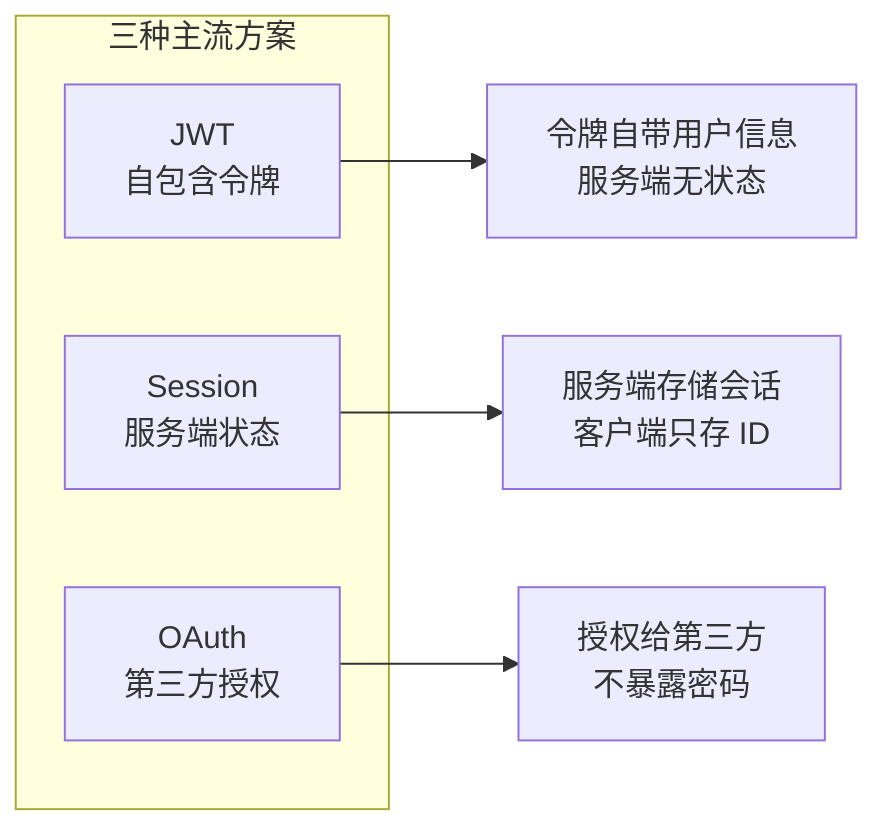
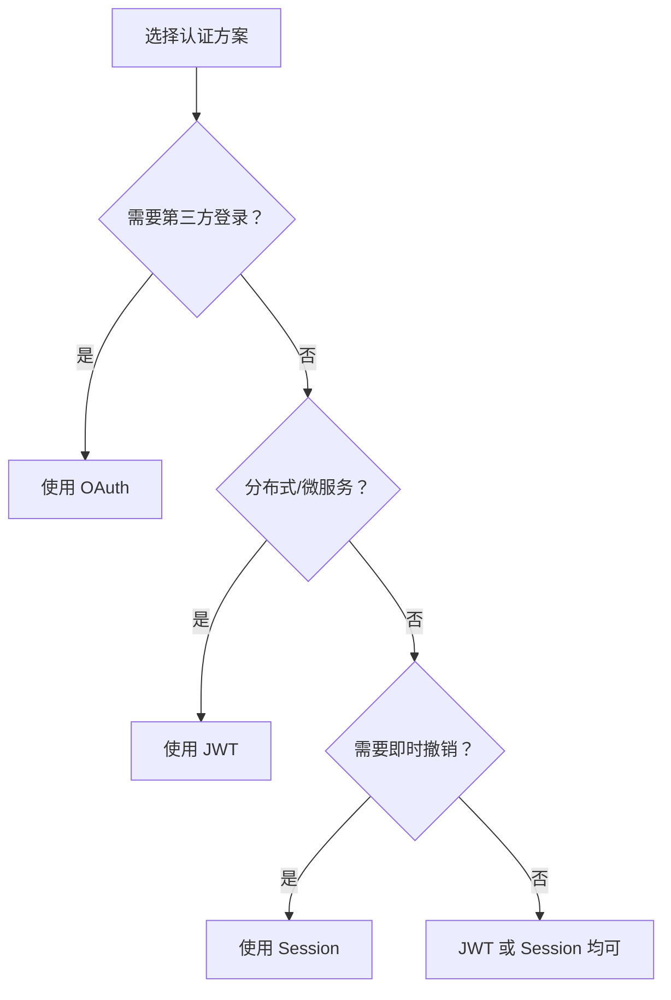

# 6.3.1 认证与授权：JWT/Session/OAuth 选择与实现

## 本质还原

API 认证的核心问题只有一个：**这个请求是谁发的？** 不同的认证方案，本质上是用不同的方式回答这个问题。



## 三种方案的本质差异

| 方案 | 状态存储 | 适用场景 | 撤销难度 |
|------|----------|----------|----------|
| **JWT** | 客户端（令牌自包含） | 分布式系统、微服务 | 困难 |
| **Session** | 服务端（内存/Redis） | 单体应用、需要即时撤销 | 简单 |
| **OAuth** | 授权服务器 | 第三方登录、开放 API | 中等 |

## JWT 实现

JWT 把用户信息编码在令牌中，服务端无需查询数据库即可验证身份。

```typescript
// lib/jwt.ts
import { SignJWT, jwtVerify } from 'jose'

const secret = new TextEncoder().encode(process.env.JWT_SECRET!)

export async function signToken(payload: { userId: string; role: string }) {
  return new SignJWT(payload)
    .setProtectedHeader({ alg: 'HS256' })
    .setIssuedAt()
    .setExpirationTime('15m')
    .sign(secret)
}

export async function verifyToken(token: string) {
  const { payload } = await jwtVerify(token, secret)
  return payload
}
```

```typescript
// API 路由中验证
export async function GET(request: Request) {
  const token = request.headers.get('Authorization')?.replace('Bearer ', '')
  
  if (!token) {
    return Response.json({ error: '未提供令牌' }, { status: 401 })
  }
  
  try {
    const payload = await verifyToken(token)
    // 继续处理业务逻辑
    return Response.json({ userId: payload.userId })
  } catch {
    return Response.json({ error: '令牌无效' }, { status: 401 })
  }
}
```

## Session 实现

Session 方案将状态存储在服务端，客户端只持有一个 Session ID。

```typescript
// 使用 iron-session 实现
import { getIronSession } from 'iron-session'
import { cookies } from 'next/headers'

interface SessionData {
  userId?: string
  role?: string
}

export async function getSession() {
  return getIronSession<SessionData>(await cookies(), {
    password: process.env.SESSION_SECRET!,
    cookieName: 'session',
    cookieOptions: {
      httpOnly: true,
      secure: process.env.NODE_ENV === 'production',
      sameSite: 'lax',
      maxAge: 60 * 60 * 24 * 7, // 7 天
    },
  })
}

// 登录时设置 session
export async function login(userId: string, role: string) {
  const session = await getSession()
  session.userId = userId
  session.role = role
  await session.save()
}

// 登出时销毁 session
export async function logout() {
  const session = await getSession()
  session.destroy()
}
```

## 如何选择？



### 决策清单

- **选 JWT**：无服务器函数（Vercel/Cloudflare Workers）、多服务共享认证
- **选 Session**：传统单体应用、需要随时踢人下线、对安全要求极高
- **选 OAuth**：接入 Google/GitHub 等社交登录、对外开放 API

## 混合方案：NextAuth 的做法

NextAuth 默认使用 JWT 存储会话，但也支持数据库会话：

```typescript
// JWT 策略（默认）
session: {
  strategy: "jwt",
  maxAge: 30 * 24 * 60 * 60, // 30 天
}

// 数据库策略（需要 adapter）
session: {
  strategy: "database",
  maxAge: 30 * 24 * 60 * 60,
}
```

::: tip 实践建议
对于大多数 Next.js 应用，推荐使用 NextAuth 的 JWT 策略 + Refresh Token 机制。简单够用，又能在需要时撤销令牌。
:::
