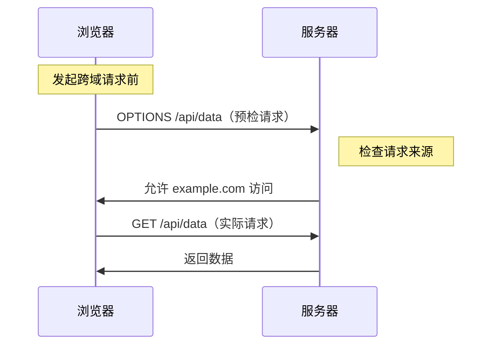

# 6.3.2 预检不是麻烦是保护：CORS 机制

## 本质还原

CORS（Cross-Origin Resource Sharing）不是浏览器在刁难你，而是在保护用户。它的本质是：**浏览器在问服务器"这个外来请求，你允许吗？"**



## 为什么需要 CORS？

假设没有 CORS 保护：

1. 你登录了银行网站 `bank.com`，Cookie 中存有登录凭证
2. 你访问了恶意网站 `evil.com`
3. `evil.com` 的 JS 向 `bank.com/api/transfer` 发起请求
4. 浏览器自动带上 `bank.com` 的 Cookie
5. 你的钱就被转走了

**CORS 的存在，就是为了阻止这种跨站请求。**

## 简单请求 vs 预检请求

并非所有跨域请求都需要预检。浏览器会根据请求特征自动判断：

### 简单请求（无需预检）

满足以下所有条件的请求：

- 方法：`GET`、`HEAD`、`POST`
- 请求头：仅限 `Accept`、`Accept-Language`、`Content-Language`、`Content-Type`
- Content-Type：仅限 `text/plain`、`multipart/form-data`、`application/x-www-form-urlencoded`

```typescript
// 这是简单请求，直接发送
fetch('https://api.example.com/data')
```

### 预检请求

只要不满足简单请求的条件，浏览器就会先发一个 `OPTIONS` 请求：

```typescript
// 这会触发预检请求（因为有自定义 header）
fetch('https://api.example.com/data', {
  headers: {
    'Authorization': 'Bearer xxx',
    'Content-Type': 'application/json'
  }
})
```

## Next.js 中配置 CORS

### 方式一：API 路由中处理

```typescript
// app/api/data/route.ts
const corsHeaders = {
  'Access-Control-Allow-Origin': 'https://your-frontend.com',
  'Access-Control-Allow-Methods': 'GET, POST, PUT, DELETE, OPTIONS',
  'Access-Control-Allow-Headers': 'Content-Type, Authorization',
  'Access-Control-Max-Age': '86400', // 预检结果缓存 24 小时
}

export async function OPTIONS() {
  return new Response(null, { headers: corsHeaders })
}

export async function GET() {
  return Response.json(
    { data: 'Hello' },
    { headers: corsHeaders }
  )
}
```

### 方式二：Middleware 统一处理

```typescript
// middleware.ts
import { NextResponse } from 'next/server'
import type { NextRequest } from 'next/server'

const allowedOrigins = [
  'https://your-frontend.com',
  'http://localhost:3000',
]

export function middleware(request: NextRequest) {
  const origin = request.headers.get('origin')
  
  // 检查是否是允许的源
  if (origin && allowedOrigins.includes(origin)) {
    // 处理预检请求
    if (request.method === 'OPTIONS') {
      return new NextResponse(null, {
        headers: {
          'Access-Control-Allow-Origin': origin,
          'Access-Control-Allow-Methods': 'GET, POST, PUT, DELETE, OPTIONS',
          'Access-Control-Allow-Headers': 'Content-Type, Authorization',
          'Access-Control-Max-Age': '86400',
        },
      })
    }
    
    // 普通请求，添加 CORS 头
    const response = NextResponse.next()
    response.headers.set('Access-Control-Allow-Origin', origin)
    return response
  }
  
  return NextResponse.next()
}

export const config = {
  matcher: '/api/:path*',
}
```

## 常见问题与排查

### 问题一：`Access-Control-Allow-Origin` 不能用 `*` 配合凭证

```typescript
// ❌ 错误：带凭证时不能用通配符
{
  'Access-Control-Allow-Origin': '*',
  'Access-Control-Allow-Credentials': 'true',
}

// ✅ 正确：必须指定具体域名
{
  'Access-Control-Allow-Origin': 'https://your-frontend.com',
  'Access-Control-Allow-Credentials': 'true',
}
```

### 问题二：预检请求未正确处理

```typescript
// ❌ 问题：没有处理 OPTIONS 请求
export async function POST(request: Request) {
  // ...
}

// ✅ 正确：显式处理 OPTIONS
export async function OPTIONS() {
  return new Response(null, {
    headers: {
      'Access-Control-Allow-Origin': '*',
      'Access-Control-Allow-Methods': 'POST, OPTIONS',
      'Access-Control-Allow-Headers': 'Content-Type',
    },
  })
}

export async function POST(request: Request) {
  // ...
}
```

## 安全配置建议

::: warning CORS 安全清单
1. [ ] 永远不要在生产环境使用 `Access-Control-Allow-Origin: *`
2. [ ] 维护一个允许的域名白名单
3. [ ] 设置合理的 `Access-Control-Max-Age` 减少预检请求
4. [ ] 敏感接口必须验证 `Origin` 头
5. [ ] 使用 `Access-Control-Allow-Credentials` 时格外小心
:::
