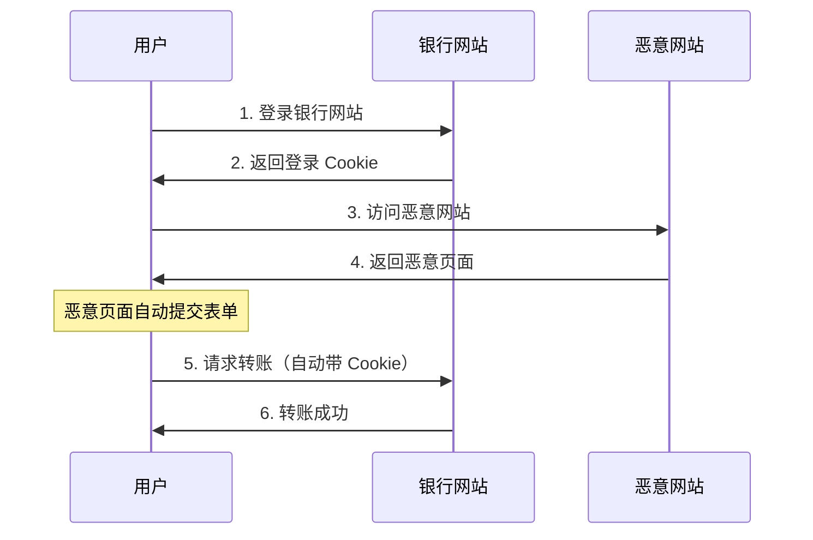

# 6.3.4 身份被借用的防线：CSRF 攻击

## 本质还原

CSRF（Cross-Site Request Forgery）的本质是：**攻击者借用你的身份，让你的浏览器替他发送请求**。你已经登录了某网站，攻击者诱导你访问恶意页面，该页面自动向目标网站发起请求，浏览器会自动带上你的 Cookie。



## CSRF vs XSS 的区别

| 攻击类型 | 攻击方式 | 攻击目标 |
|----------|----------|----------|
| **XSS** | 在目标网站注入脚本 | 窃取数据、劫持会话 |
| **CSRF** | 借用用户身份发请求 | 执行敏感操作 |

关键区别：CSRF 不需要在目标网站执行任何代码，只需要诱导用户访问恶意页面。

## 攻击示例

恶意网站的隐藏表单：

```html
<!-- evil.com 的页面 -->
<h1>恭喜你中奖了！</h1>

<!-- 隐藏的自动提交表单 -->
<form id="csrf-form" action="https://bank.com/transfer" method="POST" style="display:none">
  <input name="to" value="attacker-account" />
  <input name="amount" value="10000" />
</form>

<script>
  document.getElementById('csrf-form').submit()
</script>
```

用户只要访问这个页面，表单就会自动提交，浏览器会带上 `bank.com` 的 Cookie。

## 防护策略

### 策略一：CSRF Token

服务端生成随机令牌，嵌入表单中，提交时验证：

```typescript
// 生成 CSRF Token
import { randomBytes } from 'crypto'

export function generateCsrfToken(): string {
  return randomBytes(32).toString('hex')
}

// 服务端 Action
export async function transferMoney(formData: FormData) {
  const token = formData.get('csrfToken')
  const session = await getSession()
  
  if (token !== session.csrfToken) {
    throw new Error('CSRF 验证失败')
  }
  
  // 执行转账逻辑
}
```

```tsx
// 表单中包含 Token
export default async function TransferForm() {
  const session = await getSession()
  
  return (
    <form action={transferMoney}>
      <input type="hidden" name="csrfToken" value={session.csrfToken} />
      <input name="to" placeholder="收款账号" />
      <input name="amount" type="number" placeholder="金额" />
      <button type="submit">转账</button>
    </form>
  )
}
```

### 策略二：SameSite Cookie

现代浏览器支持 `SameSite` 属性，限制 Cookie 的发送场景：

```typescript
// NextAuth 配置
cookies: {
  sessionToken: {
    name: 'session-token',
    options: {
      httpOnly: true,
      sameSite: 'lax',  // 或 'strict'
      secure: true,
    },
  },
}
```

SameSite 取值：

| 值 | 效果 |
|-----|------|
| `Strict` | 跨站请求完全不发送 Cookie |
| `Lax` | 跨站 GET 请求发送，POST 不发送（推荐） |
| `None` | 总是发送（需配合 Secure） |

### 策略三：验证 Origin/Referer

检查请求来源：

```typescript
export async function POST(request: Request) {
  const origin = request.headers.get('origin')
  const allowedOrigins = ['https://your-domain.com']
  
  if (!origin || !allowedOrigins.includes(origin)) {
    return Response.json({ error: '非法来源' }, { status: 403 })
  }
  
  // 继续处理
}
```

### 策略四：双重 Cookie 验证

将 Token 同时放在 Cookie 和请求头中：

```typescript
// 设置 Cookie
response.cookies.set('csrf-token', token, {
  httpOnly: false,  // 前端需要读取
  sameSite: 'strict',
  secure: true,
})

// 前端发送请求时读取 Cookie 放入 Header
fetch('/api/transfer', {
  method: 'POST',
  headers: {
    'X-CSRF-Token': getCookie('csrf-token'),
  },
  body: JSON.stringify(data),
})

// 服务端验证
const cookieToken = request.cookies.get('csrf-token')
const headerToken = request.headers.get('X-CSRF-Token')

if (cookieToken !== headerToken) {
  throw new Error('CSRF 验证失败')
}
```

## Next.js Server Actions 的内置保护

Next.js 的 Server Actions 已内置 CSRF 保护：

```typescript
// 这是安全的，Next.js 自动处理 CSRF
'use server'

export async function createPost(formData: FormData) {
  // Server Action 会验证请求来源
  const title = formData.get('title')
  // ...
}
```

::: tip 实践建议
使用 Next.js Server Actions 时，框架已自动处理 CSRF。但如果使用 API Routes，仍需手动实现防护。
:::

## 安全配置清单

::: warning CSRF 防护清单
1. [ ] 敏感操作使用 POST/PUT/DELETE，不用 GET
2. [ ] Cookie 设置 `SameSite=Lax` 或 `Strict`
3. [ ] 表单提交验证 CSRF Token
4. [ ] API 验证 Origin/Referer 头
5. [ ] 使用 Server Actions 获得内置保护
:::
