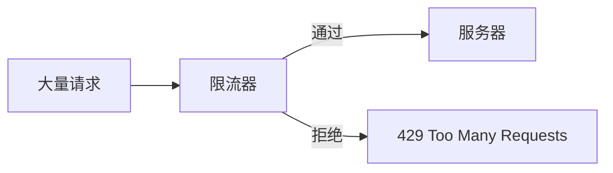

# 6.3.5 API 限流与防护

## 本质还原

限流的本质是：**控制资源消耗速率，防止服务被打垮**。无论是恶意攻击还是意外流量高峰，限流都是保护系统的最后一道防线。



## 常见限流算法

### 1. 固定窗口

按时间窗口计数，窗口结束后重置。

```
时间窗口: |----1分钟----|----1分钟----|
请求计数:      58         12
限制:         60次/分钟
```

缺点：窗口边界可能出现突发流量（前一窗口末尾 + 后一窗口开头）。

### 2. 滑动窗口

将窗口滑动计算，更平滑地控制流量。

```typescript
// 滑动窗口限流示例
function slidingWindowRateLimit(
  requests: number[],  // 最近请求的时间戳
  windowMs: number,    // 窗口大小（毫秒）
  maxRequests: number  // 窗口内最大请求数
): boolean {
  const now = Date.now()
  const windowStart = now - windowMs
  
  // 只统计窗口内的请求
  const recentRequests = requests.filter(t => t > windowStart)
  return recentRequests.length < maxRequests
}
```

### 3. 令牌桶

以固定速率向桶中添加令牌，每个请求消耗一个令牌。桶满时多余令牌被丢弃。

优点：允许一定程度的突发流量（桶中积累的令牌）。

## Next.js 实现限流

### 使用 Upstash Redis

```bash
pnpm add @upstash/ratelimit @upstash/redis
```

```typescript
// lib/ratelimit.ts
import { Ratelimit } from '@upstash/ratelimit'
import { Redis } from '@upstash/redis'

export const ratelimit = new Ratelimit({
  redis: Redis.fromEnv(),
  limiter: Ratelimit.slidingWindow(10, '10 s'),  // 10秒10次
  analytics: true,
  prefix: 'ratelimit',
})
```

```typescript
// middleware.ts
import { NextResponse } from 'next/server'
import type { NextRequest } from 'next/server'
import { ratelimit } from './lib/ratelimit'

export async function middleware(request: NextRequest) {
  // 只对 API 路由限流
  if (request.nextUrl.pathname.startsWith('/api')) {
    const ip = request.ip ?? '127.0.0.1'
    const { success, limit, reset, remaining } = await ratelimit.limit(ip)
    
    if (!success) {
      return NextResponse.json(
        { error: '请求过于频繁，请稍后再试' },
        {
          status: 429,
          headers: {
            'X-RateLimit-Limit': limit.toString(),
            'X-RateLimit-Remaining': remaining.toString(),
            'X-RateLimit-Reset': reset.toString(),
          },
        }
      )
    }
  }
  
  return NextResponse.next()
}
```

### 内存限流（无依赖方案）

适用于单实例部署：

```typescript
// lib/memory-ratelimit.ts
const requests = new Map<string, number[]>()

export function rateLimit(
  key: string,
  limit: number = 10,
  windowMs: number = 60000
): { success: boolean; remaining: number } {
  const now = Date.now()
  const windowStart = now - windowMs
  
  // 获取该 key 的请求记录
  let timestamps = requests.get(key) || []
  
  // 清理过期记录
  timestamps = timestamps.filter(t => t > windowStart)
  
  if (timestamps.length >= limit) {
    return { success: false, remaining: 0 }
  }
  
  // 记录本次请求
  timestamps.push(now)
  requests.set(key, timestamps)
  
  return { success: true, remaining: limit - timestamps.length }
}

// 定期清理过期数据
setInterval(() => {
  const now = Date.now()
  for (const [key, timestamps] of requests.entries()) {
    const valid = timestamps.filter(t => t > now - 60000)
    if (valid.length === 0) {
      requests.delete(key)
    } else {
      requests.set(key, valid)
    }
  }
}, 60000)
```

## 分级限流策略

针对不同接口设置不同限制：

```typescript
// lib/ratelimit-config.ts
import { Ratelimit } from '@upstash/ratelimit'
import { Redis } from '@upstash/redis'

const redis = Redis.fromEnv()

// 普通接口：每分钟 60 次
export const standardLimit = new Ratelimit({
  redis,
  limiter: Ratelimit.slidingWindow(60, '1 m'),
  prefix: 'standard',
})

// 认证接口：每小时 10 次（防暴力破解）
export const authLimit = new Ratelimit({
  redis,
  limiter: Ratelimit.slidingWindow(10, '1 h'),
  prefix: 'auth',
})

// 高频接口：每秒 100 次
export const highFreqLimit = new Ratelimit({
  redis,
  limiter: Ratelimit.slidingWindow(100, '1 s'),
  prefix: 'highfreq',
})
```

```typescript
// app/api/login/route.ts
import { authLimit } from '@/lib/ratelimit-config'

export async function POST(request: Request) {
  const ip = request.headers.get('x-forwarded-for') ?? 'unknown'
  const { success } = await authLimit.limit(ip)
  
  if (!success) {
    return Response.json(
      { error: '登录尝试次数过多，请 1 小时后再试' },
      { status: 429 }
    )
  }
  
  // 继续登录逻辑
}
```

## 异常检测与响应

### 监控可疑行为

```typescript
// lib/anomaly-detection.ts
interface RequestPattern {
  ip: string
  userAgent: string
  path: string
  timestamp: number
}

const patterns: RequestPattern[] = []

export function detectAnomaly(request: Request): boolean {
  const ip = request.headers.get('x-forwarded-for') ?? 'unknown'
  const userAgent = request.headers.get('user-agent') ?? ''
  const path = new URL(request.url).pathname
  
  // 记录请求模式
  patterns.push({ ip, userAgent, path, timestamp: Date.now() })
  
  // 检测异常模式
  const recentFromIp = patterns.filter(
    p => p.ip === ip && p.timestamp > Date.now() - 60000
  )
  
  // 1. 短时间内大量不同路径请求（可能是扫描）
  const uniquePaths = new Set(recentFromIp.map(p => p.path))
  if (uniquePaths.size > 50) {
    return true  // 异常
  }
  
  // 2. 可疑 User-Agent
  if (!userAgent || userAgent.includes('bot') || userAgent.includes('curl')) {
    // 可能是爬虫或自动化工具
  }
  
  return false
}
```

### 渐进式响应

```typescript
// 根据违规次数采取不同措施
async function handleRateLimitViolation(ip: string, violations: number) {
  if (violations === 1) {
    // 第一次：警告
    return Response.json(
      { error: '请求频率过高，请放慢速度' },
      { status: 429 }
    )
  } else if (violations < 5) {
    // 多次违规：增加等待时间
    return Response.json(
      { error: `请等待 ${violations * 60} 秒后重试` },
      { status: 429, headers: { 'Retry-After': (violations * 60).toString() } }
    )
  } else {
    // 严重违规：加入黑名单
    await addToBlacklist(ip)
    return Response.json(
      { error: '您的 IP 已被暂时封禁' },
      { status: 403 }
    )
  }
}
```

## 配置清单

::: tip 限流配置建议
| 接口类型 | 建议限制 | 说明 |
|----------|----------|------|
| 登录/注册 | 10次/小时 | 防暴力破解 |
| 短信验证码 | 5次/小时 | 防滥用 |
| 普通 API | 60次/分钟 | 正常使用够用 |
| 搜索接口 | 30次/分钟 | 防止爬虫 |
| 文件上传 | 10次/小时 | 防止滥用存储 |
:::

::: warning 限流安全清单
1. [ ] 所有 API 都配置了基础限流
2. [ ] 敏感接口（登录、支付）有更严格限制
3. [ ] 返回标准的 429 状态码和 Retry-After 头
4. [ ] 记录被限流的请求用于分析
5. [ ] 对重复违规 IP 实施渐进式惩罚
:::
